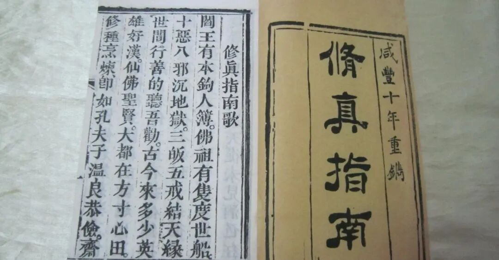

**《修真指南歌》**

我们再继续读读《修真指南》这部民间佛教曾经的“畅销书”。一方面因为已经读了一段了，一方面也觉得可以拿它当一个标本来“解剖”一下在民间的佛教。

《修真指南》开篇就是《修真指南歌》，这也是这部书署名的来源。文字介于文白之间，遣词造句也不粗俗、晦涩，这也是他能流行的原因吧——

** 《修真指南歌》**

** “阎王有本钩人簿，佛祖有只度世船；十恶八邪沉地狱，三皈五戒结天缘。**

** 世间行善的听吾劝，古来多少英雄好汉，仙佛圣贤，大都在方寸心田，修种烹炼。即如孔夫子温良恭俭，斋食必变；了明一贯，佛老家慈悲方便，皈戒精严，悟彻玄关，才能够超出三千大千，万古名传，天地有换他无换。**

** 从未见为佛为仙，不好到十全；从未见为圣为贤，不止于至善；从未见宰杀屠夫，升了大罗天；从未见酒色狂徒，赴得蟠桃宴；从未见贪财斗气，长生二百年；从未见图利争名，躲脱阎王殿；尽都是睁眼跳入黄河里面。**

** 劝英贤，这酒色财气中，苦海无边，好姻缘还是恶姻缘；因此上，修的牛毛多，成的兔角难。倒不如，认清定盘，锁定心猿；红尘不染，世事不贪；学取往昔的圣贤佛仙，孝悌忠信，礼义耻廉。恶去尽而善学满，三皈净而五戒全，拜求明师，一贯玄关，解了连环，烹炼抽添；三载九年，七祖飞腾天外天，方免得人笑道，咱是口头禅。野狐凡夫，外道诸门，面睁着一对光光的眼儿，上了阎王老子套和圈。”**

** 清案：**

前面说过，中国的“在民间的宗教”，多游走于儒释道之间，《修真指南》是略略偏向于佛一点点，大概是“四分佛+二分道+一分儒+三分自我发挥”的样子。

他借用了佛教的框架，但底子实际基本是中国文化的，它的“世界观”是“地狱+人间+天堂”的中国式“三界”，他对“西方（极乐世界）”的理解实际也就是“天堂”（，所以有些相对外行而把这些民间宗教当作大乘佛教的那些人，也就基于这些“现象”而说“极乐世界实际只是天道”）。

某种角度看，《西游记》作者所理解的佛教大致就是这个《修真指南》的程度——应该说《西游记》的作者和《修真指南》的作者在宗教知识层面是高度吻合的。《封神演义》作者的宗教知识背景则要更民间、更“大仙儿”一些。

上述这段《修真指南歌》的“意思”应该算是不错的，当然用词等等肯定不是标准佛教法相的——我们总不能要求《西游记》真的照抄《瑜伽师地论》吧。

