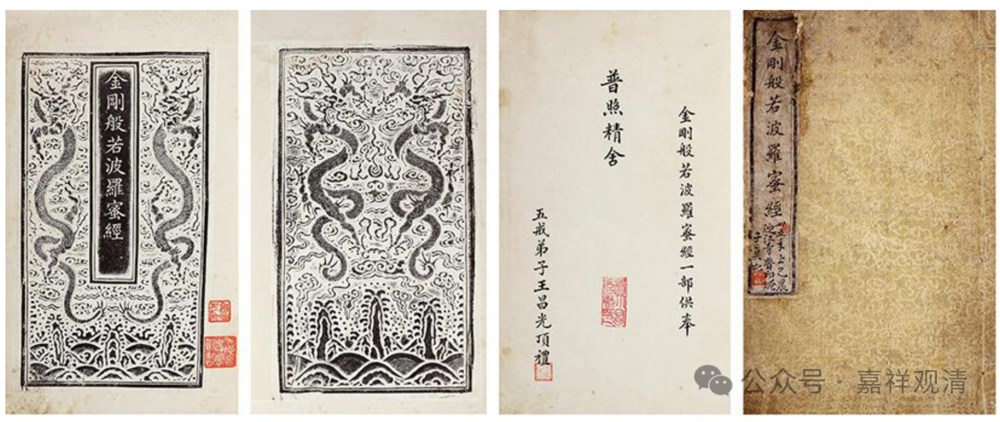
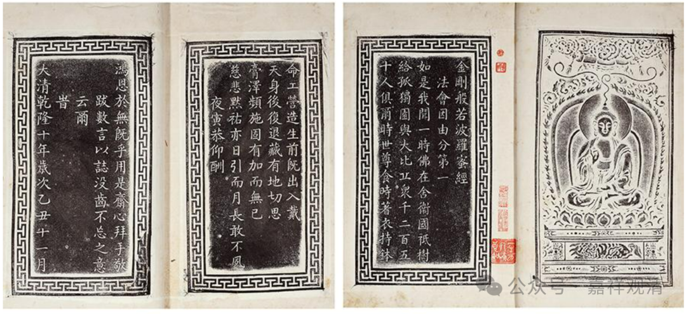
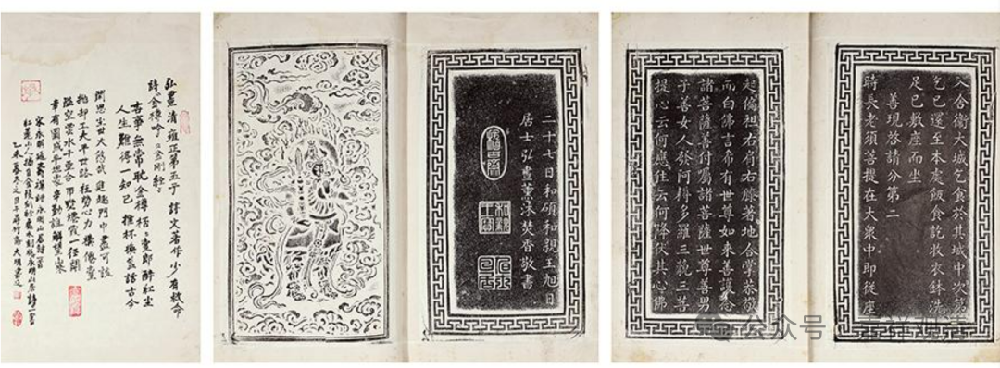
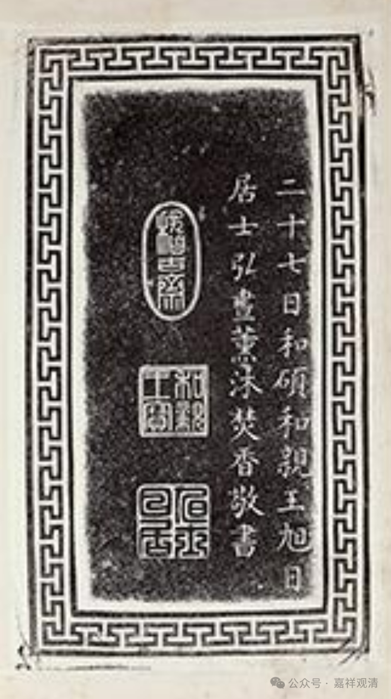

**弘昼抄写的《金刚经》**

这是一件《金刚经》的拓本。

乾隆十年，乾隆皇帝赐给他的弟弟（老五）和硕和亲王弘昼一块墓地，弘昼就抄了一份《金刚经》呈上去，皇帝高兴，照原样打了一册铸金的《金刚经》赐还给弘昼。后来这件铸金的《金刚经》就随葬于和亲王墓中。

民国时期，京郊密云、房山的清代帝王陵、亲王墓被盗严重，比如大家熟知的孙殿英盗东陵……盗墓者中，有平民、土匪、军阀、也有王爷家族之后人，也有军队，东北军于学重部、西北军送哲元部的士兵都有盗墓记录。

和硕和亲王弘昼的墓也在这一时期被盗，拍卖录上说是“1937年国民军83军盗发墓地”，但可能不准确，国民军38军番号历史上出现过三次，但都不在北京周围驻防，同时期38军在1937年10月淞沪会战时成立……所以这一记载恐是有误。

盗墓后，盗墓贼在北平销赃时被捕，而金册已经熔为金饼。估计在销赃过程中，有人把这一份金册给拓下来了，就是现在大家看到的这个样子了。据说是孤本。

今天大家比较熟悉的书画家启功先生，就是和硕和亲王弘昼的八世孙。

