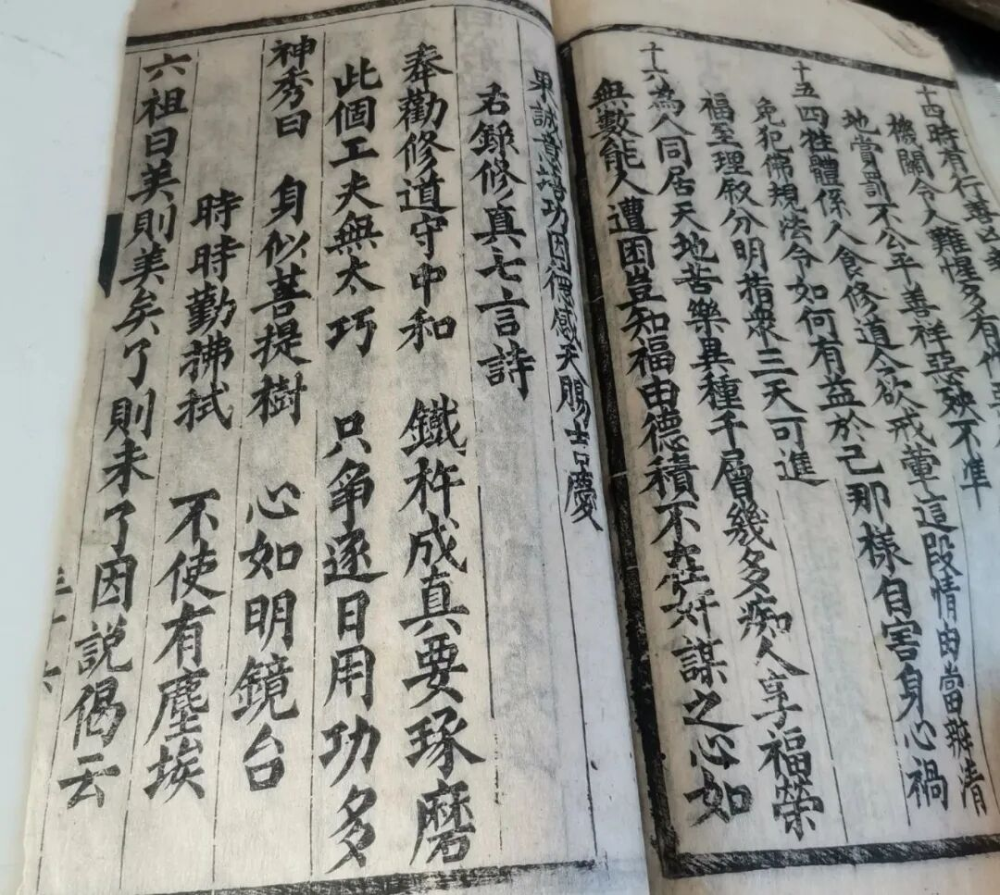
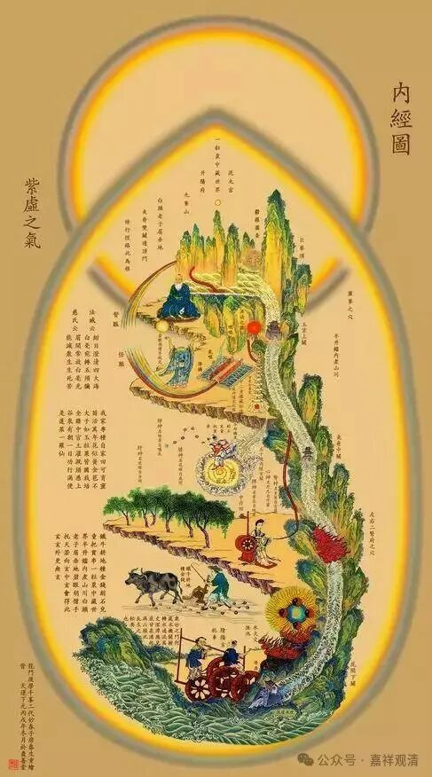

继续解读《修真指南》。

在对“皈依”做了拆字先生一般的“真解”之后，《修真指南》又对“三皈依”“真解”了一遍，其实很明显的，这里的“真解”实际也就是“赋”了一段韵文。民间宝卷里面这类韵文是很常见的。

“**皈依佛真解**

** 一、皈依佛，佛是自性珠，你若觉悟便是佛，你若迷昧便成畜，你若快乐天堂佛，你若烦恼生地狱。**

** 皈依佛，要舍名利拘束，要抛恩爱劳碌，食不用美粟，居不求华屋，随缘随分随时足，性天晶辘轳，法轮常转轴，做一个返本还原大丈夫。**

** 佛佛佛，也不是铜打铁铸，也不是彩画红绿，认得真面目，方才是皈依十方一切佛。**

** 皈依法真解**

** 二、皈依法，法是自性花，你行正道便是法，你走旁门便为邪，你悟无字便是法，你炼有为便成假。**

** 皈依法，要去奸贪诡诈，要除血性刚叉。守一粒金砂，抱些子黄芽，交结龙虎兴龟蛇，甘露儿降下，醍醐儿味佳，无生地产粒明珠真无价。**

** 法法法，也不是搬运吐纳，也不是符咒搞（敲）打，会合我三家，方才是皈依十方一切法。**

** 皈依僧真解**

** 三、皈依僧，僧是自性真，你常清净便为僧，你贪嗔痴便难名，你修净土便是僧，你恋声称便不成。**

** 皈依僧，要晓生前主人，要识骨髓真经，返照我黄庭，回首观世音，倒转黄河上昆仑，聋女儿弹琴，哑童儿歌咏，欢会处产个婴儿见娘亲。**

** 僧僧僧，也不是削发归隐，也不是炙指燃灯，成就我三身，才是皈依十方一切僧。”**

清案：

结合上下文来看，作者“修真”的外壳是抄的佛家的，比如用“皈依”“佛法僧”“贪嗔痴”“自性”“无生”“削发”这些词；但对“道”、对“修炼”的内容则明确是道教的——“金砂”、“黄芽”、“龙虎鬼蛇”、“黄庭”、“昆仑”、“搬运”、“吐纳”，都是道教丹道的术语。这和《西游记》也是一致的——形而上学的、制度化的标准件用佛教，形而下的、落实的内容用道教。这大概已经告诉我们唐宋以来一般知识分子的平均宗教知识层次。

大概那个时候知识分子的脑子里都有一张这个图（《内景图》或者叫《内经图》）吧。我有一个兄弟房间里也挂着这个图（，而不是百法的、现观的图表）。

