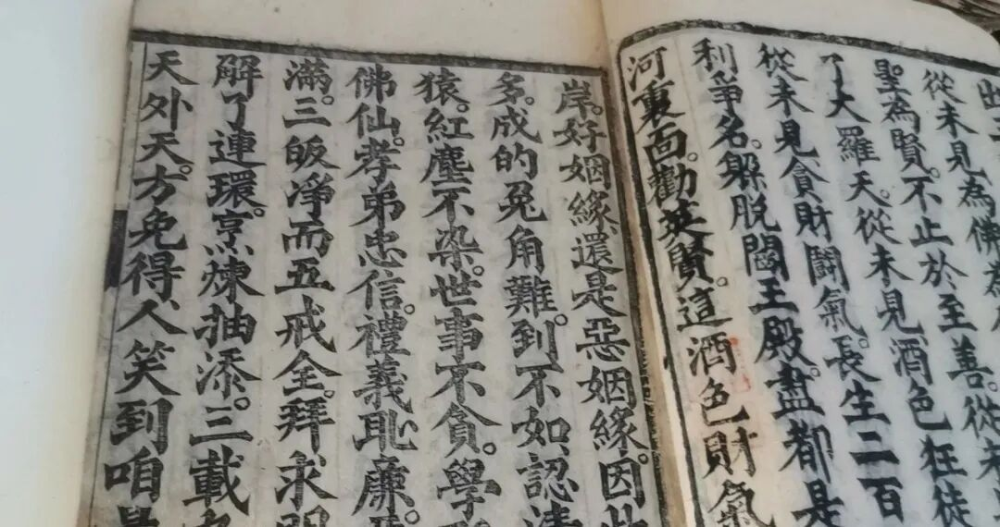

**不杀生与不吃肉**

继续读几句《修真指南》。（总觉得像李东宝的《人间指南》。）

** “修真路引**

** 欲生天堂自在，当持三皈五戒；欲免四生六畜，莫要喫他血肉；欲离十八地狱，十恶八邪尽除；求师指点炼玄珠，才是男儿大丈夫。”**

清案：

已经说过的内容就不再说了。

“四生”就是“胎、卵、湿、化”，这是中国文化里原先没有的概念。

六畜：佛教说六道、五趣，六畜是纯中国的概念，六畜最多代表傍生道。中国人的轮回概念只有四道：天神、人、畜生、地狱。中国人思维里面的鬼道和地狱道是重合的。

** “五戒律诗一首**

** 道在红尘闹市修，全凭五戒做根由，**

** 杀生戒却慈悲大，偷盗除清廉节优，**

** 见色不迷淫绝迹，酒荤断尽性长流，**

** 语言无妄心如赤，天外龙华任汝游。”**

清案：

《修真指南》里的“杀生”不提杀人，仅提到杀畜生。酒戒则包括了“酒”和“荤”，这里的“荤”是被解释为荤腥的——这是符合一般人对佛教五戒理解的。

民间，特别是元明以后，茹素、茹蔬基本就是民间对“修行”的入门级的要求了，后来统称为“食斋”，最差的“斋公”“斋婆”也要在初一、十五“食斋”以符合其“身份”。

在民间，强调“食斋”甚至要高过强调“不杀生”。记得汪曾祺有一篇散文里说：有个老太太硬拗自己“食斋修行”的人设，坚持初一、十五吃素，却在这一天杀鸡、炖鱼以便第二天“开斋”……这是“欲长功德，反增罪过”了。

