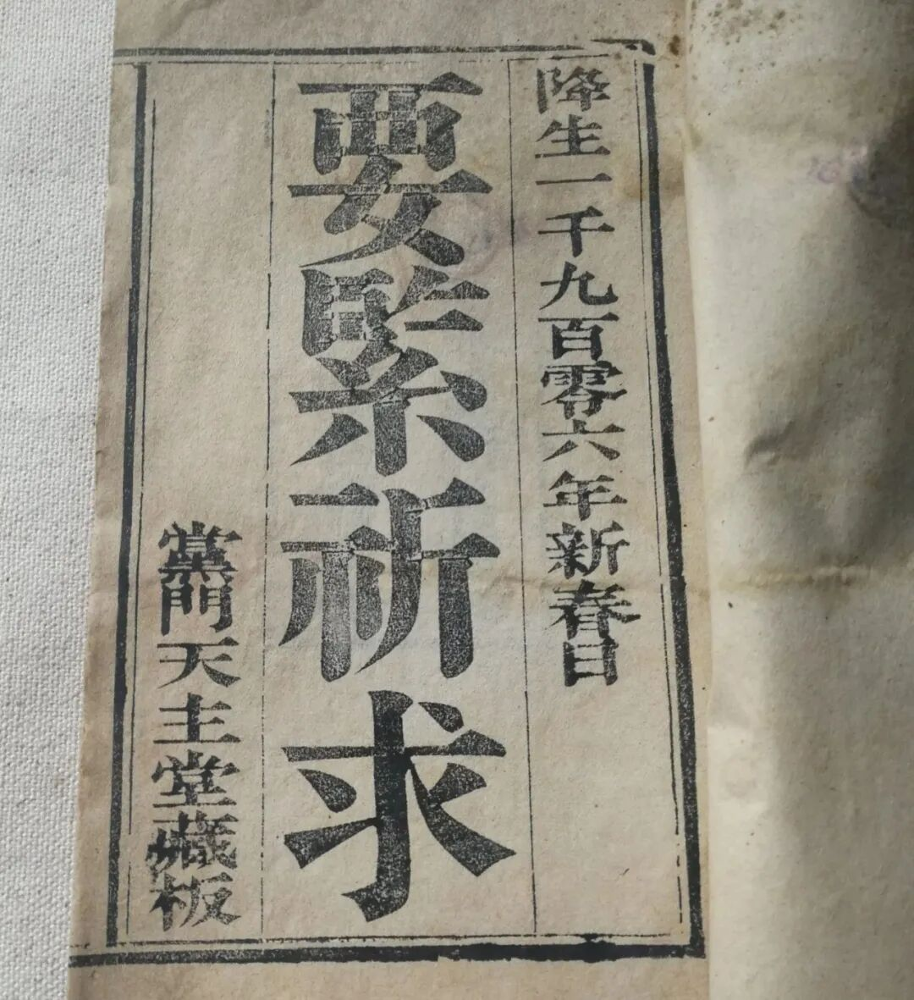
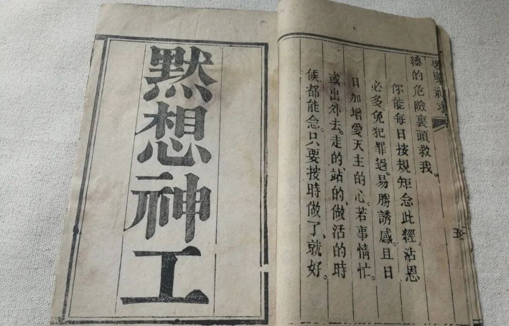
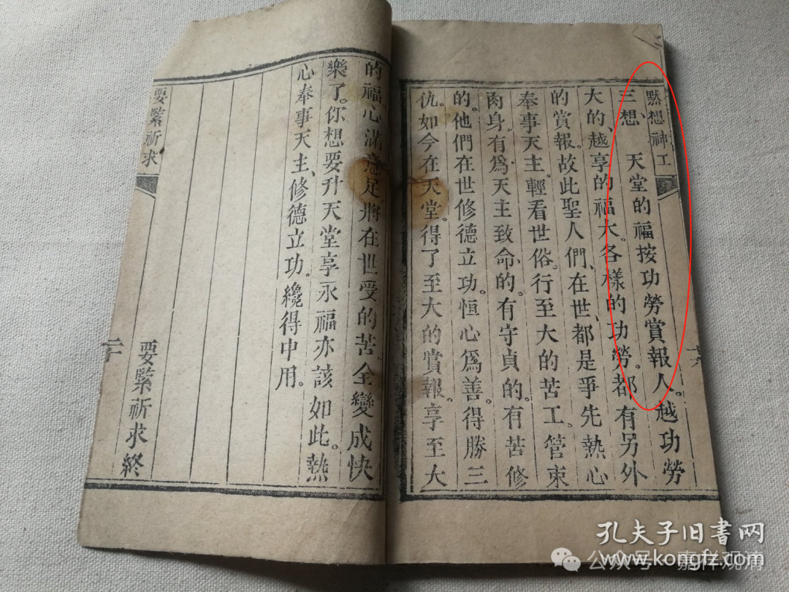

**基督教的“念死无常”也是“三根本”**

《道次第》实践中，有“念死无常”一科，一般分为三个部分观察：1、有情决定死；2、死无定期；3、死时除法之外余皆无益。这三个称为“三根本”，每一个又可以分三，总结起来叫做“三根本九因相”。

这是清光绪三十二年（1906）山西长治“党门天主堂”（属于圣方济各教会）藏版的天主教流通的木刻本《要紧祈求》。

《要紧祈求》后面有一部分教《默想神工》，他解释说，“默想”就是“心里盘算一件事”，这倒是很接地气的说法，大概接近于我们讲的观察修、思维。

最后“瞻礼四”叫“想死”，基本就是我们说的“念死无常”了。他也分三段：

一想：你一定死……这不就是我们说的“有情决定死”吗？

二想：你不知道什么时候死……等于我们说的“死无定期”。

三想：天堂的福按功劳赏报……大致就是基督教版本的“死时除法之外余皆无益”了。

哈哈，正是“太阳底下没有新鲜事”。

所以正统佛教一直强调，无我智慧以外的、泛泛的出离、慈悲是和外道共（通）的，单纯修这些是不能解脱、不能出离轮回的。

《三主要道》说：

** “不具通达实际慧，虽修出离善菩提，**

** 不能断除有根故，应勤通达缘起法。”**

