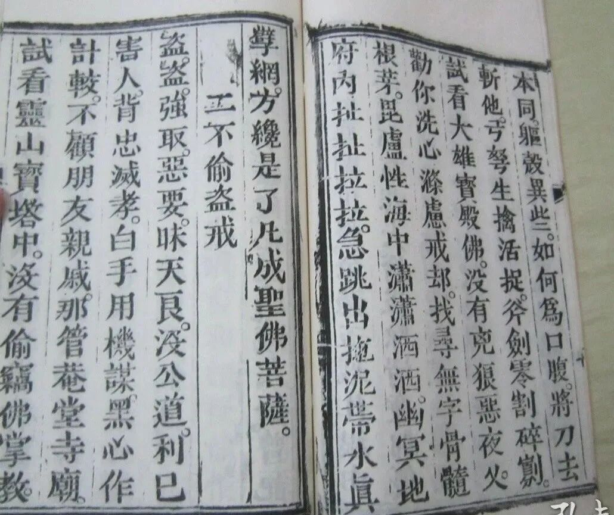

**禅宗与丹道**

接着看《修真指南》。现在到“五戒篇”。

《修真指南》关于“三皈”“五戒”的篇幅很多，可以说反复强调，但基本上连皮毛都没碰到，只能算是借题发挥的打油诗词。

** “一、不杀生戒**

** 杀杀，痛楚疼辣，惹仇恨，结冤家，性体本同，躯壳异些，如何为口腹将刀去斩他，弓弩生擒活捉，斧剑零割碎剐，试看大雄宝殿佛，没有凶狼恶夜叉。劝你洗心涤虑戒却，找寻无字骨髓根芽，毗卢性海中潇潇洒洒，幽冥地府内扯扯拉拉，急跳出拖泥带水真擘网，方才是了凡成圣佛菩萨。**

** 二、不偷盗戒**

** 盗盗，强取恶要，昧天良，没公道，利己害人，背忠灭孝；白手用机谋，黑心作计较，不顾朋友亲戚，哪管庵堂寺庙。试看灵山宝塔中，没有偷窃佛掌教。劝你斩钉截铁戒却，每日勤恳回光返照，坤转乾旋，参玄而入妙，水升火降，龙吟而虎啸，只夺得先天造化归吾手，方显咱袖里机关真个高。”**

清案：

“不杀生”谈的是不杀畜生以解口腹之欲。

“不偷盗”大部分篇幅、内容都在文不对题地谈道教的丹道。

这可能和《阴符经》有关。《阴符经》说“天有五贼，见之者昌。五贼在心，施行于天。”“天地，万物之盗；万物，人之盗；人，万物之盗也。三盗既宜，三才既安……”，一股“道者，盗也”的味道。所以在这里“不偷盗”的时候大谈“不盗之道”，谈“水升火降”“水火既济”，谈“夺天造化”“偷天之机”……在这儿借题发挥呢。

还是前面说的，封建时代中层以下知识分子的宗教知识，“形而上”用佛教的（主要是禅），形而下都在用道教的（主要是内丹术），就是一个杂拌儿。

