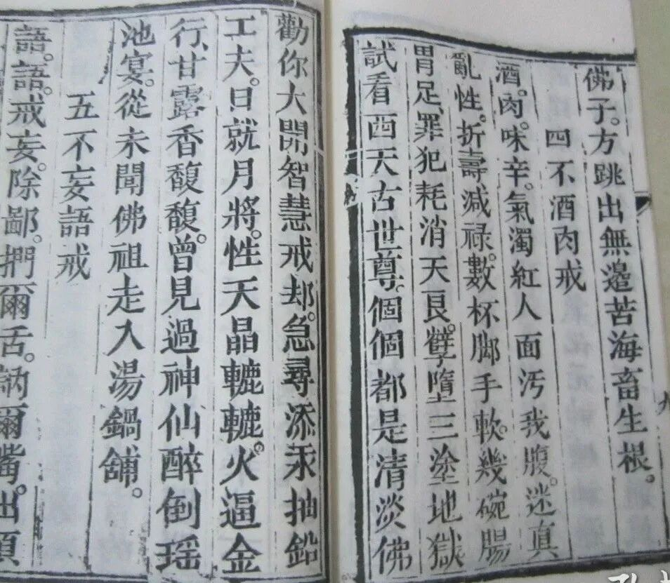
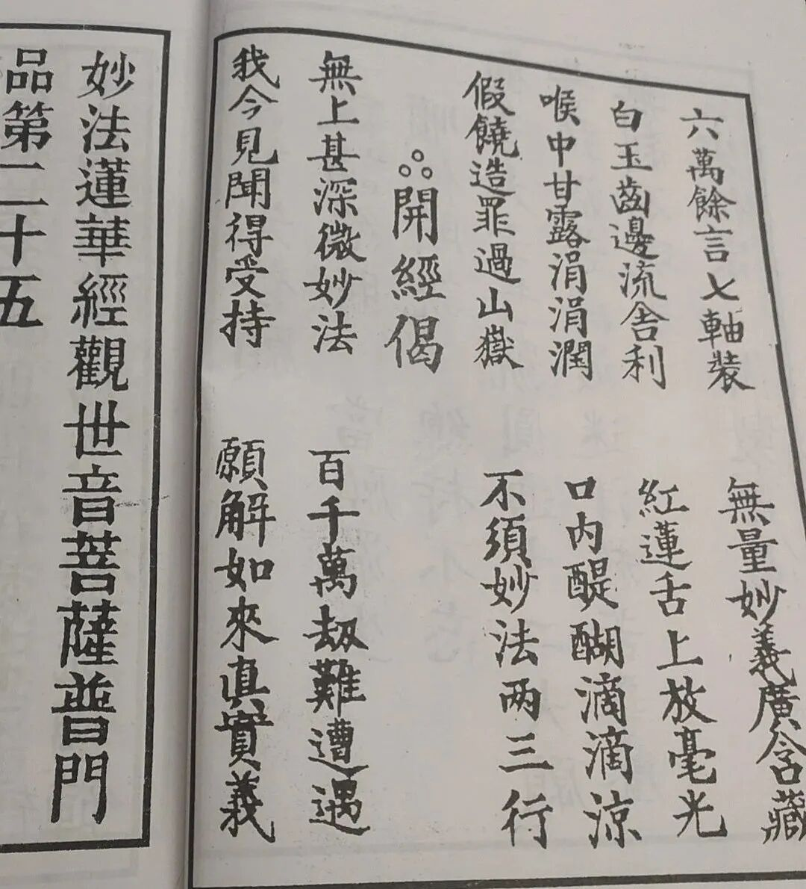

**灭佛的道君皇帝——宋徽宗**

继续读《修真指南》。

现在到五戒部分了。今天一次多放一点。

** “三、不邪淫戒**

** 淫淫，野兽、蠢禽，犯王法，灭人伦，曾记灵山一母生成，本是亲姊妹，如何丧天真。眉来眼去丢丑，言邪语怪偷情，试看灵山大法王，没有奸邪下贱人。劝你斩草除根戒却，急办定光古佛前程，炼精化气，炼气化元神，炼神还虚，炼虚还无生，做一个不漏净通真佛子，方跳出无边苦海畜生根。**

** 四、不酒肉戒**

** 酒肉，味辛气浊，红人面，污我腹，迷真乱性，折寿减禄，数杯脚手软，几碗肠胃足，罪犯耗削天良，孽堕三途地狱，试看西天古世尊，个个都是清淡佛。劝你大开智慧戒却，急寻添汞抽铅工夫，日就月将，天晶辘辘，火逼金行，甘露香馥馥，曾见过神仙醉倒瑶池宴，从未闻佛祖走入汤锅铺。**

** 五、不妄语戒**

** 语语，戒妄除鄙，扪尔舌，讷尔嘴，出须有章，发必中理，御人以口给，说风便成雨，多奸多诈多谎，惹羞惹辱惹耻，试看天外佛菩萨，没有一个妄语的。劝你慎微谨小戒却，每日闭户关门采取，天桥上滴沥沥甘露洗，花池下润涓涓百脉娱，三年九载，酿成舍利金刚，百千万劫永续长生不死。**”

清案：

“灵山一母生成”，这是说大家都是“无生老母”“生”的。“无生老母”是明以后民间宗教著名概念。几乎所有民间宗教都认可这位“大神”。最早应该出自“罗教”“罗祖教”。

“炼精化气，炼气化神，炼神还虚”：这又是丹道派著名的话术。

“不酒肉”，之前说过，佛教的五戒中的“不饮酒”，民间则说的是“不酒肉”，这是“自下而上”的影响到中国佛教道德实践的，已经成为一个凌驾于正统佛教之上的“社会共识”了。前两天还看到有人在网上晒出南传僧侣吃肉的照片，然后帖主和跟贴的都一众谩骂……没办法。我曾经检讨过，我对其他专业的认识也是随大流的，我肯定不会去看《唐山大地震》《一九四二》，但是会去追《非诚勿扰》……抛开专业，我也是群氓之一。

今天摘出的这一段，我有些地方用了红字，这是因为，这些字都是有来历的。他们出自民间传说的宋徽宗的御制诗《莲花经赞》：

“** 六万余言七轴装，无边妙义内含藏。**

** 溢心甘露时时润，灌顶醍醐滴滴凉。**

** 白玉齿边流舍利，红莲舌上放毫光。**

** 假饶造罪如山岳，只消妙法两三行。**”

很明显看出上述《修真指南·五戒》里的文字收到这首诗赞的影响。

民间认为这《莲花经赞》是《妙法莲华经赞》，这应该是张冠李戴了。宋徽宗是一个崇道灭佛的皇帝，他不可能去赞《法华经》，而这首诗赞的内容也明显是在谈道教。

        修改于