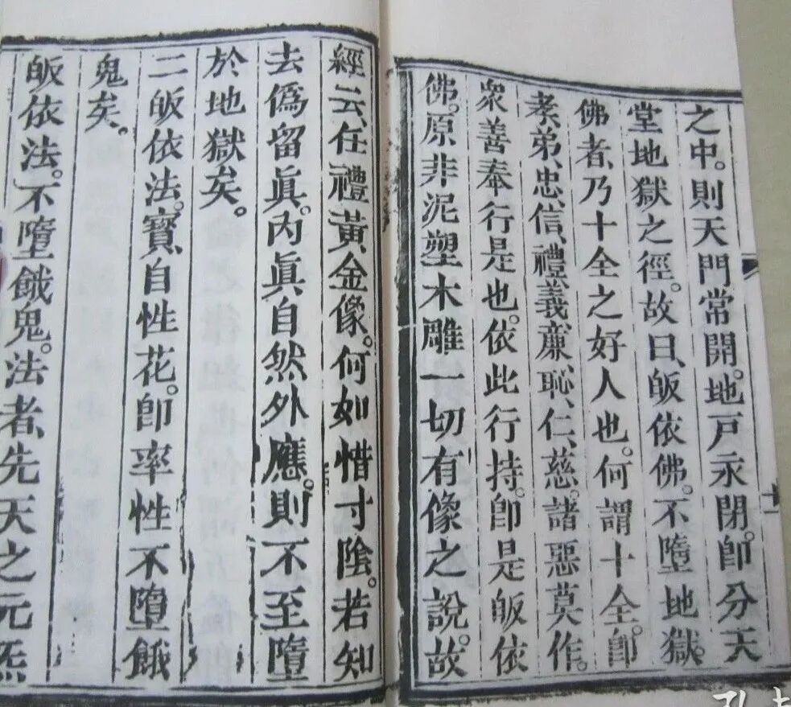

**任礼黄金像，何如惜寸阴**

继续解读《修真指南》。也不多了，我们把它读完吧。（说起来，古人还是简单啊，三千字就能出版一本书了，这不就是一篇大作文吗？）

“** 三皈真解**

** 一、皈依佛宝自性珠，即天命不堕地狱矣。**

** 皈依佛，不堕地狱。佛者，先天之元神，自性真汞是也。能安元神于祖窍之中，则天门常开，地户永闭，即分天堂地狱之径，故曰‘皈依佛不堕地狱’。**

** 佛者，乃十全之好人也。何谓十全？即孝、悌、忠、信、礼、义、廉、耻、仁、慈，诸恶莫作，众善奉行是也。依此行持，即是皈依佛。原非泥塑木雕一切有相之说，故经云：‘任礼黄金像，何如惜寸阴’。若知去伪留真，内真自然外应，则不致堕于地狱矣。**”

清案：

这是第二遍谈三皈依了。下面五戒也要重复谈一遍。按我师父中期辩论的结果，那只要承认三皈依随一就算是佛教徒了。不过实际“活着的”宗教市场没有那么一刀切地“了了分明”。

“皈依佛不堕地狱，皈依法不堕恶鬼，皈依僧不堕畜生”，这又是汉传经忏仪轨里的常见句型，原是泛泛而谈，这里被“落实”了——这一段“皈依佛”就是依此展开的。

这里对“佛”的认识就是“元阳”，假如再结合今天的“西式中医”推理下去，那“佛”就变成“激素”了。“先天元神”“自性真汞”“祖窍”“天门”还是内丹术的丹道概念。

“任礼黄金像，何如惜寸阴”在正统的佛教经典里并没有出现过，估计又是民间经典里的了。

