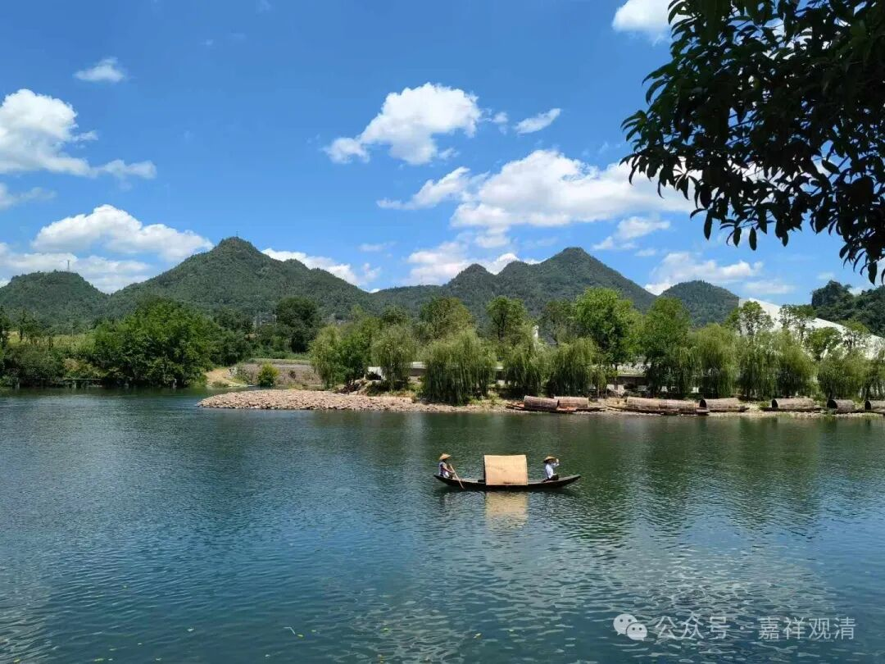

**《宗义略讲》005·012**

那么我们现在讲的经部呢，是以汉传文献来谈一谈，至少是印度佛教早中期的说法，至于藏传的后期“他们所认为的经部”，我们待会再聊。

我们还是把它翻回宗义书的背景，这里定义讲，经部师“** 是许自证分且许外境实有的小乘说宗义师**”。其实在这里“外境实有”是不需要加的，因为按宗义书的理解，“** 承许自证分的小乘说宗义师**”就足以指向经部师了。

那么接下来，历史上的经部师是不是一定许自证分呢？至少在汉传的经部当中没有看到谈到关于自证分的问题（如果大家看到可以告诉我，谢谢！）。实际上经部呢，如果说有部的观点是承认一切法蕴处界实有的话，经部最重要的就是，首先不承认三世实有，过去未来是假的，现在是实有，那么我们不妨可以说，“** 承许现在十八界实有的说宗义师。**”

有部是讲一切所知是摄为五事的，心法，心所法，色法，不相应行法，无为法，经部则认为心、心所不是别异的独立存在，他认为一切法摄为四：心法、色法、不相应行法、无为法。

其实经部和有部的差异处挺多的，比如《成实论》认可的五蕴次序是“色、识、想、受、行”，但这个不是经部非常核心的观点，我们就不多说了。我们第一次这么（脱稿）说也不知道从哪里讲起，我们先试着聊聊看吧……

首先色法，我们一个个来。

有部认为色法分析到最小，极微，地水火风；经部（《成实论》）认为不是，成实论主认为地水火风是假法，地水火风还可以再分，地水火风是由什么所造？地水火风还有它的性质，拿今天来讲叫性质，还有它的部分，什么部分呢？叫色香味触，他的意思就是，只要你有物质，我们上次所讲，就是“八事所成”，实际上它找出佛讲的这些东西，“色法，就有坚湿暖动，就有地水火风，它里面也有色香味触，加上声音是碰击的，单独的声音呢它是不在这里讲的”，其他的数论派也是这样的，它讲极微也是色香味触，因为声音是没有的，声音是两个碰到一起的。

由于成实论主说物质的最小单位是色、香、味、触，所以有人说经部的、诃梨跋摩这个说法呢，是和数论是一样的，说他受到外道的影响——这在当时的历史环境下是一种非常负面的评价，今天来说倒也很中性，但当是不是。

其实不应该这么解读。

我带着点“同情”去“理解”它，他这里只是想说地水火风不是终极形态的存在，地水火风也要依其他条件而存在——色香味触……后面我们讲经部二谛的时候我们就会发现，《成实论》的二谛说和中观非常的接近，也就是说他认为“地水火风不是独立的实体的存在，假如地水火风存在的话，它也必须是假法的存在，也必须依赖于条件，比如说色香味触”——我觉得从这个角度来说就比较容易理解狮子铠的意思。

