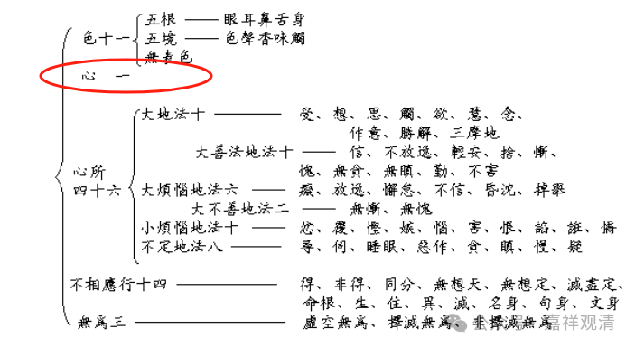
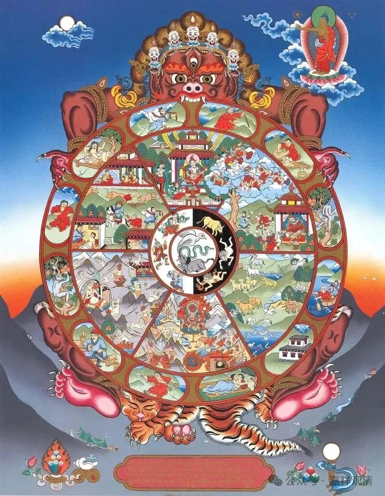
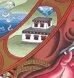

**《宗义建立》005·014**

那么接下去谈谈经部师说的心法，就是有部说的“心王”和“心所”，但是从有部譬喻师来就有一个说法，叫“心所即心”，那么，在心所的建立上，经部和有部就很不一样了。经部师的心所就是“心所即心”，说心所就是心的前后差别。另外经部认为一刹那不可能有多个心，只能有一个心，只是心的前后差别，表现为不同的心所而已，心所是心的表现，一个阶段一个阶段的表现——这种说法我觉得我蛮能接受的。

如果要说的话，心只有一个，《俱舍论》也说心只有一个，一个心，但是唯识又好像把这些称为一心师，也就是只承认只有一个心的，在某些说法当中唯识师好像把“一心师”称为外道的，唯识好像有这个说法，反正俱舍论当中至少是谈到只有一个心的，经部也是谈到一个心的。

我们应该还记得这样一个唐卡，那个无常大鬼，十二因缘唐卡。

这个当中，第五个，是六入、六处。“六入”的表现。是一个房子，有六个窗（这幅唐卡上特别明显，就是六扇窗），意思是，在房间里面还有一个人，一个人通过六扇窗来认识外在的世界。比喻结合事情合起来说的话，那就是一个心通过眼、耳、鼻、舌、身、意来认识外在世界……这种解读，基本上大致还原了“一识师”的观点，“一识师”的意思是，实际上只有一个识，或者一个心，通过六扇窗（眼、耳、鼻、舌、身、意）来观察外面的世界……

也就是说，西藏的这个唐卡当中，它其实隐藏着一识师的观点，很明显啊，中间有一个人外面有六个窗，他把眼、耳、鼻、舌、身、意当做观察外界的六个窗口，而不是独立的有六个人，或者六个识，所以这幅图可以解读为不是大乘，或者六识师，或者八识师的观点，经典当中叫一意识师，只承认有一个意识。

我觉得也挺好，省的啰嗦。一意识师，挺简单的。

说明一意识师的很多观点有意无意的流传下来了，那个图就很明显的可以解读为是一意识师的图。

这个图，有时候表现为五趣，有时候表现为六趣；“五趣”小乘说的比较多，“六趣”大乘说的比较多……这些图有时候去观察观察还是有点背景的。

