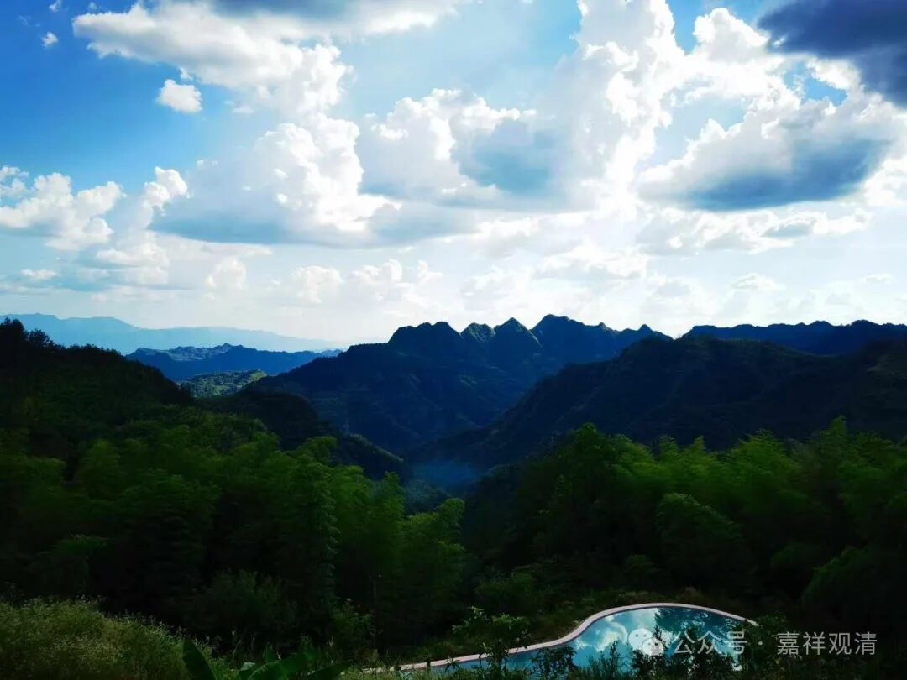
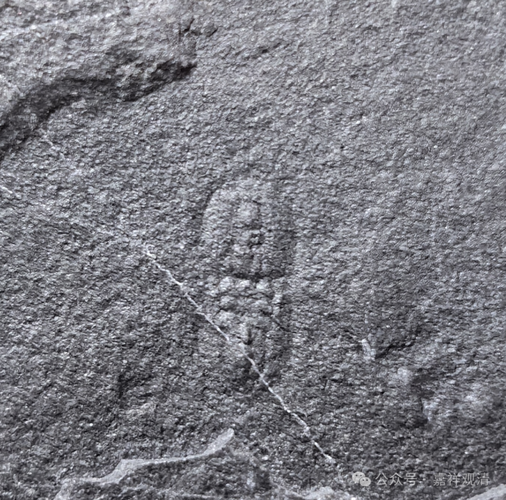
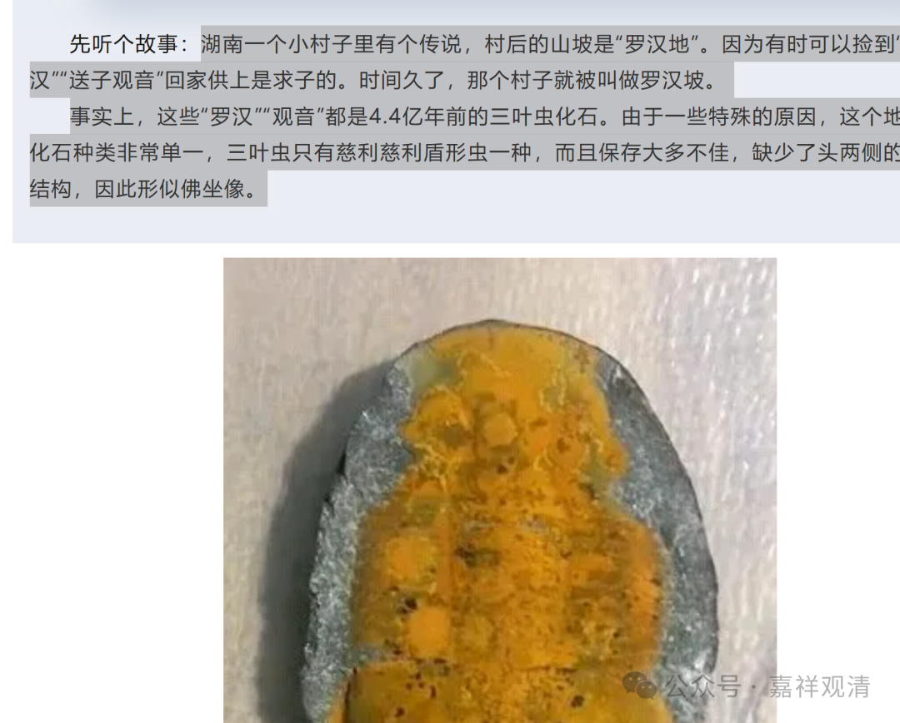
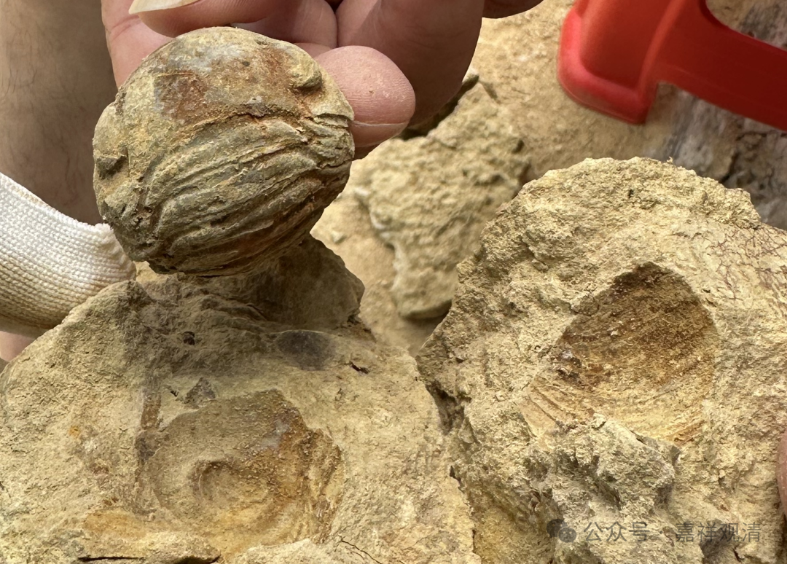
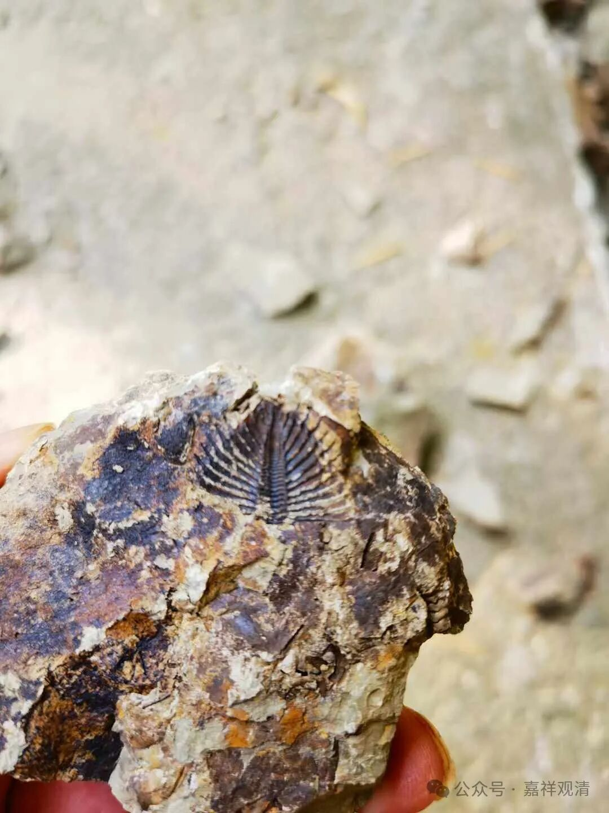
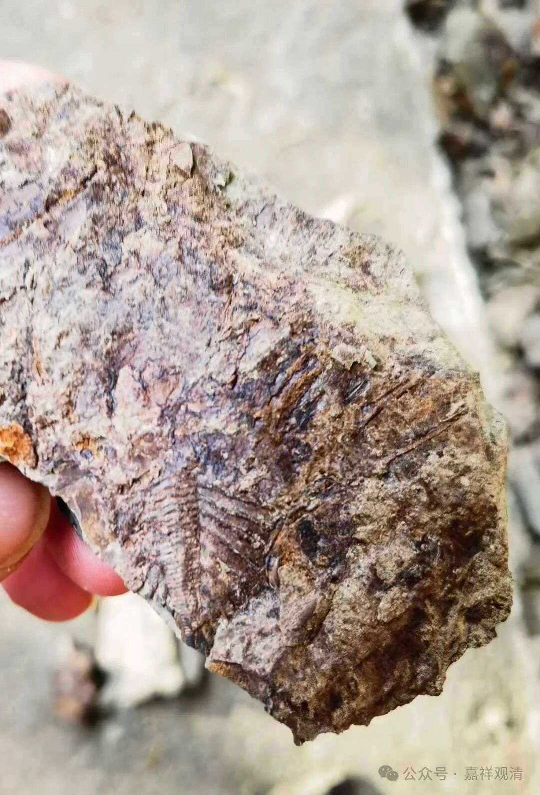
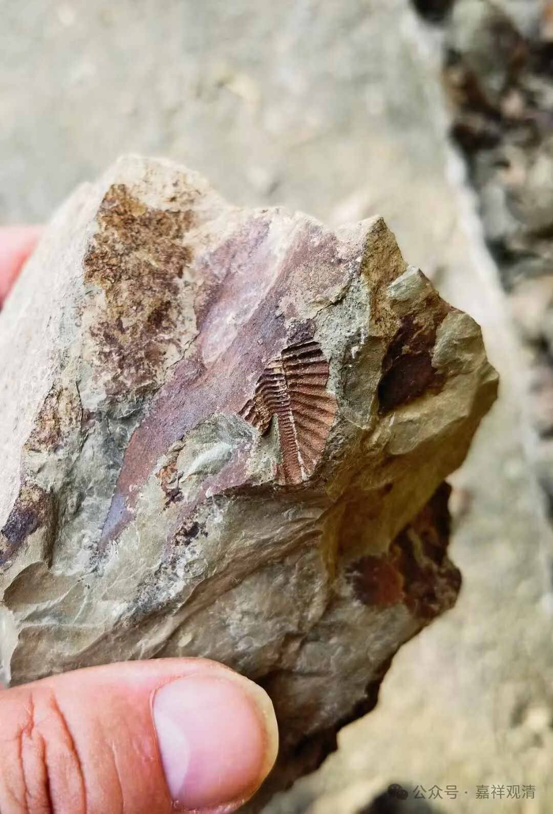
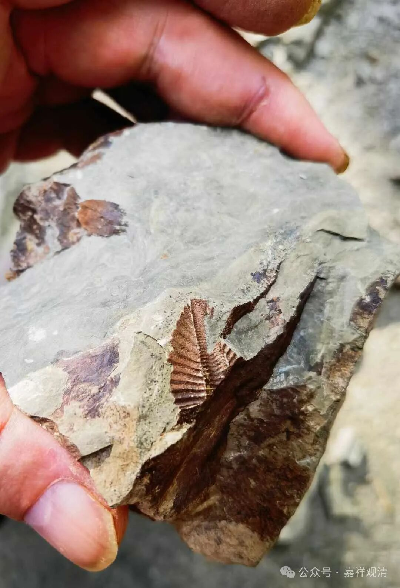
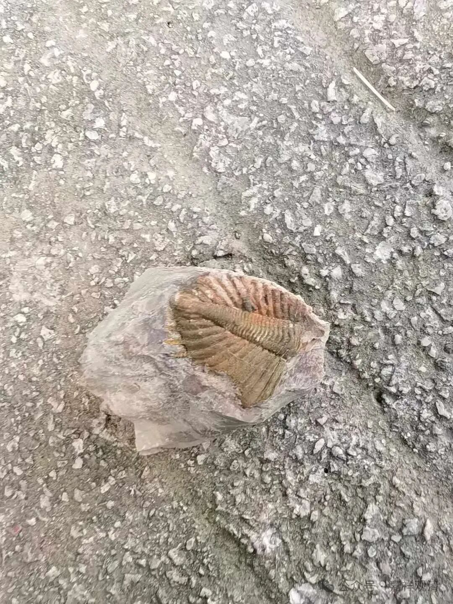

**化石——观音还是地狱**

龙老师把我拉到了三叶虫群，我的微信瞬间收到13个好友申请……哈哈，跨界到化石圈的和尚，压力好大。

有人发了这个——

还真有点像佛像的样子。

据说当地人把慈利慈利盾形虫被当作观音、罗汉。

LOOK——

昨天还有个朋友给我发他们在贵州挖的——

甚至可以直接把三叶虫化石完整剥离出来。这要是在古代，人们可以认为是“石头里蹦出个虫子”。

佛教里面有地狱一说，地狱有八寒、八热、近边、独孤地狱，总称十八地狱。对于独孤地狱，历史上有些法师就解释为“（有人发现）石头里的青蛙”“石头里的虫子”之类的，我现在认为，他们说的看样子就是化石了，只是古人没有相关的化石知识，而附会为独孤地狱了。

下午住的宾馆在山上，上山的路上，也能随手在路边掏出三叶虫化石，不过这里的石头太松、太碎，手都可以轻松掰碎，所以掏出来的都是些碎片……随便拍了点照片留念，就不带回去了。

这些都属于是王冠虫。

