**慈利江垭九溪卫**

上午爬了张家界（其实是坐的索道上山），下午去了江垭九溪卫。

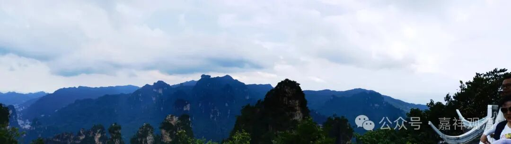

江垭九溪卫在慈利，昨天我们还提到了慈利的三叶虫——慈利慈利盾形虫Ciliscutellum ciliensis。湖南的古生物的遗存真是多啊，我们不禁感叹上海周围要是有这么丰富的化石库，那些高校早就把这门学科“打上去”了。

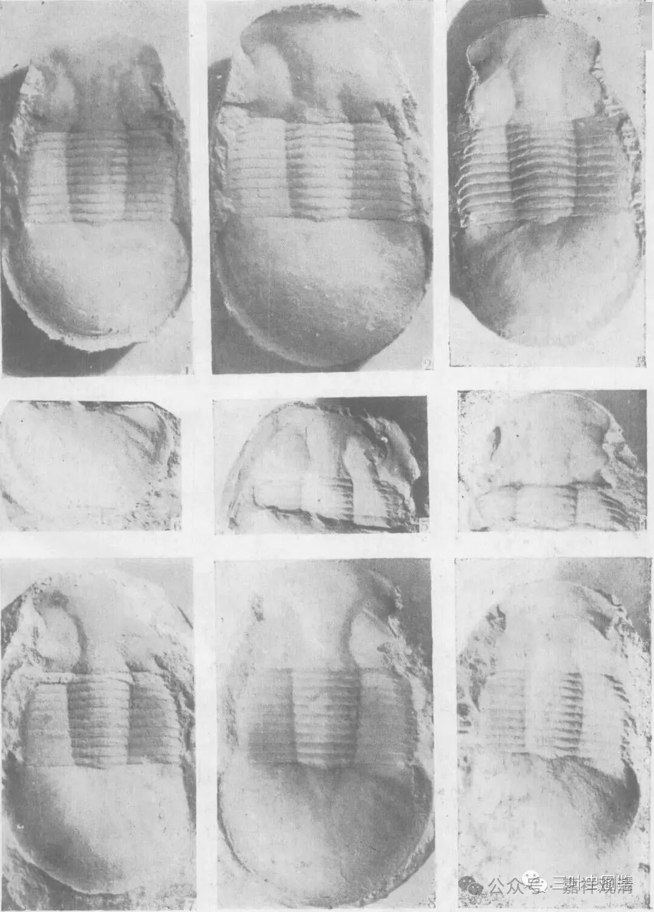

九溪，就是喝堡溪、索溪、输赢溪、斗溪、仁石溪、张马溪、冷水溪、野牛溪、湖鲁溪的合称。明初，由于此地土司数反，为长久实际控制这一地区，遂设九溪卫。卫是明代军事编制，一卫5600人，下设五所，五千户，每所领1120人。清代改土归流成功后，遂废九溪卫所。

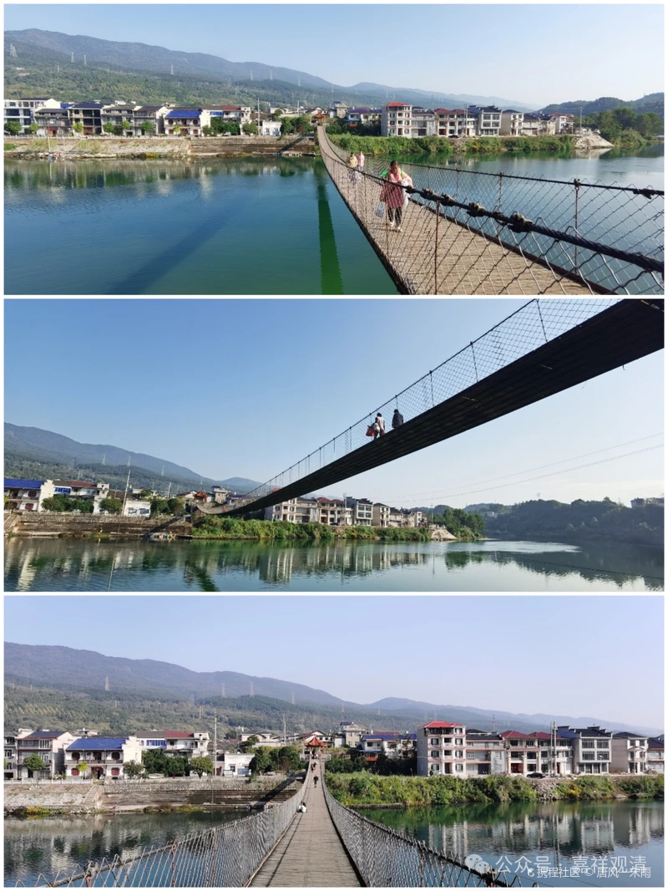

去九溪卫的路上，先得过一个索桥。

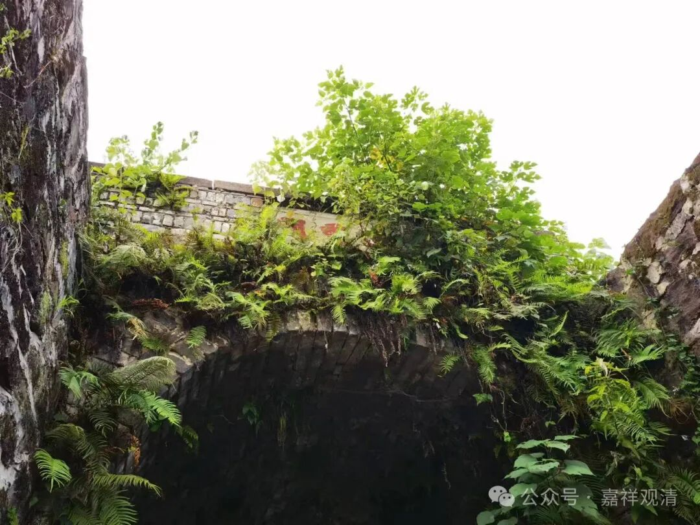

这是古城墙的南门，字迹被杂草遮住了，闪转腾挪地读了半天，读出来叫“迎熏门”。

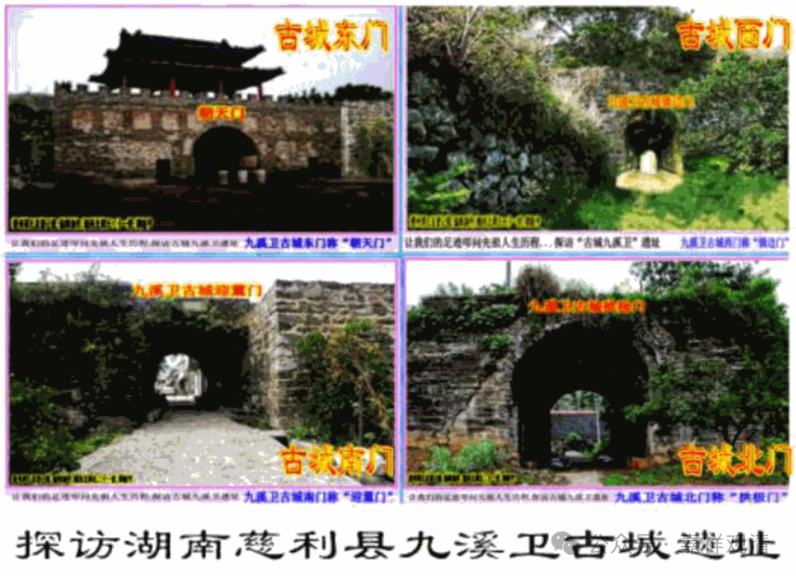

卫所四门分别是：东“朝天门”，南“迎薰门”，北“拱极门”，西“定边门”。

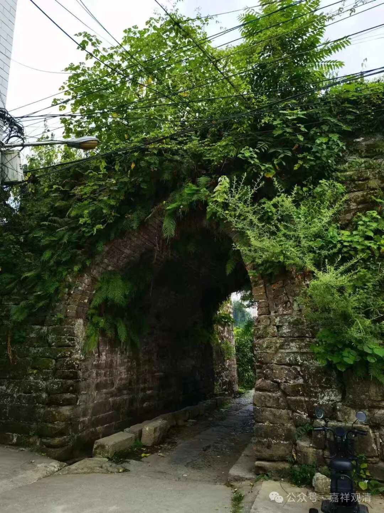

迎熏门另一侧

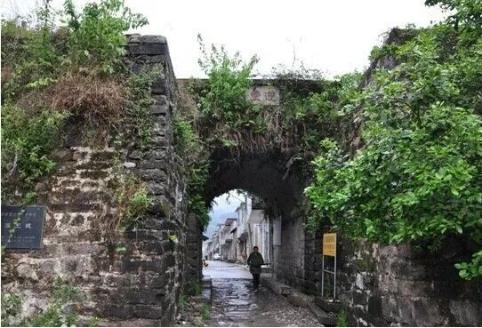

这是网上的照片，前几年拍的，字迹还比较清楚。

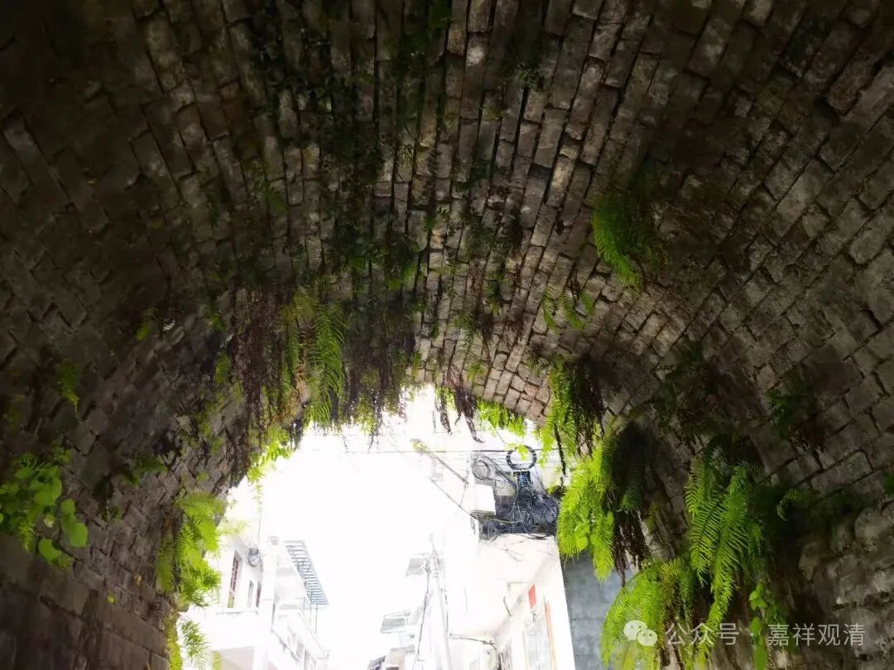

城门洞

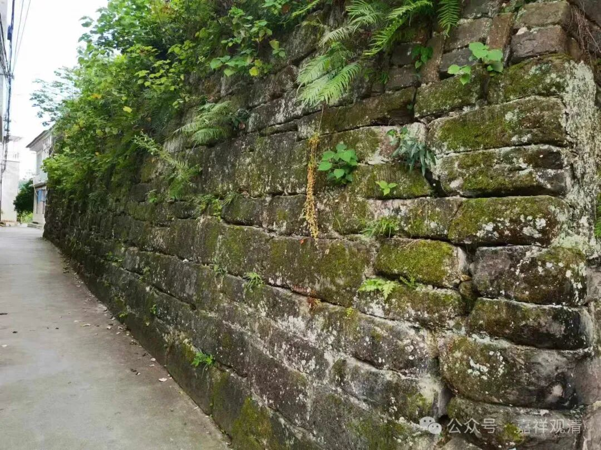

老城墙

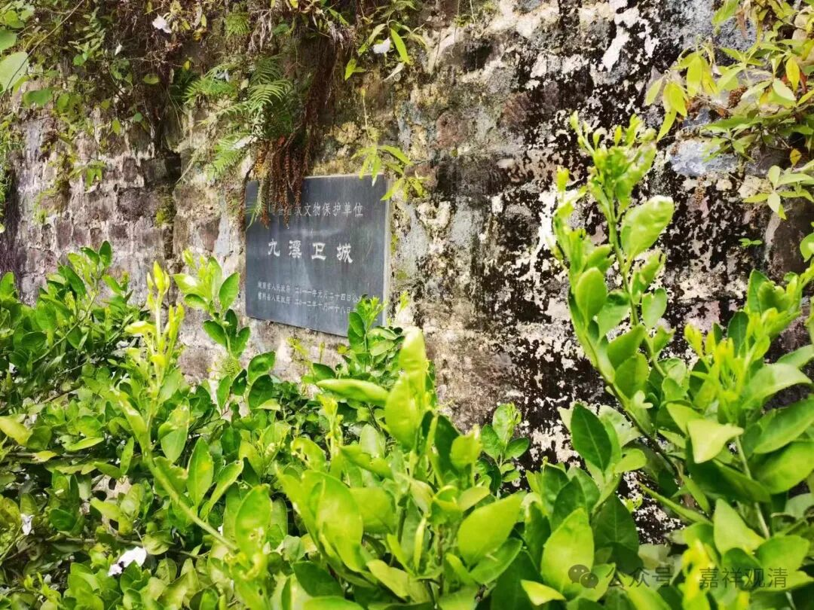

城墙上挂牌，二零一一年被授予省级文保单位。

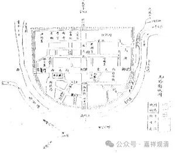

由于是个卫所，所以基本的类似“县城架构”以前是完整的。以前去几个古城，都有很多宗教建筑，九溪卫也是，计有：兴国寺、城隍庙、白衣庵、杨泗庙、文庙、武庙、玉皇阁、山川社稷庙、火神庙、马王庙、奎圣庙、万寿宫、宫王庙、接官亭、五童庙、王爷庙等，现在多半不存，有些仅有遗迹，最大的兴国寺现在是慈利二中，现在放假，也没法进去看了。

