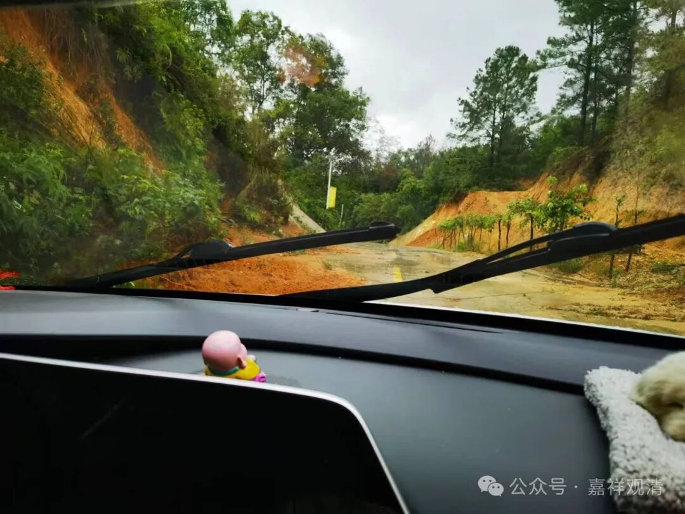

**好事多磨……**

从张家界去潮州，只有一个红眼航班是直达的，晚上两点到。果断放弃，找到有个高铁，时间上稍微还好一点，下午两点出发，晚上十点半到潮州。就坐这班了！

出发前潮州那边就说有很大的台风，我还没当回事，后来发现，影响确实很大。

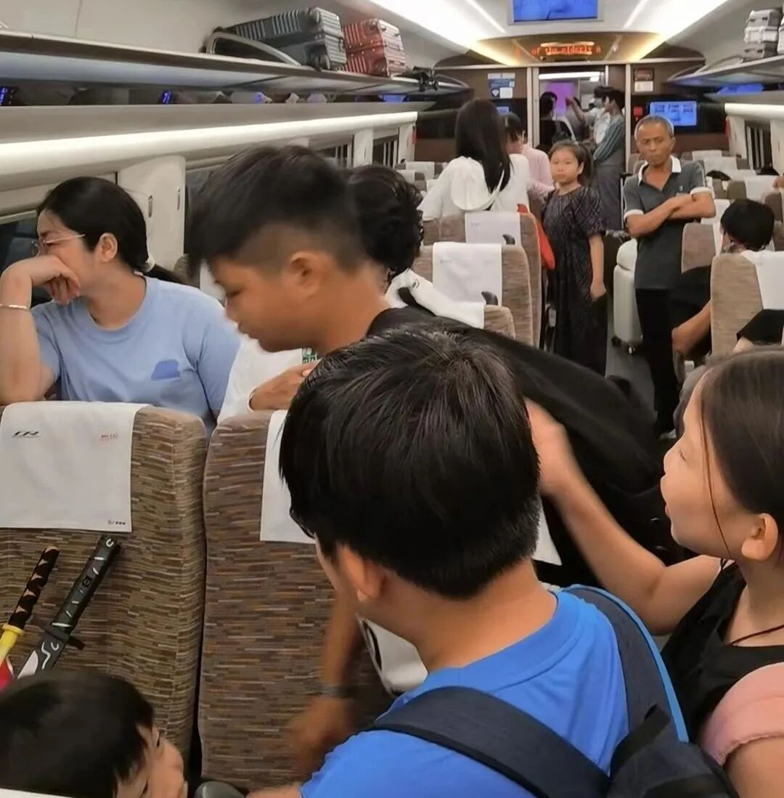

车子一直开到广州，路上潮州人打来电话，说潮州古城已经积水+停电……然后在广州东站临时停车，停了大概有一个小时吧，广播通知说，我们车次停运了……

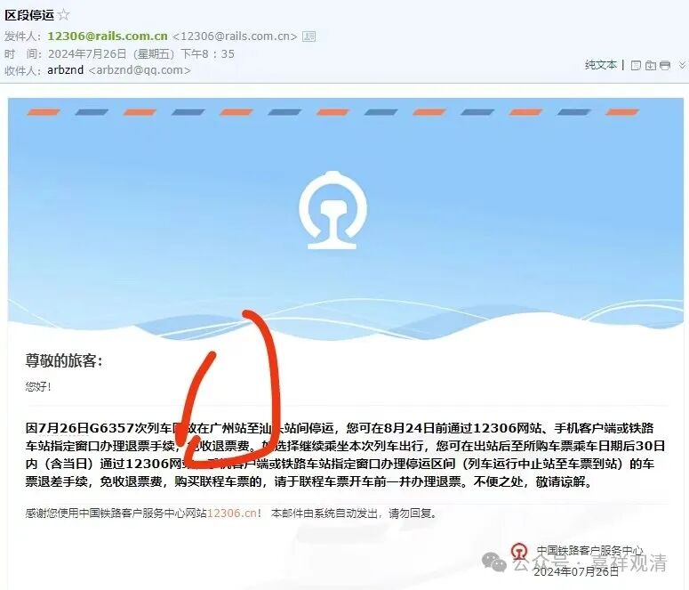

呃……

倒下去一车人……排队出站——因为半路出来，广州东站因为不是本次列车应该停靠的站点，所以我们的身份证刷不了票，得人工出站……再都挤去几个窗口退票……折腾……最后打车也排队。我听到车上的对讲机里说，“广州东站大量滞留，附近的车辆请赶去支援”——这时候离我下车都一个小时了。

恰好有几个法师也在广州，果断让他们给我订了他们住的酒店，我这儿打车过去……折腾到酒店住下，已经十点半了。第二天能不能赶到潮州，？还不知道怎么办呢（因为第二天下午学生毕业答辩，我是主持人，要到场）。

十一点多了吧，学院那里说给我买了第二天的票。“还能正点吗？”

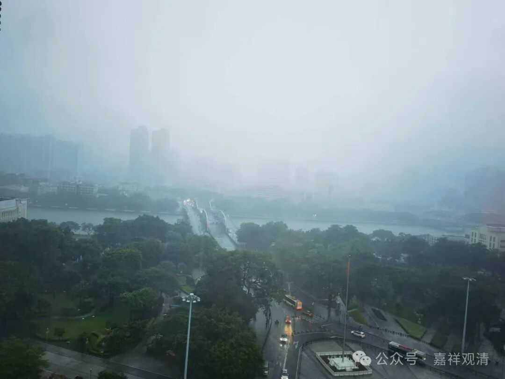

第二天，广州仍旧暴雨。淋了半身的我终于上了准点出发的车——大屏幕显示，大概有三分之一的列车停运。

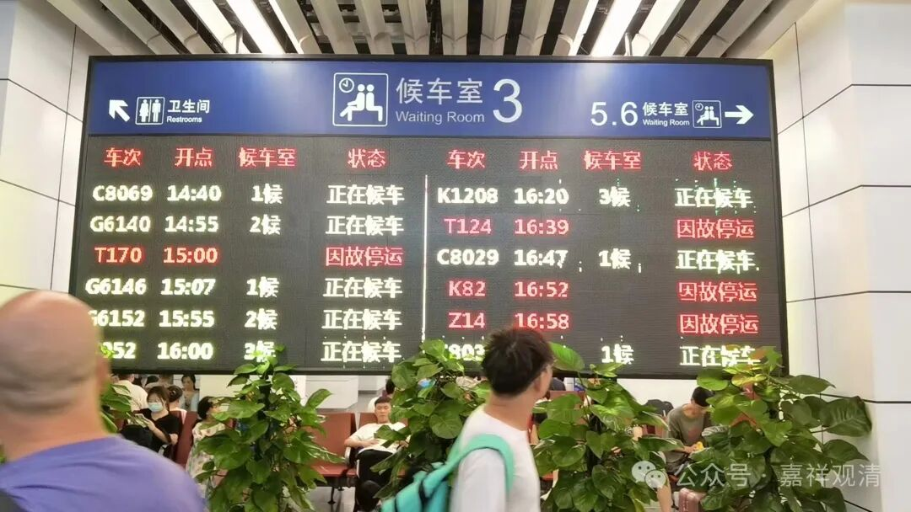

幸运地，车准点到了潮汕（但是这列车不去原来的目的地汕头了）。我上了一辆出租车……

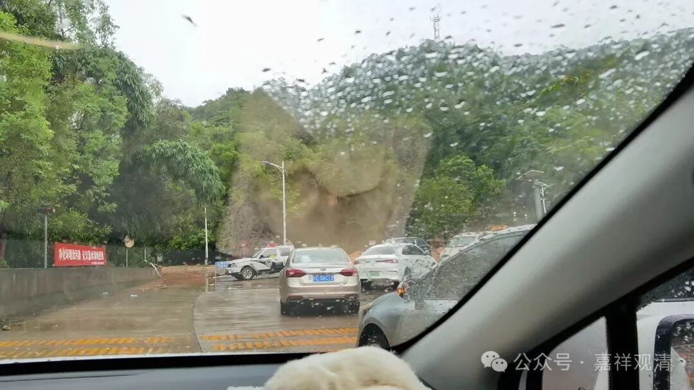

结果，离寺院二十公里的时候，前面一辆警车横在路中间——前方路基垮了。

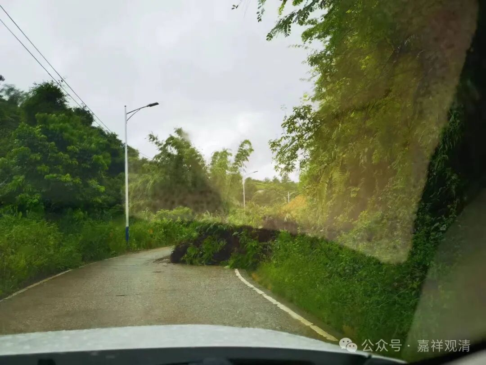

果断换一条路走……又塌方了……

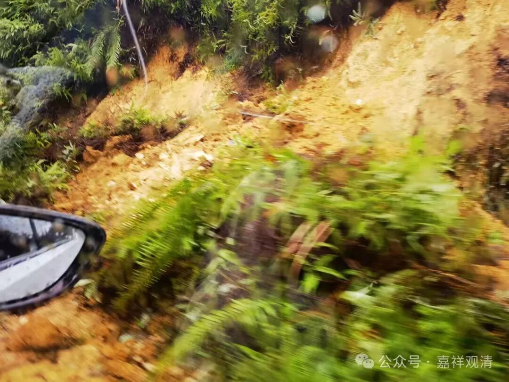

再换一条路，还是塌方……

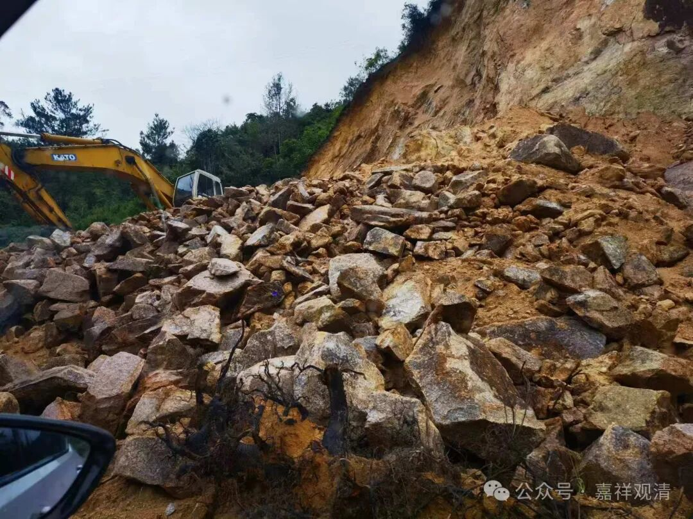

最后绕到凤凰再去丰顺，这条路虽然也有塌方，但是不严重，总算又绕了两个小时以后，下午5点赶到了惠仁圣寺。

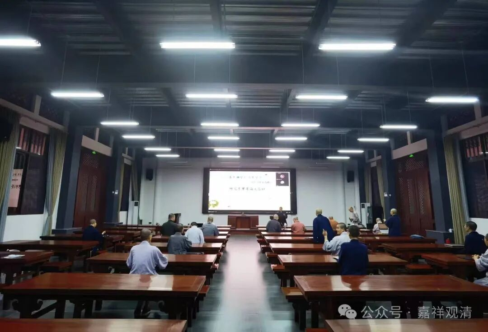

晚上六点半夜里答辩……他们说因为是夜里问难，应该叫“夜问”。

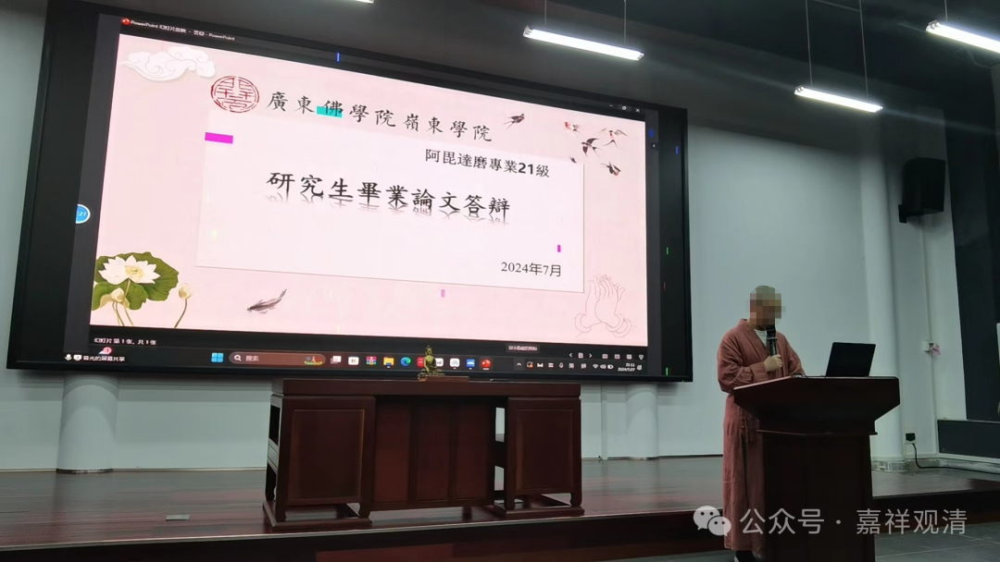

打了腹稿的开场白也都不用了，“我们直接切入主题——岭东佛学院2021级阿毗达磨班毕业答辩现在开始……”

