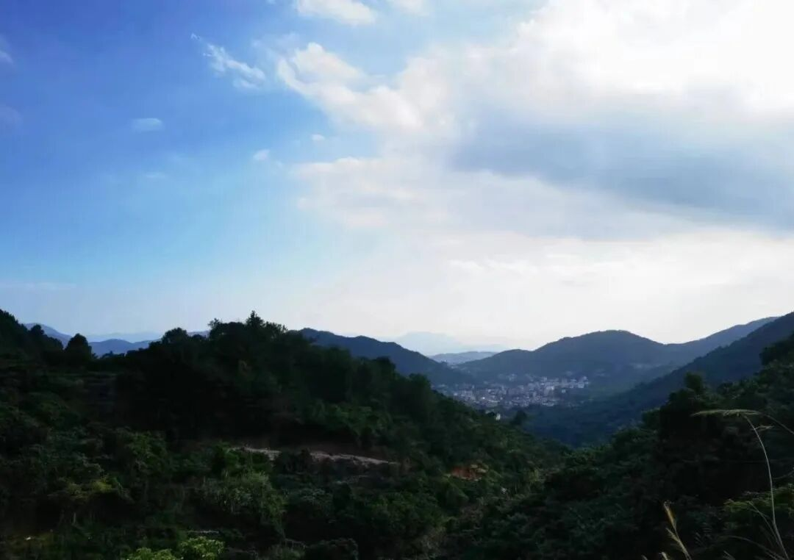
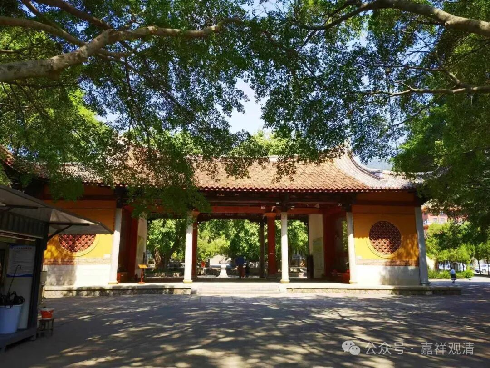
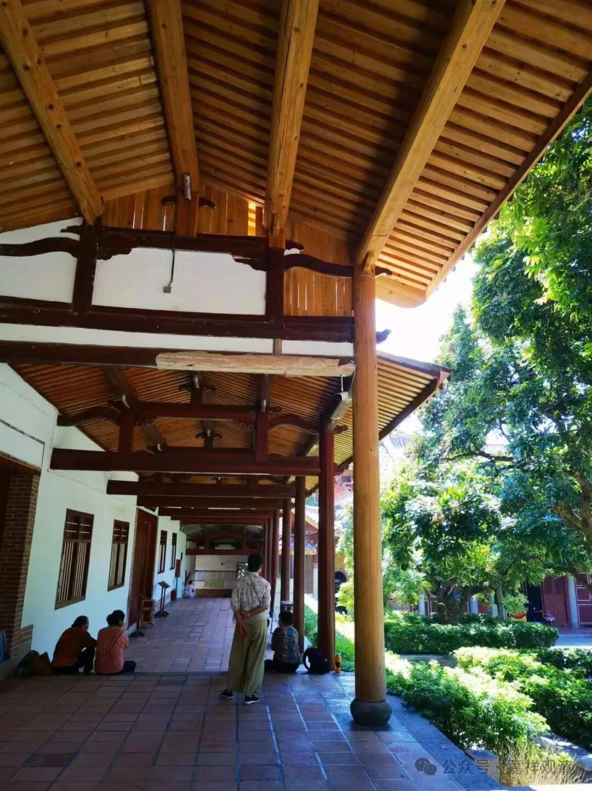
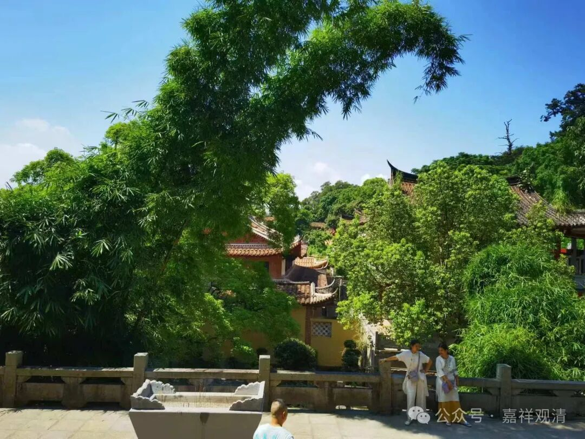
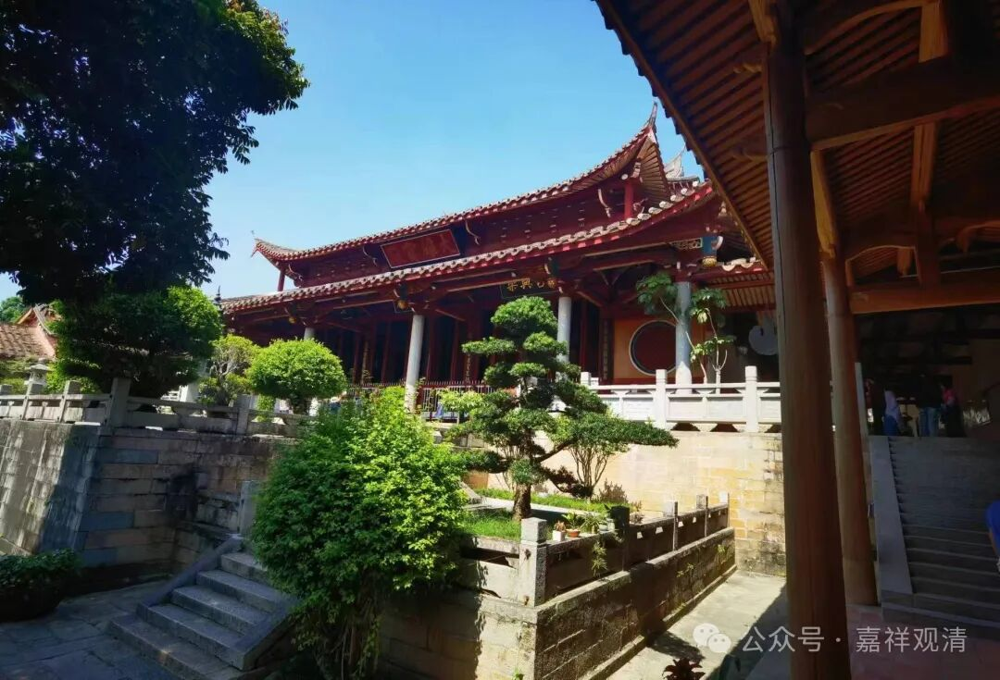
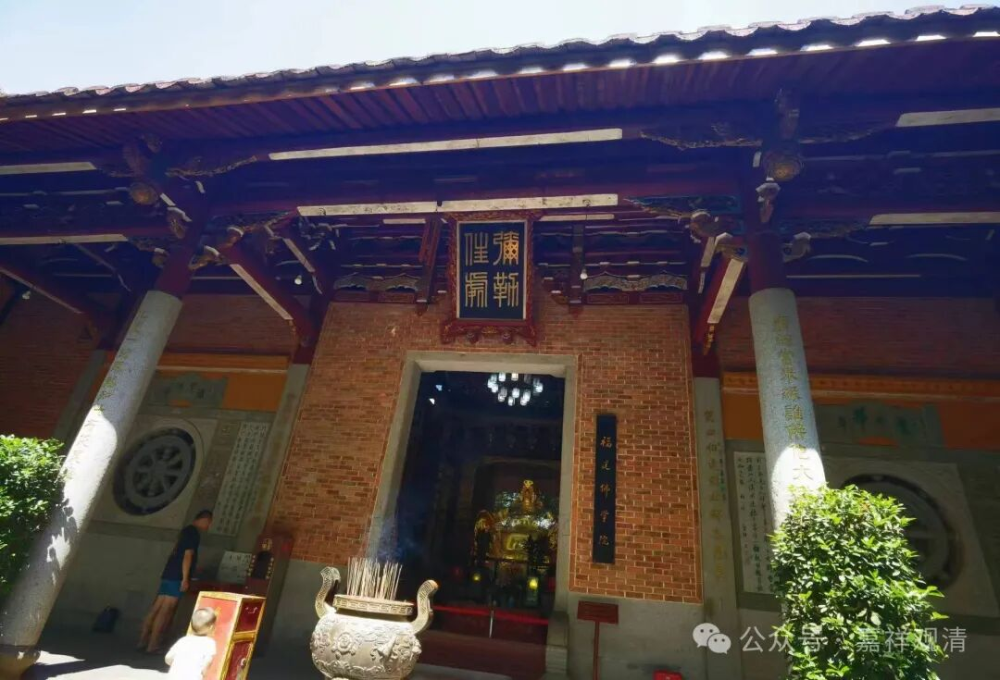
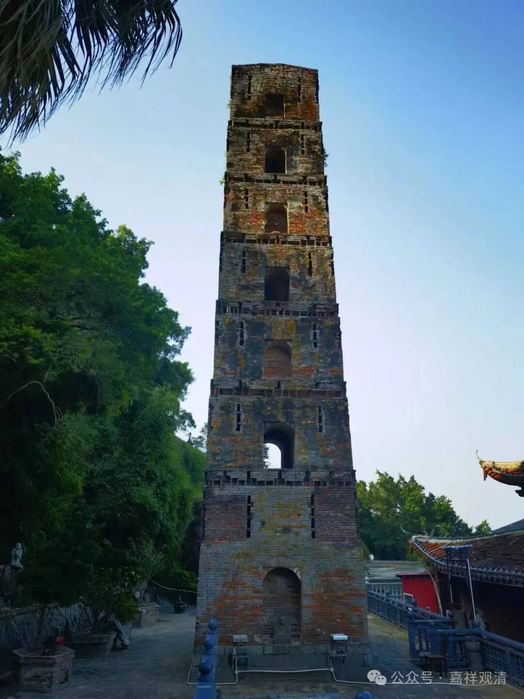
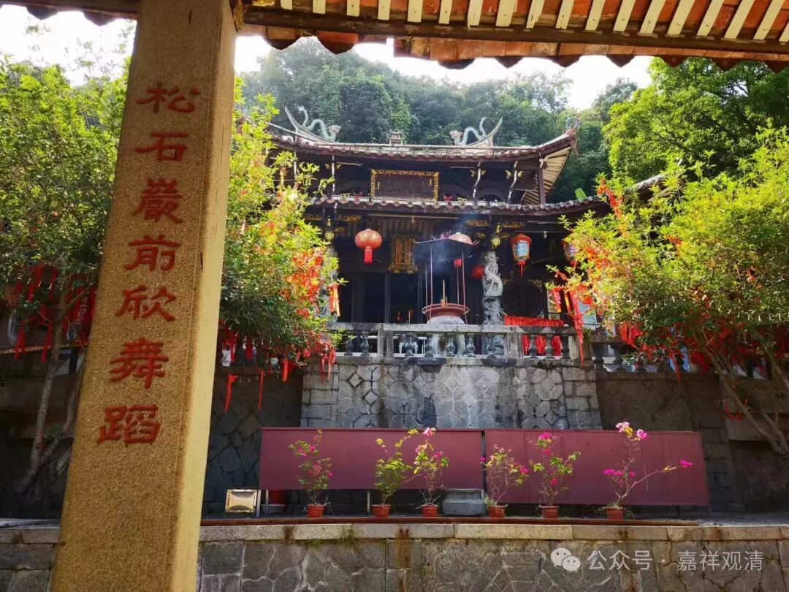
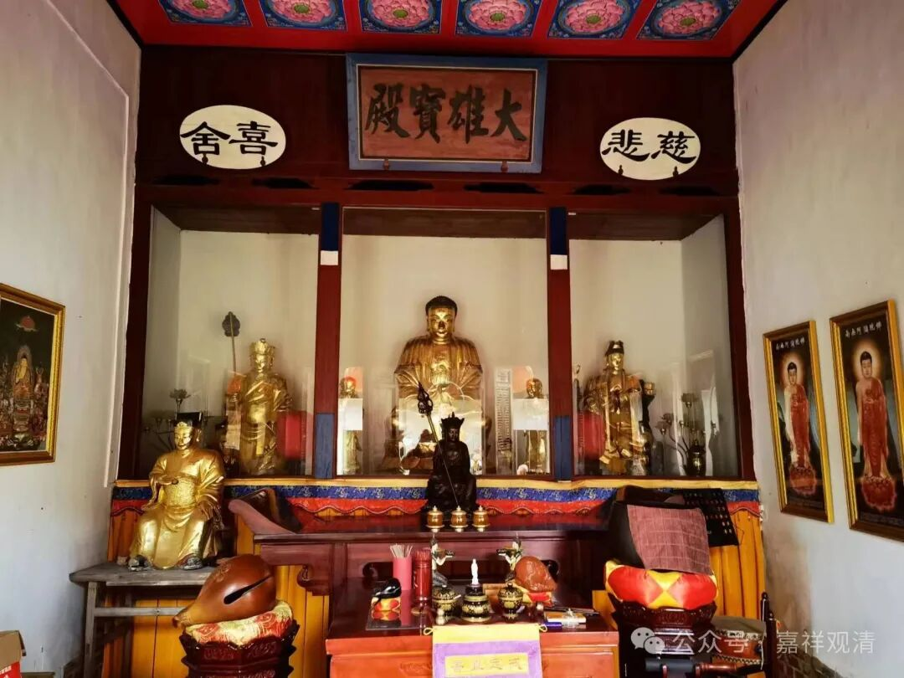
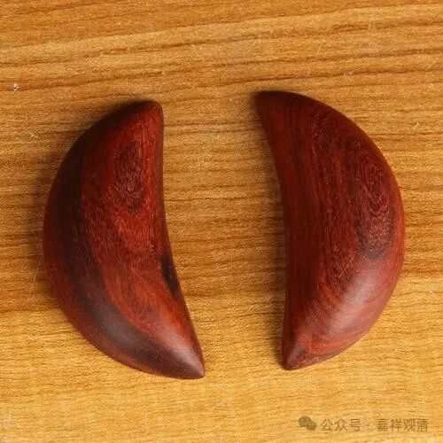

**“观音刚才不在家”**

福建的小庙真是遍地都是。

今天来到莆田市区，先去了广化寺。我一直以为广化寺在山上，没想到原来在市区。

寺院、佛学院历代领导的介绍里，感觉像是少了哪个

匆匆，赶去不远处的石室岩寺，佛协的常务副会长老和尚在等我们过去一起用斋，真是太客气了。

上山的路牌，看，一个山有六个寺院……但实际上可能得加个倍，可能还不止。老和尚说，莆田市辖区内寺院大概有1200多座，有宗教场所证的有五百，其他各类宗教点、民间宗教活动场所有700多，还有很多下院之类的，一个村子三个庙的也很常见。

寺院、村庙（包括民间宗教）这类的名字也是五花八门，有叫“寺”“岩”“宫”“所”“堂”“殿”……的。

有个尼师在村里守着个小庙，叫“观音堂”，她决定改名，叫“观音寺”，当地理事会会长（因为捐款几十万在村里修了一条路，就做了村里理事会的会长）死活不同意（福建的村庙，理事会有很大话语权）。说要到观音（像）面前打个“杯”，就是丢一个“茭杯”，说要观音同意了才可以改名。

打杯出来，“不允”！

尼师突发奇想，说不算，说刚才观音不在家，我念个经请回来，再打一个！老会长就再丢了一次茭杯（又叫告子、茭贝），结果，“允”！

老会长只能同意。所以现在寺院就叫“观音寺”了。

尼师说，后来就不行了，她再用这个套路，说“观音不在家”，人家也不理她了，说“反正就一次”……哈哈，老会长学乖了。

