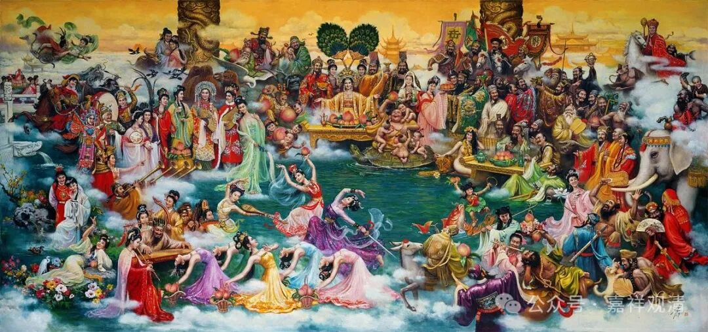

**“只有你不认识的，没有我不供奉的！”**

修正一下，今天和老会长继续聊，他说，莆田佛教场所，有证的+活动点，有1200，民间宗教场所+活动点，有3000多……有的一个自然村就可以有五个不同性质的庙宇。

今天坐车，和司机聊，他说莆田最重要的就是湄州岛的妈祖！每年过年和妈祖生日，盛大巡游，大额捐款有十几亿，其中某镇的珠宝老板们就捐了十亿……这还不算平常人一把一把的捐款……司机说，我们福建人，捐款（给妈祖，们）很舍得的！

他问我，妈祖算不算道教。我说，实际妈祖、火神、马王爷、城隍这些在古代都是正统的官方信仰，是官方册封的有品秩的“正神”，某种角度下接近于“儒教”的一部分，和道教原本没有直接的关系，只是在演变过程中，道观也供（其实基层的佛教叫寺院也供），加上那什么以后儒教被打倒了，正统的佛教又排斥，所以现在这些以前官方的正神信仰（着）现在大都自称为“道教”了。

其实就此，我们的佛教走到民间、落地，应该是什么样的模式，其实可以思考一下。

莆田这里有个村庙，还比较大，村民和理事会也比较好说话，就非常顺利地交给了几个出家人。这些出家人是学南传佛教止观禅修的，他们相对民间的底层佛教那是科班多了。这些僧人“姿势”正统，严格作息，五点关门，绝不通容……但当地有个风俗，有人过世以后，当天家人一定要去寺院绕三圈。结果地方风俗遇上了刻板的僧人……最后把原来很配合的村民给惹翻天了……结果就是，和尚全部被赶走了……

另外一个极端呢，就比如我认识一个漳州的出家人，他今天搬一尊妈祖，明天请一尊清水祖师，后天供一尊宝生大帝，再供上玉皇大帝……后来大概做到只有我叫不出名的，没有他不供的……最后连宗教局都看不过去了——“你这供得也太杂了……”（浙江宁波宁海有一个水库边上的庙也是这样：只有你不认识的，没有我不供的。云南也有……那个庙刚有人接了。）

所以，走到最基层的佛教，应该以什么方式嵌入地方，其实也是一门“学问”，很可惜，这种事情，学问僧不做（学问僧只在边上观察记录发牢骚）。

