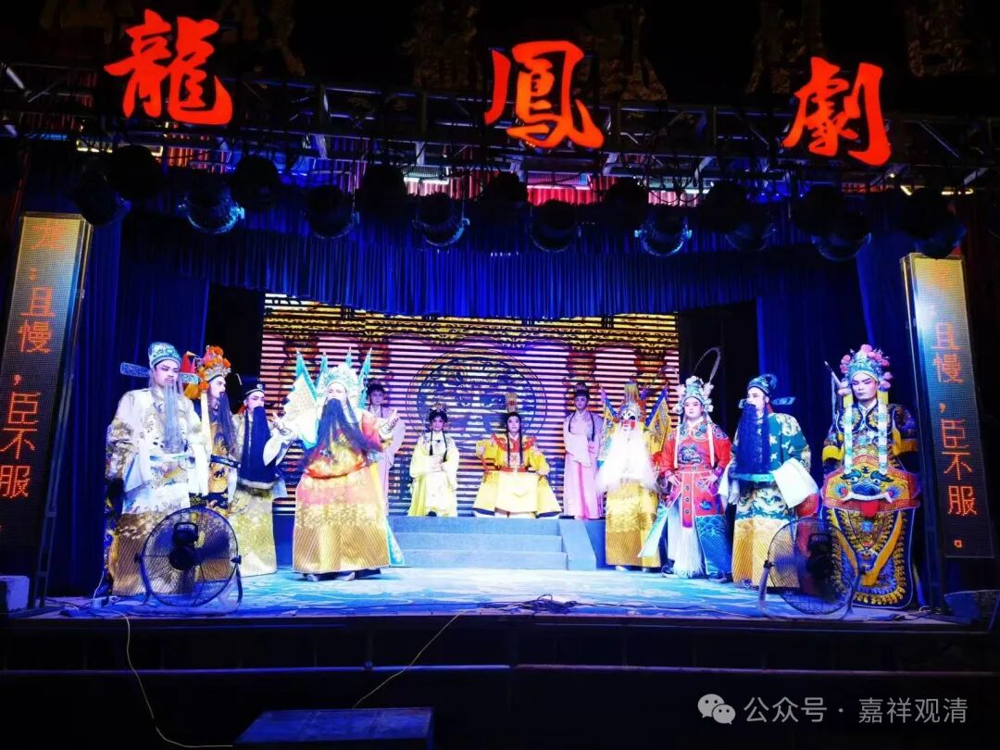

**“给观音娘娘送一台戏"**

石室岩寺请戏班子来唱了三天戏。

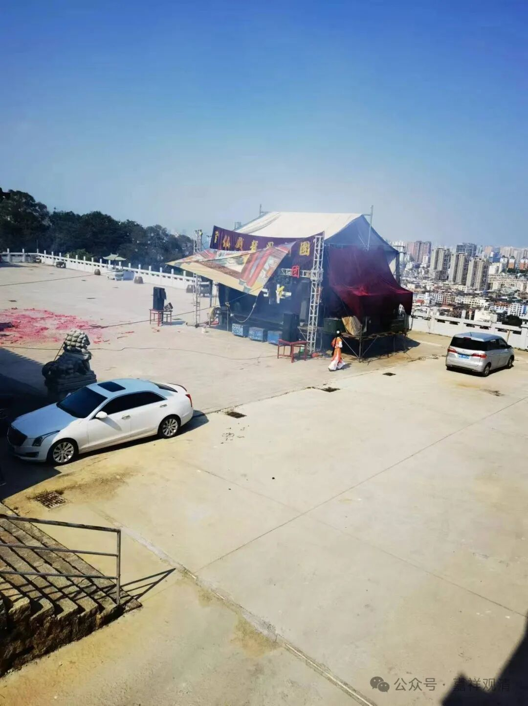

我们一到石室岩寺，就发现小广场上搭了个戏台。后来知道，当时正在拆戏台子；结果快到中午有个“居士”又包了一天戏，所以就不拆了，继续演。

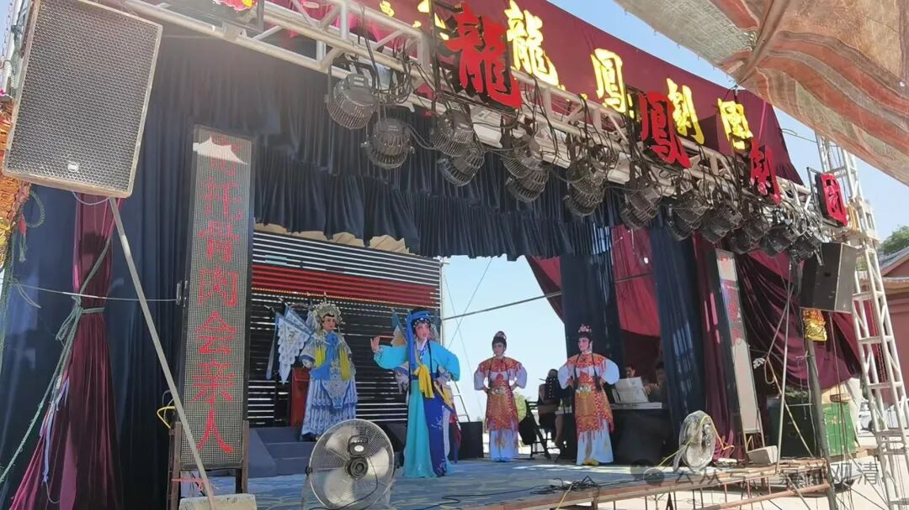

莆田这里地方戏主要是莆仙戏，这次也是演的莆仙戏，两场，下午一场《铁枪缨》，晚上一场《护储风波》。

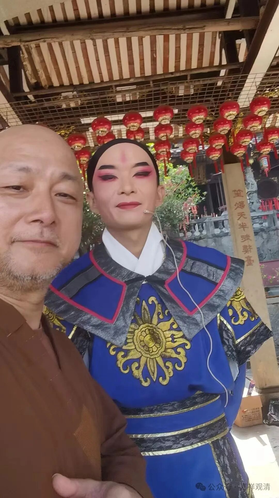

这是主演

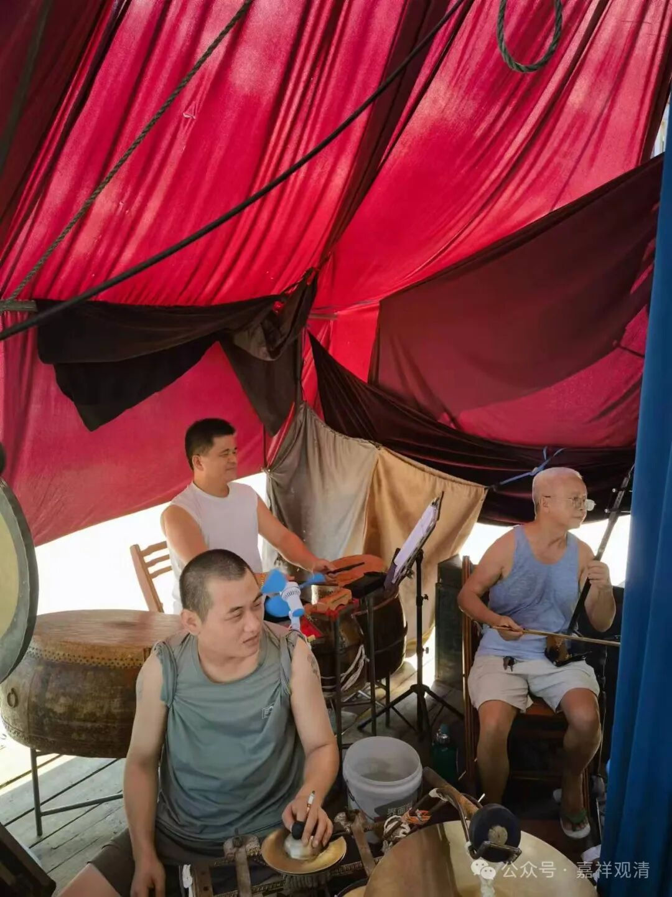

鼓点乐器伴奏

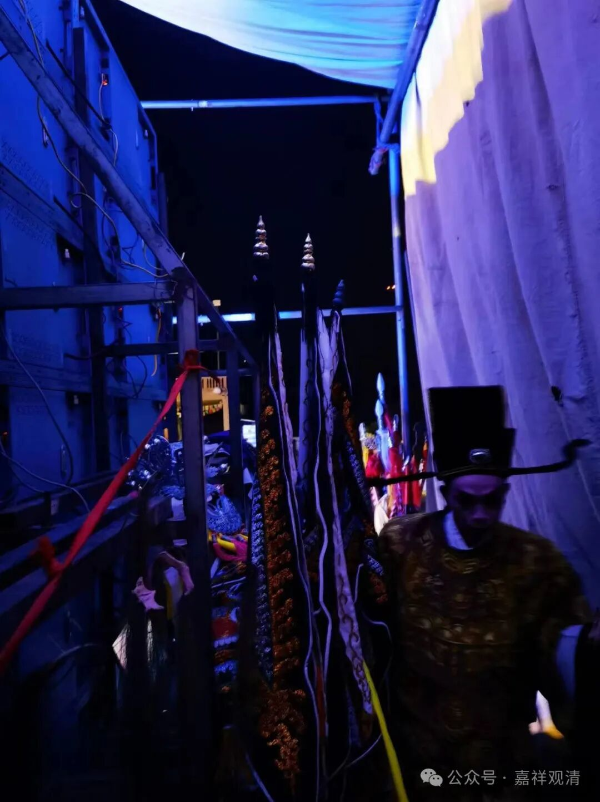

后台

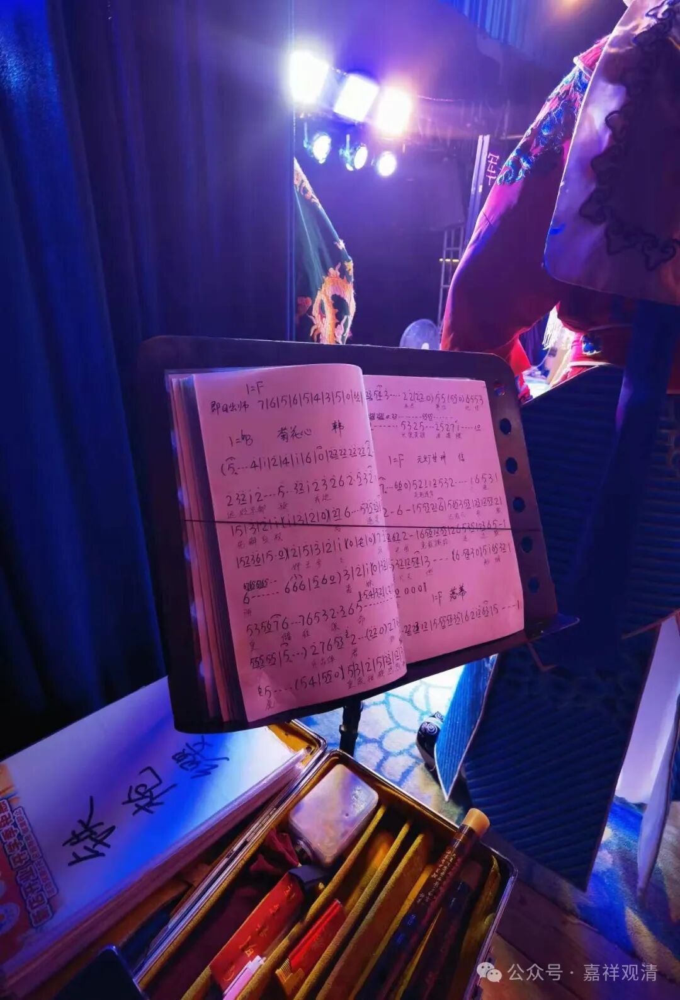

乐谱

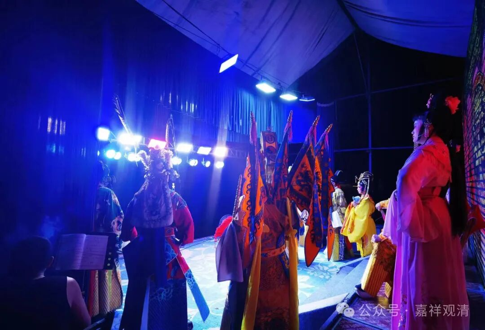

请的是民间的剧团，不是国家补贴的专业剧团。我问了一下，他们一天包场是七千到一万，请专业的剧团演一天则要超过两万了。

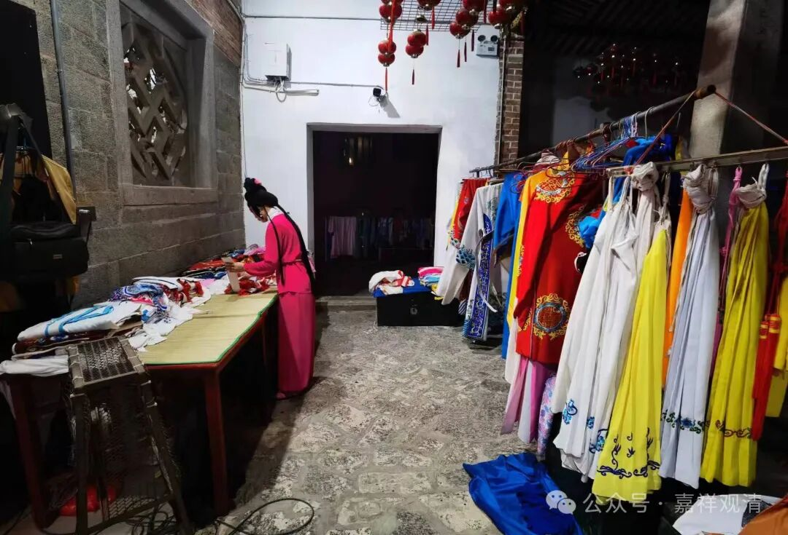

服装、道具

主演在上面唱戏，我找了个汗津津（下午两点，37度大太阳下面水泥广场上的临时戏台子上唱戏）的龙套聊天。他们主要还是在福建省内唱戏，莆田、仙游类似的戏班子大约两百个。

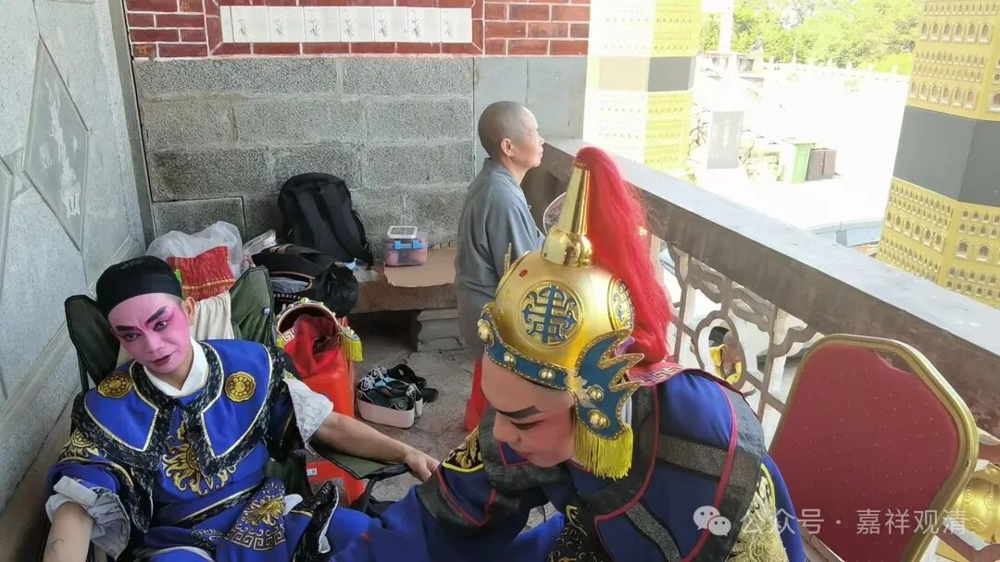

高温的下午，就一个老师太盘着腿在走廊里盯着，其他就没人了。老和尚说“唱戏是给神仙看的”，戏台正对着玉皇宝殿，那就是唱给玉皇大帝听的。

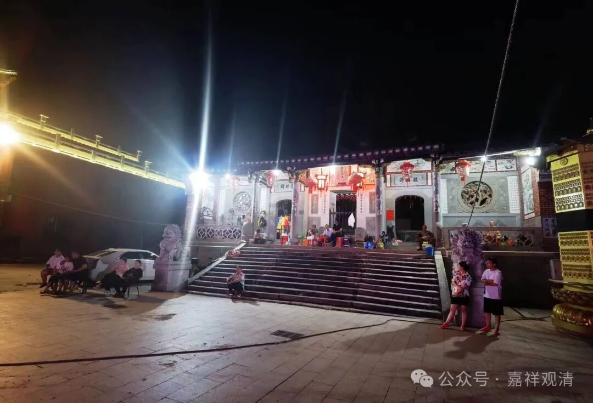

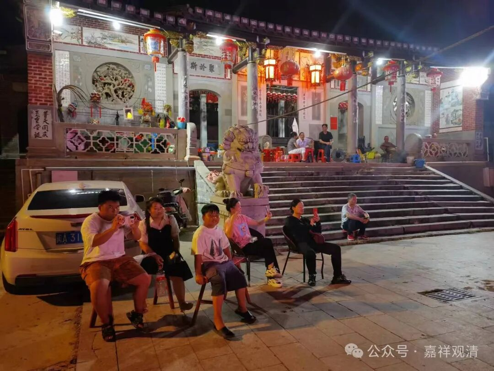

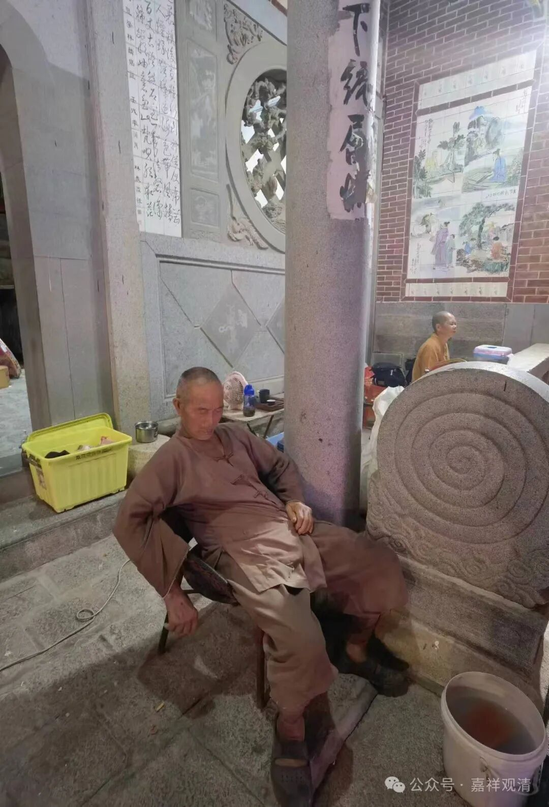

观众

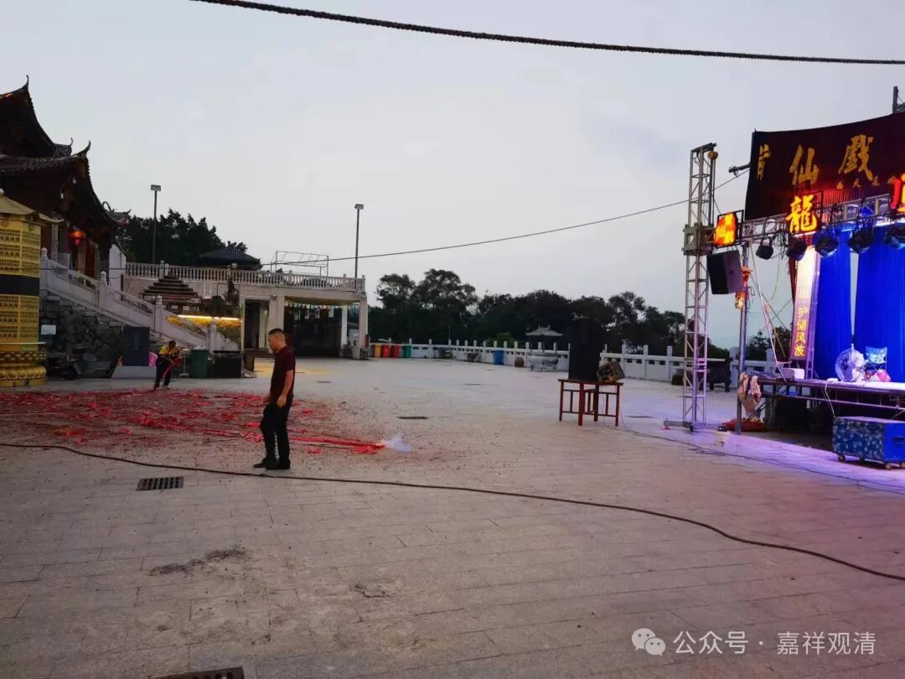

演出前后都要放鞭炮，大概类似提醒神明，“开戏了”！

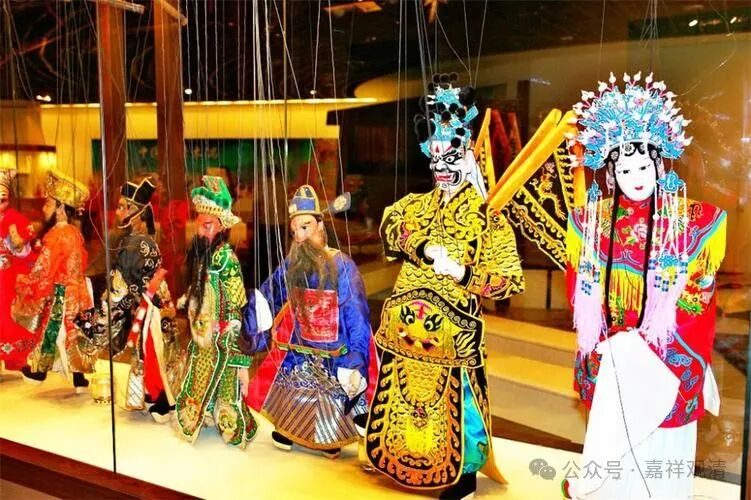

老和尚说，当地有两种戏曲形式，莆仙戏是唱给神仙的，还有一种福建的提线木偶戏是唱给鬼听的，不能弄错。我大概能理解，大概最初的提线木偶戏就是民间小庙里的偶像拿来演的吧。

中国民间在寺庙祠堂唱戏是很普遍的，南北方都有，很多地方的祠堂对面就有戏台，有些寺、庙的某某宝殿前面也有戏台，明显都是“唱给菩萨（神仙、祖宗）”听的——中国人的神仙生活都很“接地气”。

浙江舟山，我看到一个祠堂门口面对面有两个戏台子，这就是“对台戏”了。唱对台戏的时候，会请两个戏班子，谁唱的好就多给钱，唱的不好的甚至不给钱。

当家师说，他奶奶过寿诞的时候就请了两个戏班子唱“对台戏”，卖力演出的就多多打赏。

石室岩这次的大戏，也是请的不同的三个戏班子，只是不在同时演出。

其实去年和今年，那个黄梅戏团也找过我，问我是不是要几台戏上山，只是我们日子凑不上，没能成行。上次我们点的是《观音成道》～～

