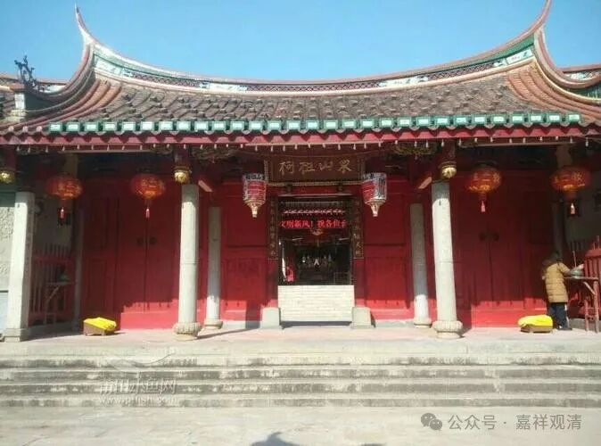
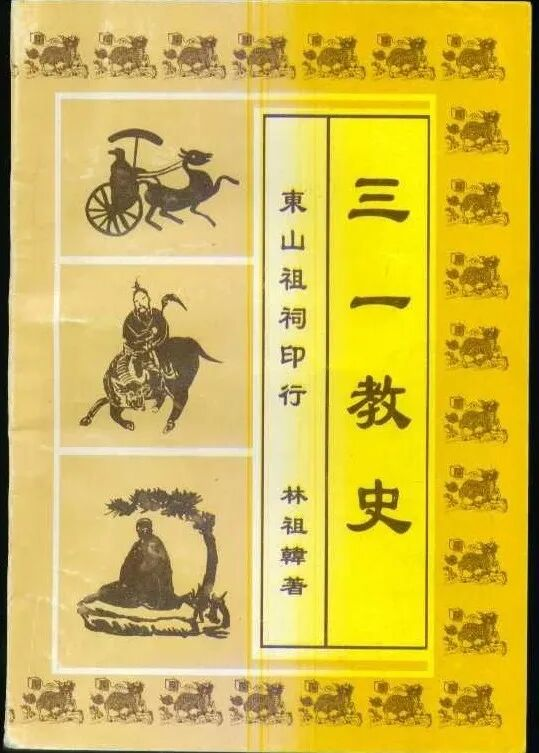
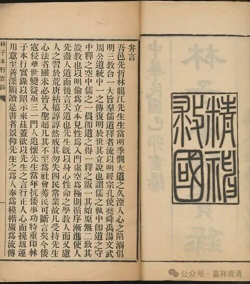
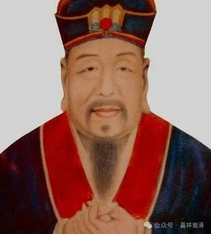
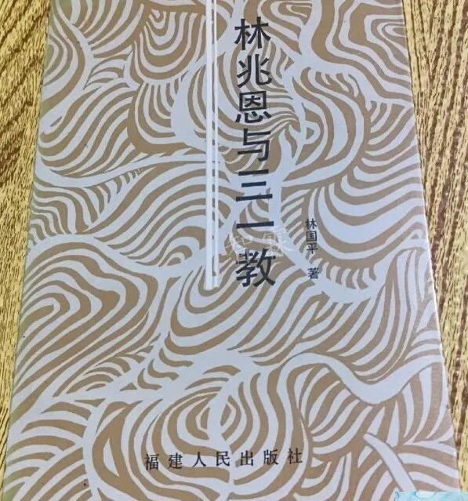

昨天讲的“莆仙戏”，“莆”是指的莆田，“仙”是指的仙游，莆田和仙游是莆仙戏主要流行区域。

莆田、仙游，有很多共同的亚文化符号。比如，三一教。

三一教，我以前只在书里看到过，还以为已经绝迹了。去年在佛学院讲课的时候，有个学生说道他们村里还有“三一教”活动，我说“你俗家是不是姓林？”她说“是的”。

三一教是明代林龙江（林兆恩1517～1598，但当地人都叫“林龙江”）创立的，可以简单理解为有儒生背景的基层士大夫创立的三教（佛儒道）合一的“宗教”。历史上，正统儒家还是把它当作“淫祀”（民间宗教）来对待并禁止的，但在莆田、仙游一代还保存，后来随着海外移民传入东南亚一带，并继续向外传播……

目前，三一教是被福建地方承认的民间宗教，而且在莆田、仙游一带还非常普遍，据统计，仙游有登记注册的三一教场所七百多座，平均每个村可以有两座。

我这次到莆田华亭镇，这里也有三一教，我住的这个村子（也可能是行政村）有一堂、四所，都是三一教的活动点，附近也有林姓村子。

而且当地法师介绍说林龙江的墓就在华亭镇的紫云山。这几天我就在这三紫山（紫云山、紫薇山、紫霞山）一带活动了，但没来得及专门去，天太热了，以后找机会再去考察。

某法师的“寺院”其实就是三一教的“民间宗教活动点”，她那里还有不少三一教的资料，我让她寄给我，帮我增长点见闻。下次好好读完以后，再过来采风……

