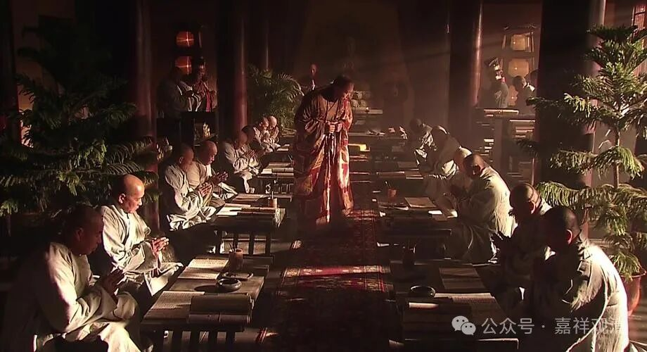

**《宗义略讲》005·026**

中国译场最兴盛的时候应该是唐代。唐代以后，宋代虽然在事实上有过译场，但是译师和译本都不是顶尖的，加上这时候“中国化的佛教”已经成熟，又没有一流的学问僧研习，皇家、上层士大夫阶层也不是很支持（皇帝玩道教，士大夫玩禅宗）……所以宋代译场的成果对中国的影响很小，甚至这些译师的大名都没几个人知道。

南北朝乃至唐代的几个译场对中国佛教的影响都很大，后期的国家级译场就是相当于一个国家工程，宋代的译场（在这上面几乎可以负责任的说，）就是单纯的一个面子工程。“历代的朝代都有译场？那我也要一个！”这些国家工程的背后呢，有其“法理”上的原因——“你看，我能造大佛，能开大译场，能刊印大藏经，说明我执政的合理性！”（宋代开出了一个新的“工程”，就是官刻大藏经，用它来证明“我朝”之强大和文化延续性。）

另一个就是面子工程，就是祝节、贺寿。皇帝过生日，你要献一部今天刚刚翻译完的，祝上寿，“皇帝长命百岁！”过两天太后过生日，正好又翻译一本，“太后万寿！”真巧吗？都是刚巧翻译完的？其实早就准备好了。

这种套路玄奘法师也会——他正在连续几年翻译六百卷《大般若经》的时候，他中间会翻译一卷两卷的，在这些节日呈上去。义净法师也会这个操作，翻译个小篇幅的阿含里的经典，祝贺一下，“今天太巧了，太后过生日，我这个东西翻译出来了，祝太后生辰吉祥！”太后一高兴，“打赏！”皇帝一高兴，“打赏！”皇后过生日也一样……

所以你看，这些大的法师，经常在大的篇幅翻译过程中翻译一些篇幅短小的文献，这些小篇幅的译本也不是很重要，甚至已经有过其他译本了，但这不重要，因为本质上就是应个景。

那宋代也是一样，皇帝位置一坐，看看要做什么点什么表示“我来了”！“嗯，别的大的王朝都有这样的译场，我们也要有！找几个人搞翻译！给我找会汉话的印度人……水平不重要，重要的是能出活儿！”搞翻译的时候，也就是这样，皇帝家过生日的时候，一本一本往上献。所以你看，宋代翻译的短篇很多，长篇的少，都是很小篇幅的。然后呢，很多密宗东西翻译出来以后，印度人觉得无所谓的（印度人觉得这方面，比较开放，不成问题），但是翻译为汉地文献以后，皇帝觉得，“这翻译出来像什么话，删掉，删掉！”

宋代的时候，印度那边佛教也有高手，但是汉地这里就没有很多记录了。这时候，汉地自己的宗派兴盛起来了，汉人人不过去“取经”了，没有再出现法显、玄奘、义净之类的大师去外面求法了，所以对印度的记载比较少，其实这个时候，像阿底峡尊者这些人，金洲法称、菩提贤等等，那个时代出现了一批人但是我们这边都没有相应的记载。

