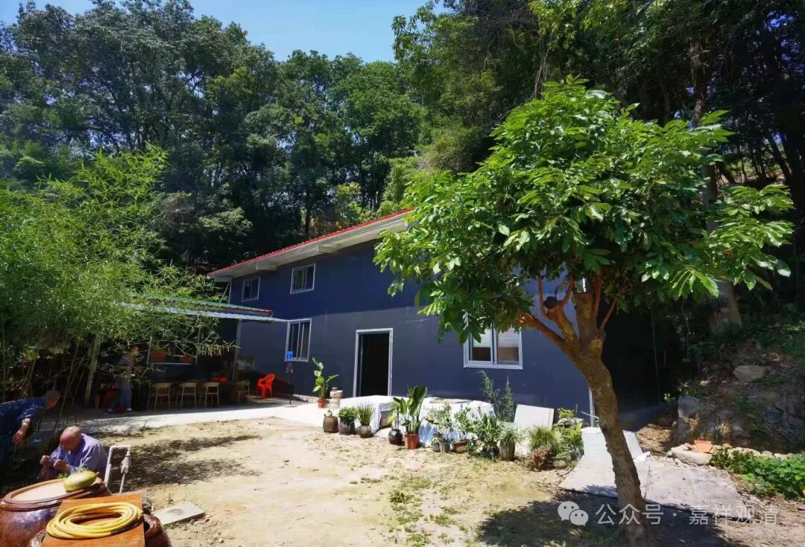
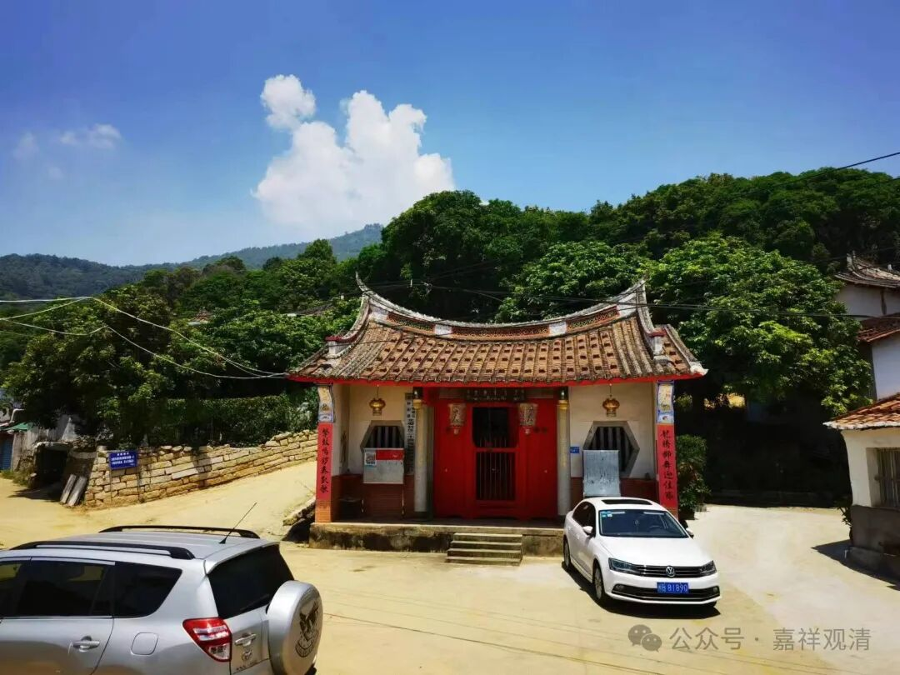
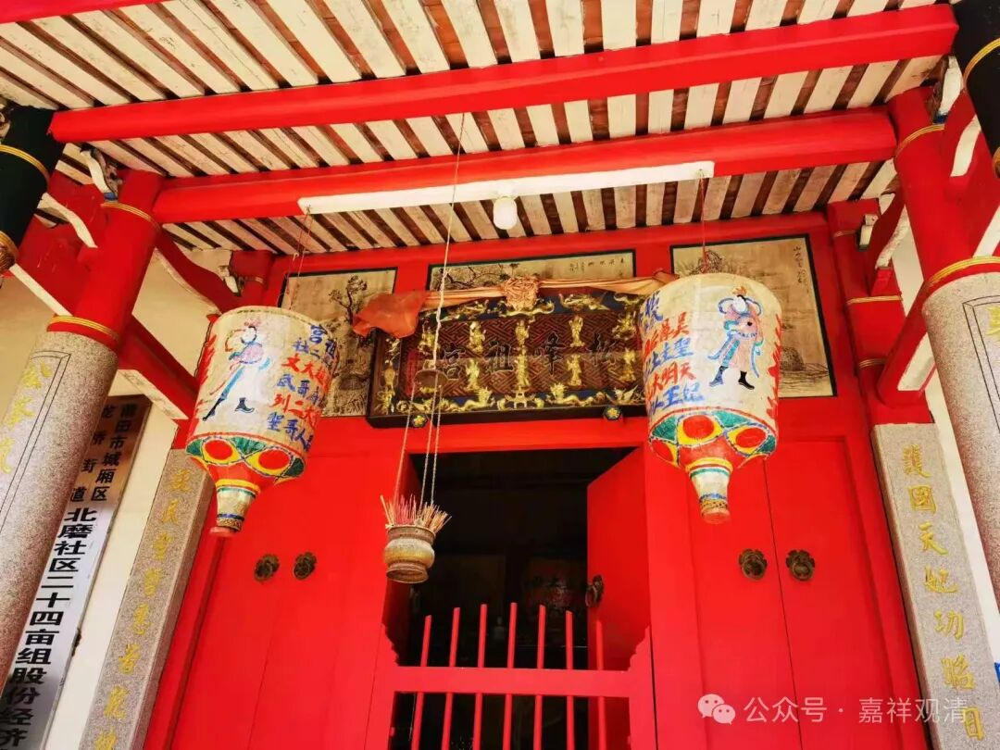
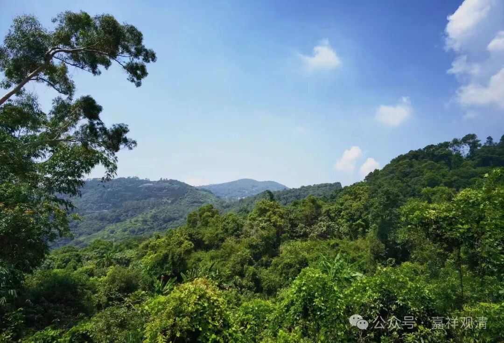
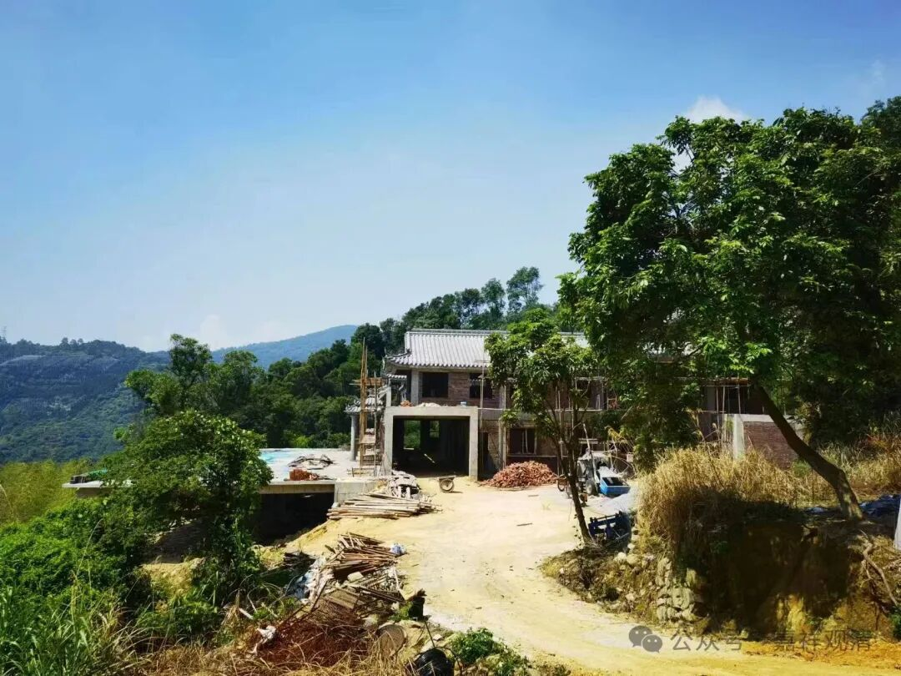
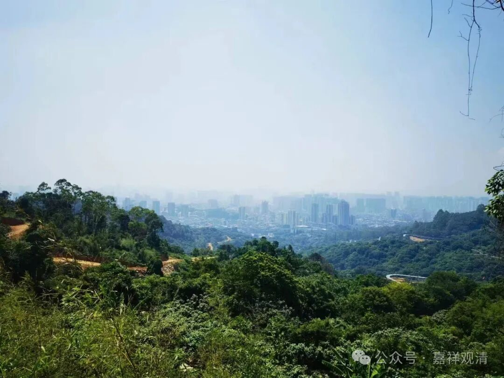
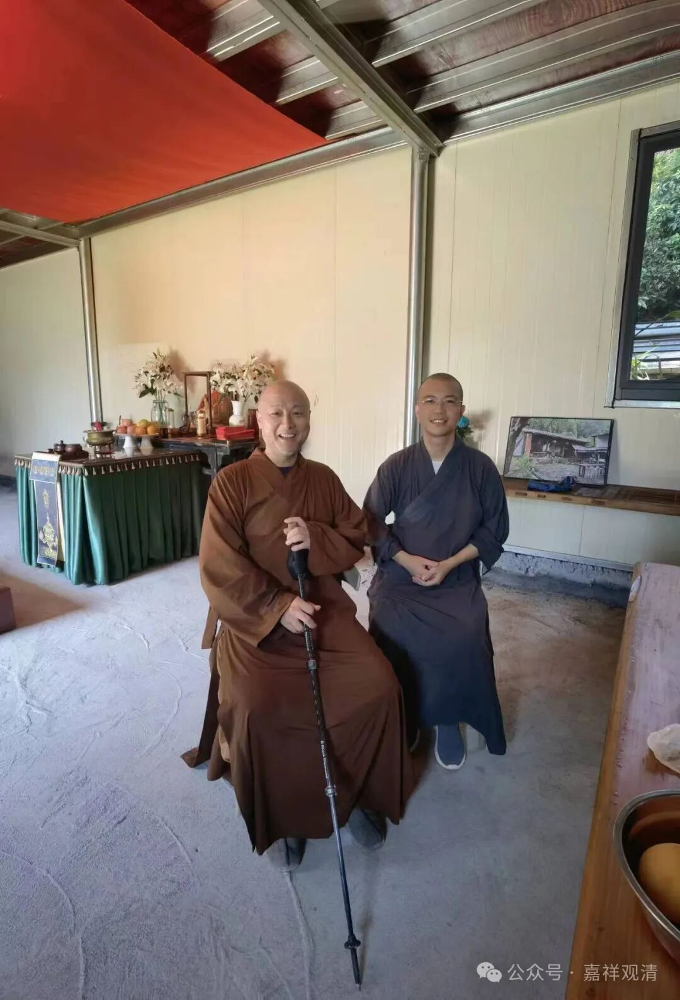

**访天竺寺中兴之祖——明意大师**

一早，老和尚就招呼我们去喝茶……

福建的寺院，带着满满的福建味道，不管你是东北的、西北的、南来的、北往的，进了寺院说两句，一律是——喝茶吧！（我现在怀疑，“吃茶去”的原意会不会是“到隔壁瞎扯去！”，“云门饼”的意思会不会是“一听你这话就不过脑子，是不是血糖不够？去补充点碳水去！”）

我对功夫茶没啥兴趣，倒是对桌上的小蜜饯有贪心……

老和尚带着我们一帮小和尚（哦，我也要算老和尚了）闲聊的时候，大家说起隔壁山头上也有一个潮州来的画僧，一问，竟是明意师，马上安排上去访访！

明意师的准寺院（还在建）在石室岩寺的左后方，徒步过去的话有条小路，说大约半个多小时能到……但是37摄氏度的天顶着个大太阳，除了我没人愿意走，于是凑了辆车凑了一车人还是开车去吧……

下山再上山，开到一个神庙边上。

神庙

再往上就只有自建的土路了（边上还有一条小路上山，我们是从那里走下来的）。土路开得陡而长……终于，我们的车，趴窝了，都下来推车都不行，打滑！最后连车子都退到路边边上，差点摔沟里去。“世上无难事，只要肯放弃！”弃车徒步，把车子留下，一会儿等山上工作的挖机来“救援”。

沿路的山景

顺着挖机开出的土路上山，衣服湿透的时候，也就到了“天竺寺”。

明意师来迎。

这就是他的名言有的天竺寺了。

后面有几间工地简易房，现在明意师们就住在这里了。这已经是升级版的了，最初只是间漏雨的木蓬蓬。

天竺寺正面望出去，对面就是莆田市区

我说“你现在是要做开山祖师了”，清月师则说因为是老庙，所以只能算“中兴祖师”。哈哈，都是祖师反正。

原来知道明意师开过画展，画国画有一手，现在我夸他，造庙也是一把好手！

“我在你这个年纪，绝对造不出这样的庙来！”

这是真话。

