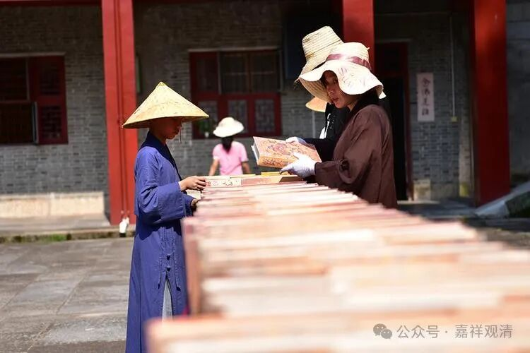
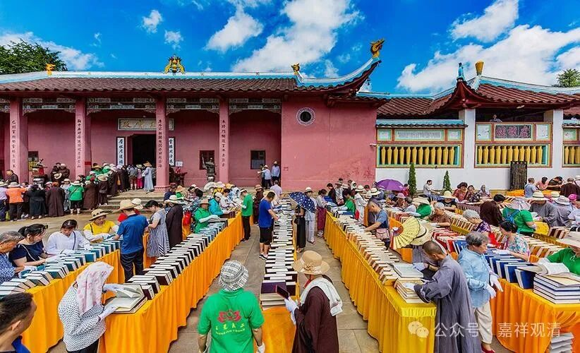
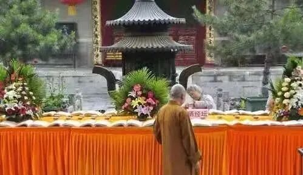
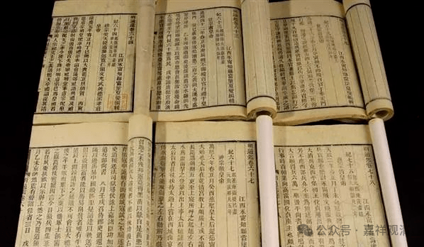
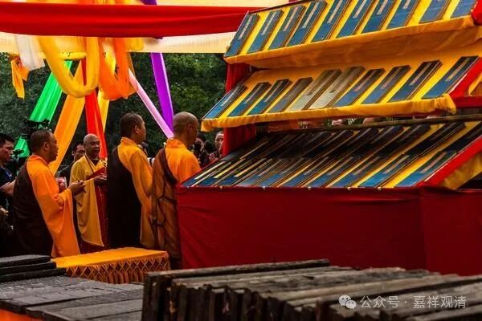
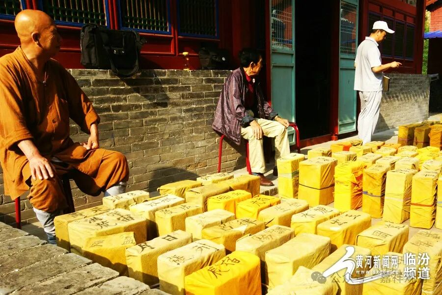
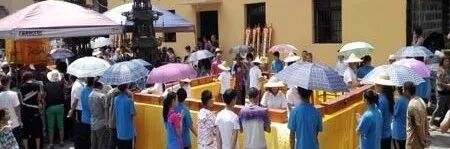

**晒经节：败家子和文盲的狂欢**

这次在福建走一圈，还是增长很多见闻的（可能我原先就是孤陋寡闻的人吧），比如大片活着的三一教，还有活在民间寺院的“晒经节”。

晒经节，一般是农历六月初六，潮汕地区这一天是鬼门关开心鬼投胎的日子。也有说是龙王晒龙鳞的日子，又说是玄奘法师取经回来落水晒经的日子，大概此时南方的梅雨季节过去，正好把发霉、阴潮的东西拿出来晾一晾、晒一晒。

有些寺院会在六月初六这一天“晒经”，也有的寺院安排在六月初三这天。这些寺院把庙里的大藏经搬出来，放到太阳底下“暴晒”，有的地方居然还把这个“晒经”申遗了。

这这这，能不瞎搞吗？！

经书古籍是最忌讳暴晒的，大太阳底下暴晒，会令纸张老化变脆，烈日下暴晒，不仅不能起到保护经典的作用，反而是一次实实在在的伤害了！古籍的保存要求恒温恒湿的环境，传统的“晒经”也只是在干燥的秋天，在阴凉通风处把书展开以散去湿气而已。

有的寺院甚至把宋元版的大藏经都拿出来晒，真的是败家至极了！

没文化，真可怕！（黄布上的字是大藏经经函的千字文排序）

此外，还有些寺院认认真真、小心翼翼、谨小慎微地拿出影印版的大藏经去“晒经”，以为这些都是千年之前珍贵的历史文物……这帮文盲连“影印”是啥都没搞懂还在那里瞎扯！影印机发明（1938）到现在也才一百年不到，你们手上那些“影印版”的经书要一千年？！愚蠢！！！

