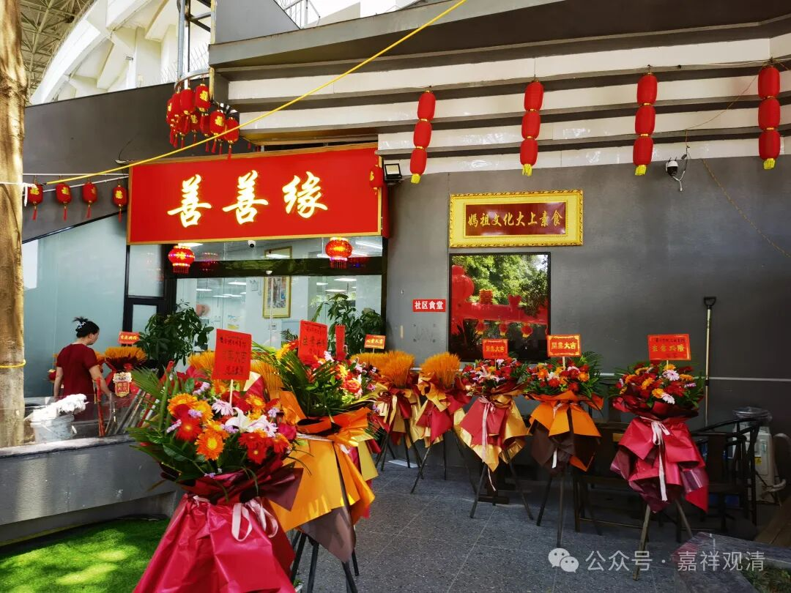
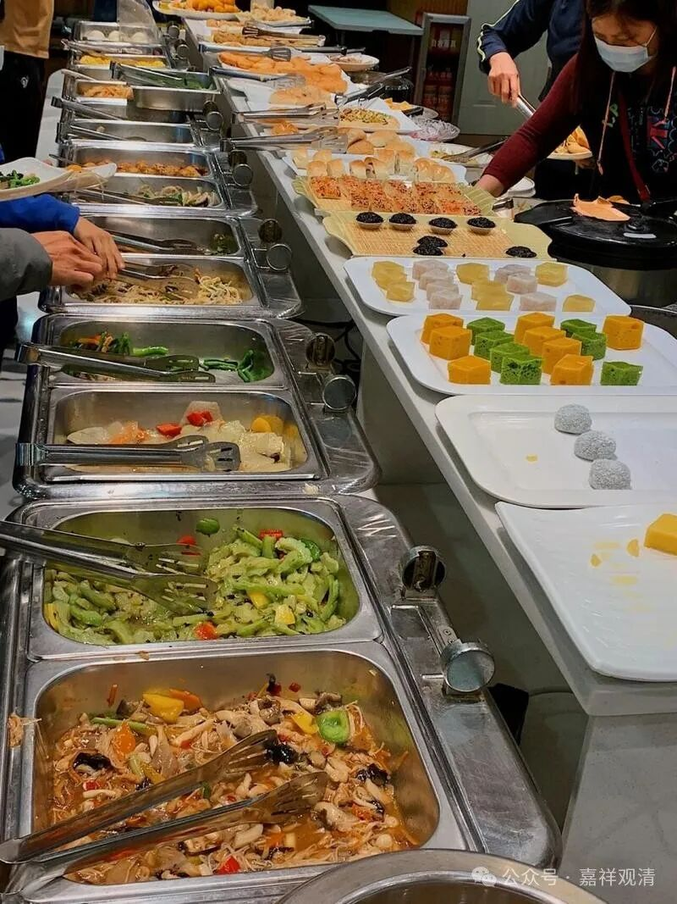
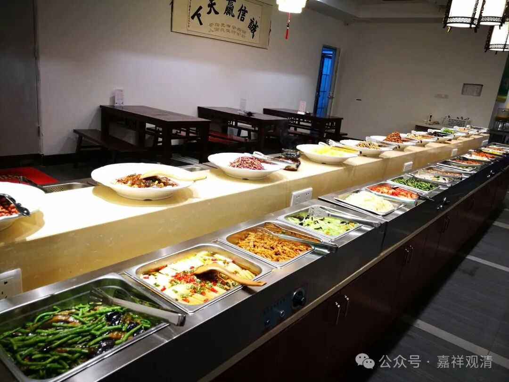
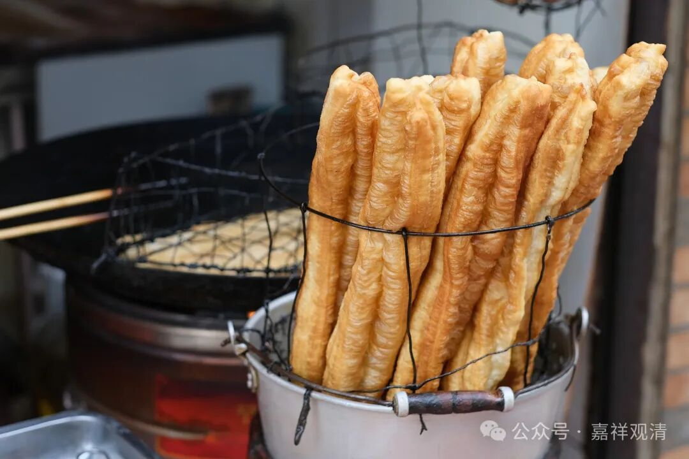
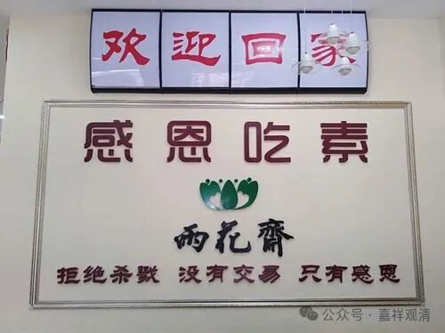

**我在福建吃白食**

从明意师的天竺寺沿山里的小路下山，还是到了分叉路口的神庙，神庙虽小，正对面的戏台可不小。

我们打车，直奔素斋馆。（我一直很紧张，生怕过了点。）

赶到素斋馆，还剩十五分钟。我也不管其他出家师父了（老师父带着一班小和尚也来了），直接打饭就吃上了。

其实一进门我就挺高兴的，因为这是一家素食的自助餐餐馆——没有点菜上菜环节，我这顿午饭有着落了！至于吃的是啥，我是转脸就忘了。

吃完饭，老板娘带我们参观她在隔壁的公司……原来他们也是做医疗这方面的，同时做公益——培训海姆立克急救法、心肺复苏、理疗按摩……我说这个我内行。

原来今天是她们素斋馆开业，老和尚带着小和尚们来捧场（我还以为是老和尚刻意请我的呢）。信妈祖的老板娘说开素斋馆是做公益。

福建的佛教氛围真的很好，和尚真的能感觉到“宾至如归”（不是“妇女之宝”！）。

有两天上街吃早餐，直接给免单了。他们免单，搞得我怪不好意思地，都不敢盯着一家吃了，换了一家，还是免单……真是受宠若惊。不同的地方吃了四顿自助餐，也都被“供养”（免单）了。

素食馆被免单倒是常见，早餐店则很少见，以前我只有过一次，那次是买了两根油条……

全国素食自助餐连锁的有一家叫“雨花斋”，很多家雨花斋对所有顾客是一律免单的，有的附近学校的学生为了省钱，就扎堆去那里吃午餐，然后随便给个三五块，或者干脆不给。

但是这么做也有一个坏处。海南有一家雨花斋的“股东”告诉我，由于一律免单，结果养了一帮懒人——有的人本来是出来打工的，结果发现有免费的午餐……就不打工了，天天来吃饭，吃完再流浪……结果因为开了家雨花斋，周围出现了一帮流浪汉。搞得这些发心做慈善的“股东们”也很纠结，“我们到底做错了没有？”

应该怎么做更好呢？

