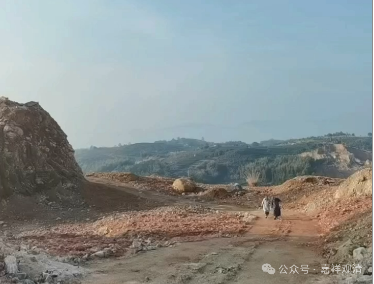
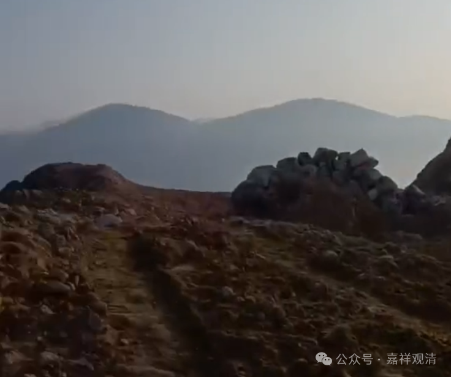
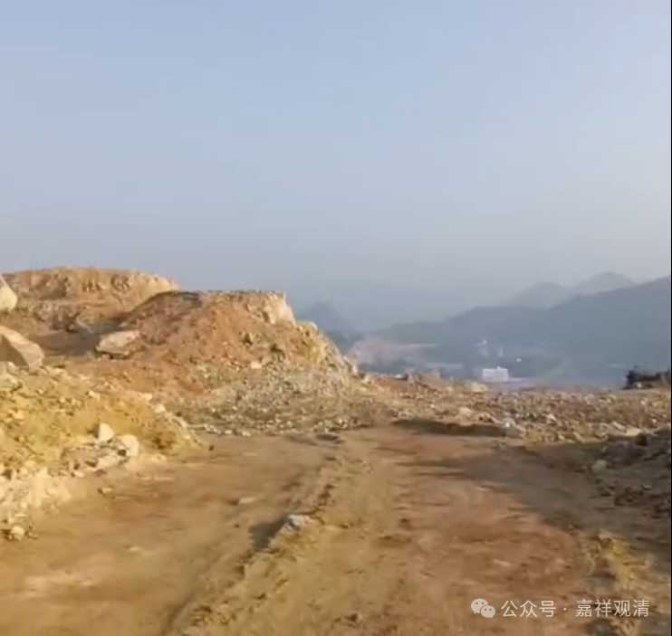
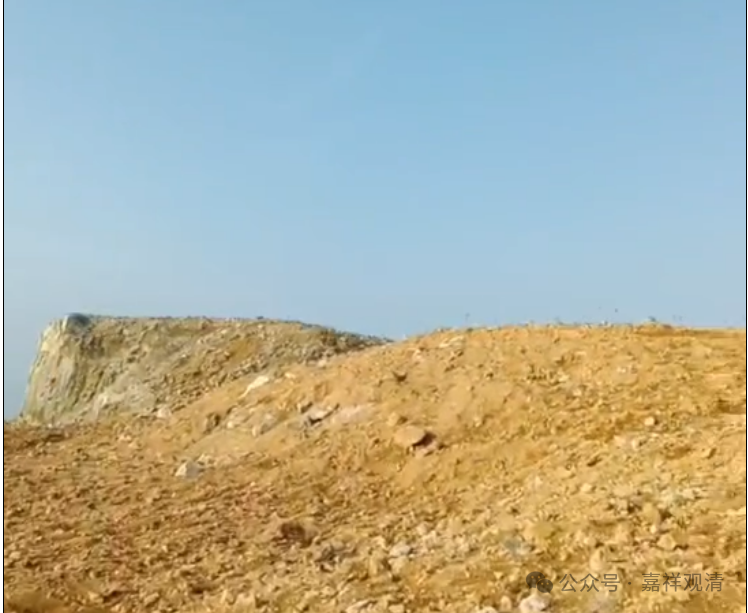
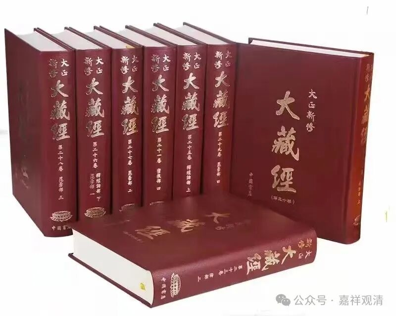
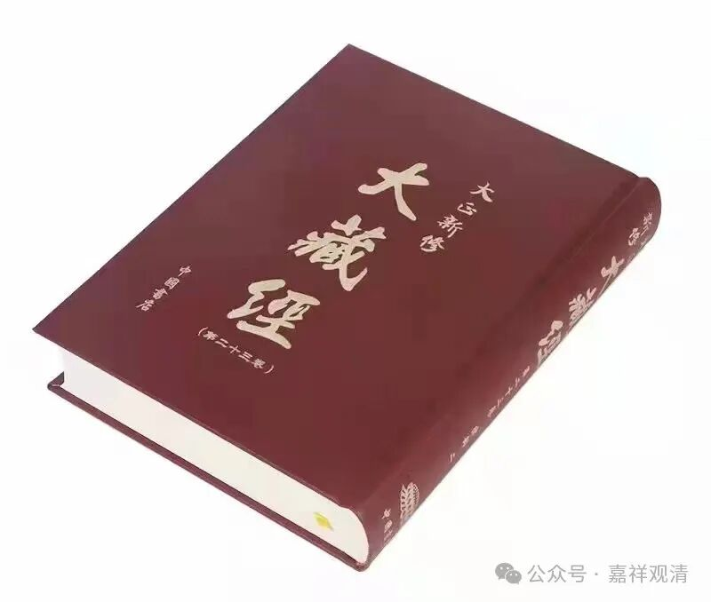
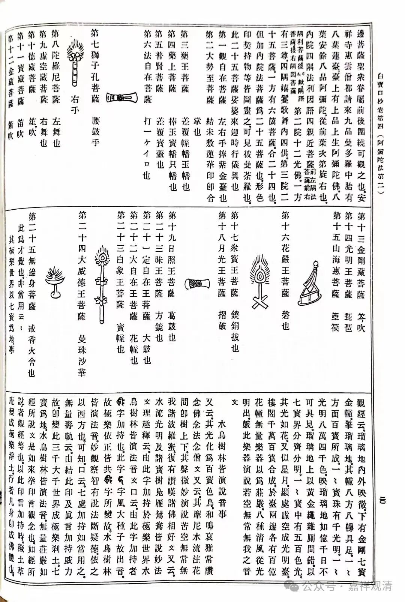
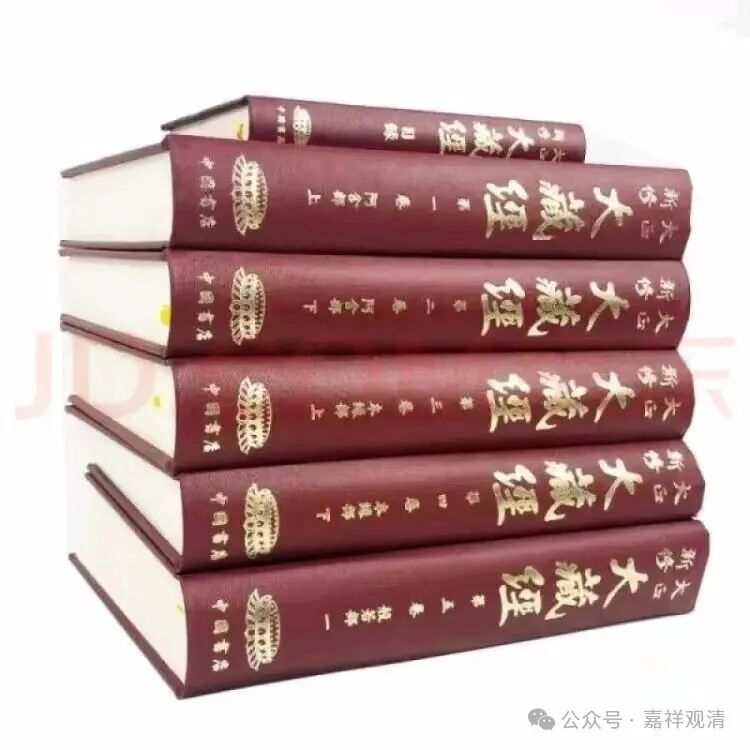
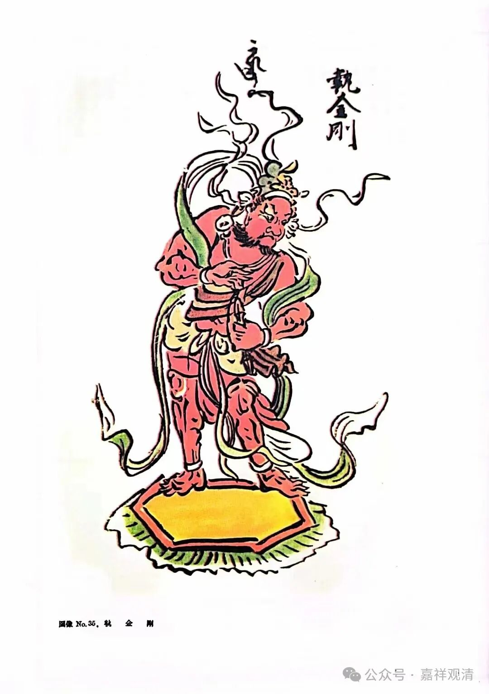

**问苍茫大地，谁主沉浮？！**

宁德，现在最有名的就是“宁德时代”了。我去拜访的一个小寺院就在宁德时代圈地的边缘……

周围的地标，都是“××时代”，一路经过的市县乡镇，都冠上“××时代”，呵呵，这一路“带节奏”啊。

“宁德时代”还在大搞基建呢——周围的山头全都被刨了，石块、土方再被拿去填海……这大片大片的山，刨出了一片苍莽浑厚……让我一眼看上去，以为来到了大西北，来到了黄土高原……

（东南沿海，竟成了西北高原，要知道，山外那就是海了！）

福建的小寺院多，多了呢，也就普遍的做不大了。好在生存不是问题。

我刚替这个小寺院化缘到了一套《大正藏》，这是我们学习最常用的《大藏经》版本了。

寺院的尼师们都年轻，有继续上佛学院进修的想法，这一套大藏经是早晚要备上的。《大藏经》的各个版本里面，平常人最爱听的是“龙藏”（乾隆藏），很多团体送寺院的也都是《龙藏》，但龙藏的实用性、权威性都不如《大正藏》，所以我一般都推荐寺院，假如只备一套藏经的话，那《大正藏》就好了。假如资金量足够、“不差钱”的话，那我就推荐大陆版的《中华大藏经》了。

一般人句读古籍还是略显困难，所以还是有句都的《大正藏》（虽然不完美）更好阅读一些。《频伽藏》的句读就更差一些了。

顺便吐槽几句——“句读”和“校勘”不是一个概念！最近有一班人马在“校勘”古籍，实际做的不过是及格线上下的“句读”而已——一篇“校勘”连个体例都没有，连个校勘记都没有，一整卷的脚注+尾注+校勘记就只有一个注解……这种东西拿出来，我觉得那个立项、组稿的负责人直接该枪毙！

大正藏图像

以前有个电影，叫《战争，让女人走开！》。按这个句型，那么，“佛教学术，请文盲走开！”

奈何文盲总以为自己是文豪

