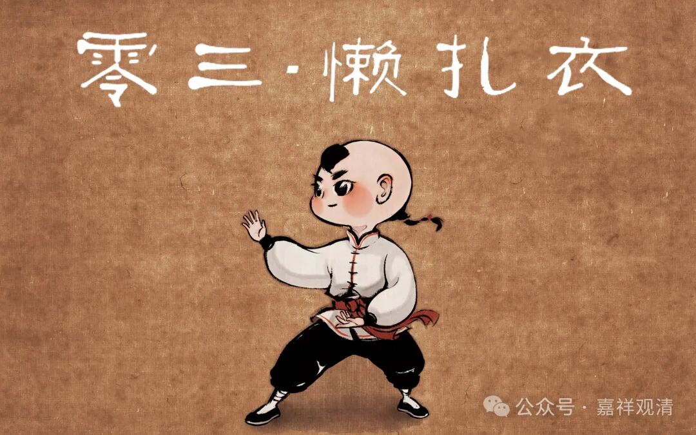

**快问快答：**

** 学习的大方向要把握好！**

提问：

师父，看到两个说法：1，禅宗源于瑜伽，中观源于吠檀多，唯识源于数论。2，商羯罗在《吠陀》、《奥义书》、《梵经》的基础上，融合了大乘佛教中观派的思想和唯识派的思想——就是取一部分中观，取一部分唯识，然后再把《吠陀》重新改造。就是利用大乘的教理框架，改造了《吠陀经》，把吠檀多派推向了理论顶峰，最终实现了印度教教理上的成熟。请您开示

回复：

你学习的方法不对！

你老是抱着二手资料学佛，靠着读公众号推送的论文学佛，这个方式错了！学院派靠发论文挣银子、挣地位，他们这个职业走这个路子很正常，是标准路径。你跟学院派八杆子打不着的，又不需要你写论文，你泡到那个池子里，谁看你都怪。（更不用说你还是个学渣。）

假如你是哲学硕士、博士，拿到大学教席了，再来问我这类问题，那我觉得很正常。你不吃这碗饭的，我回答你也没有意义，甚至我的答案你最终理解成啥样子都不可知。

就像，你看着咏春、八极、伏虎、南拳教练的录像学太极，翻了一堆体院的论文，然后找我问“陈氏的懒扎衣的动作是不是从戚继光的《纪效新书》书里来的？”我就是告诉你“是”或者“不是”，你也学不到什么真东西啊。

武术博士、硕士和我聊这个问题是对的，应景的，你作为刚起手练太极拳的，问我这个问题，我们是感觉莫名其妙的。

真学佛，就老老实实从基础学起，先把《百法》背下来，把十二因缘背下来。问我“高深”的问题并不能给你加分，实际上还是减分的。

