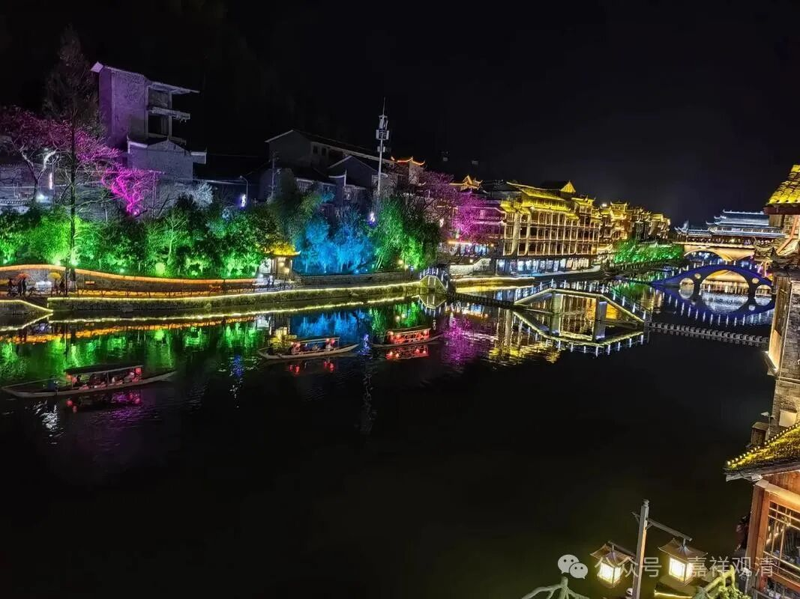

****

** 《宗义略讲》005·036**

更有趣的来了，有部是说独立实有的补特伽罗没有，补特伽罗是个假法，经部怎么说呢，经部就更过分一点，经部师主张法无我！（当然我们说的还是成实师。）如果按这个作为成实师的宗义的话，则依《宗义书》的划分，他必须是大乘的“说宗义师”了，因为宗义书系统认为小乘宗派是不许“法无我”的。——从这个角度说，南北朝后期的成实师自认为是大乘，似乎也不是全无道理（当然实际并不是从这个角度考量的）。

《成实论》它是讲世俗有、胜义空啊，最后胜义空也不满足，觉得还要“灭空心见道”，所以它是讲法无我的，而且他还引用了这个《四百论》的一个颂子，所以它是受到中观派的影响的。

总的来说，如果说《俱舍论》是“理长为宗”，《成实论》就也是这种情况，理长为宗，道理上博采诸家，对的他就接受的，也不是单纯的直接受有部（甚至也不一味排斥有部）的或者只接受小乘的这些经典，它是比较开明的，大乘的也接受，最近有人写论文说他还受到唯识的影响……

经部真的很开放，但是很有趣啊，他是从最不开放的宗派（上座部系统的说一切有部）里面出来的，然后既然开放，就和大众部、分别说部、犊子部走到一起了，大众部本身就比较开放。

有部的譬喻师就比较早了，在中观以前就有了，那么在《发智论》前后（《发智论》的作者是迦旃延腻子），至少在《大毗婆沙论》时候，已经有有部的譬喻师了，就是经部譬喻师的前身，那么中观比《大毗婆沙论》要晚一点，也就是说经部的前身（有部的譬喻师）在中观的前面，前面一点，但是像《成实论》代表的这些经部师，受到了中观的影响，应该在中观后面（从他引用到《四百论》来看应该晚于提婆），但是它的年代比鸠摩罗什法师要早，比提婆要晚，公元一二世纪，二世纪左右到四世纪中间，可能三世记左右。

