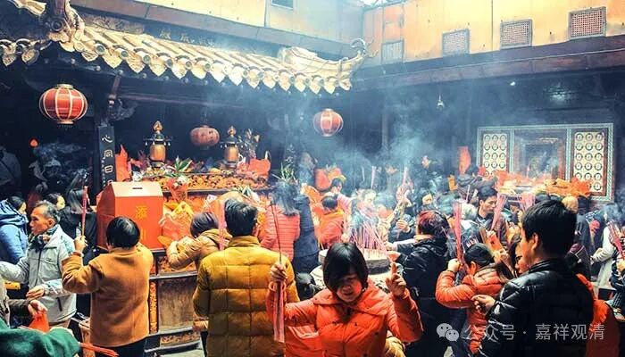
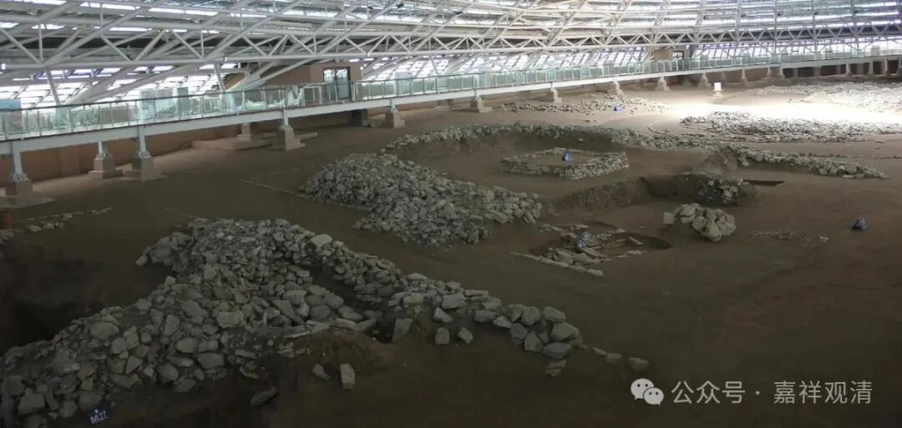

**“佛欢喜日”&“中元节”**

** ——聊聊对“七月十五”的终极文化认同**

今天七月十五，佛教圈子里，你可以看到很多这一天的很多“同出”而“异名”：盂兰盆节、盂兰盆会、佛欢喜日、僧自恣日、解夏、鬼节、中元节……

在一个企图挤进《高僧传》的小圈子里，经常把信佛教的称为“另类”——在轮回而要求解脱，岂不另类？大乘则是“另类中的另类”——慕求解脱而慈悲垂迹，就是“另类的平方”……乃至最终加到了“另类”的五次方……

佛教进入中国近两千年了。到底有没有真正融入？呵呵，看上面，他这么“另类”，怎么“融入”？甚至在印度它都没有做到“融入”——佛教之于印度文化，一直是水和水银，而不是盐和水……那么，佛教至于各大文明，基本都是这个非融入状态。或者我想用另一个比喻，他就是过饱和溶液里的硫酸铜晶体，不断地在溶解和析出……

就像“七月十五”，旁观者看来这个“时间点”可以说是同一个，但“佛欢喜日”、“僧自恣日”的文化符号，和“鬼节”、“中元节”的文化符号，完全不是同一个！——“七月十五”的这两个朝向，分别代表了“佛教的”和“民众的”，而这两个“表达”在“盂兰盆节、盂兰盆会”这里撞到了一起……

我是在辽西的一个古文化遗址（牛河梁遗址）上“顿悟”它的——这块土地上底层“宗教”的“基本逻辑”“基本框架”，经历了五千年都没有发生多大的改变，从这个角度上讲，中华文明真的是“源远流长”地没有中断过！（换一个角度呢，我对正统佛教的传播则是悲观的。）

“鬼节”、“中元节”，才是中国人心里对“七月十五”的终极文化认同。

