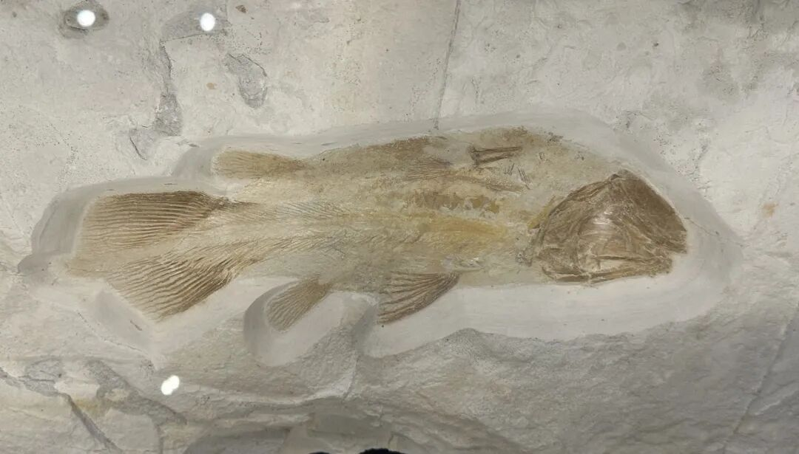
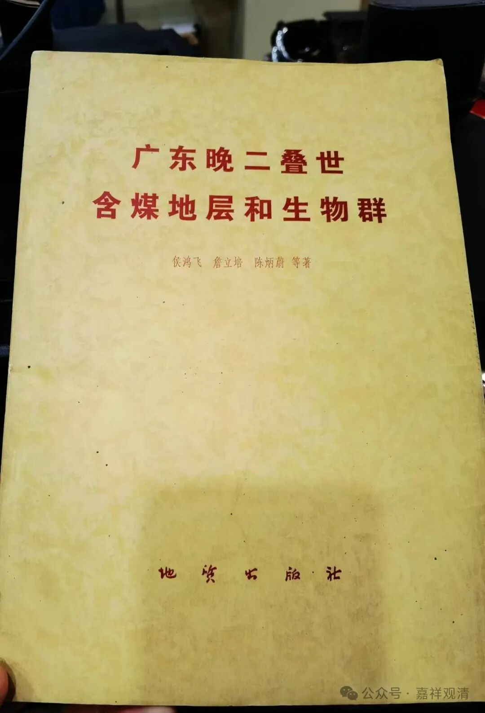
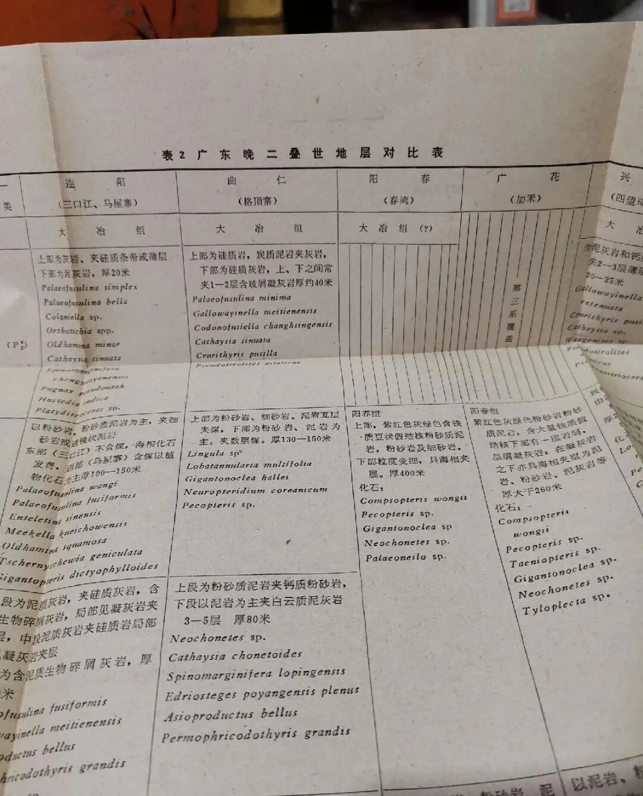
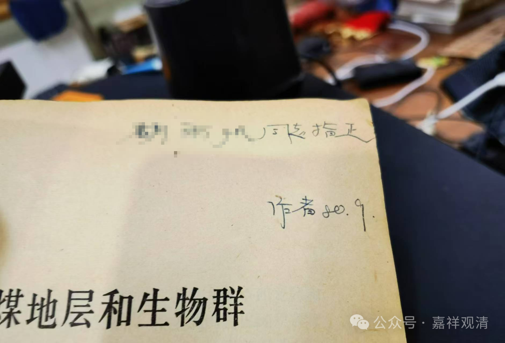
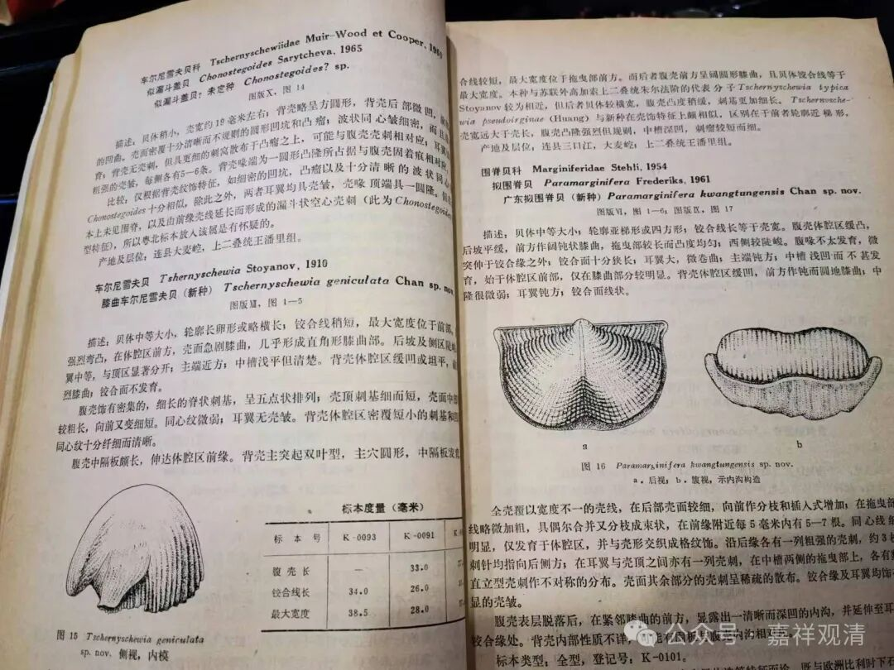

**化石的化石**

孔夫子上新买了一本书——《广东晚二叠世含煤地层和生物群》。

上一次参加古生物科考夏令营的时候，老师说过，中国早期的古生物化石科考、研究起初是个副产品，当时（新中国建国以后）在全国到处找煤、找矿、找石油，对地层的记录做整理、厘定，然后就发现了相应底层的化石……在这个基础上就慢慢展开了古生物研究，最后古生物研究就慢慢独立了出来……

我手里这本书也是有年头了，1979年9月出版的。

这一本还是个签名本，但是很有“特色”，他只是签了一个“作者，80，9”，并没有签独立的姓名。我马上就联想到看到的另一本同时代的“签名本”也是这个套路——签名，而不签自己的姓名，只是泛泛地签个“作者”。

这就很有时代特征了！

七十年代末八十年代初（本书出版于79年9月，签赠于80年9月），正是新中国历史上某个特殊的时代刚刚过去的时候，在那个时代，抬高“个人”而忽视群体的作用是要被批评的！很多书的作者那一栏都直接写“本书编委会”。（抹去个人“痕迹”，强调集体成果——这不是说没道理，但也不是很有道理。）

所以这本书、这个签名本，又是另一个层面的“化石”了！

