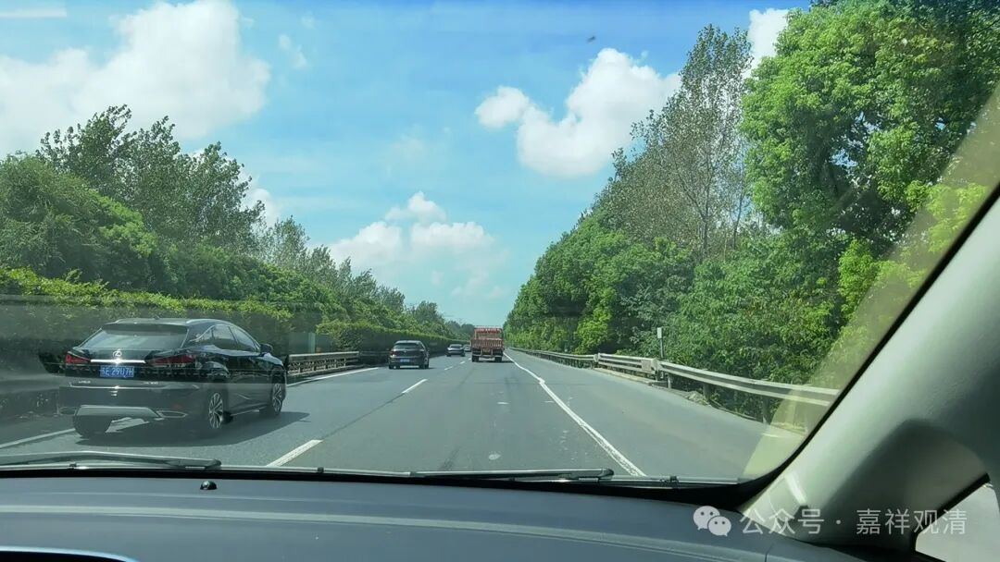
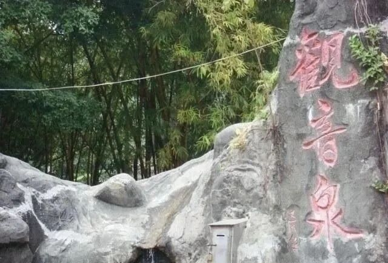
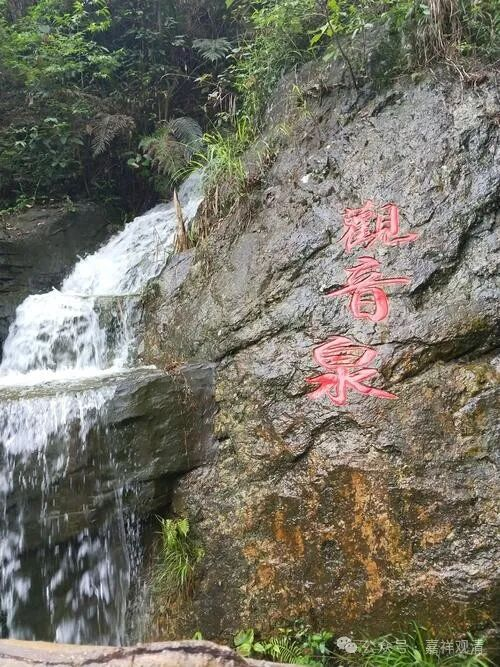

**“观音泉”**

穿过了三五个暴雨带，终于在日落时分回山了。

今年各地超高温爆表，山里还是有点热的，老周（包工头）说，四个工人扛不住，回家休息去了……哦，山里都受不了了。我一看天气预报，最高三十二，最低二十六～～按理说我们这里比山下至少要低个四五度，但至少现在没那么低。

庙里的工程停了快一年，终于改了个方案，通过审核，重新开工了。哎，现在做点事情真的不容易啊。其实让我们放手干，不是还能“拉动经济”吗？

别人的“观音泉”

让老周整修观音洞，他们居然给我刨出了一眼泉水来，哈哈，那不变成了“观音泉”了吗？泉水清冷，测试下来比农夫山泉还要优质，现在庙里全都喝的这个泉水。我刚回山，木生也给我提了一通泉水来，挺凉的。老胡说，他最近都饮用这个泉水，回上海用自来水，身体感觉不适应了，皮肤都过敏了……这么厉害的吗？那我到底是该喝呢，还是不喝呢？

还是别人的“观音泉”

咱们“观音泉”的出水量很小，刚够庙里这些人饮用的——这好像正是护法们的套路：你需要的？满足你！但，刚刚够用就是了！

明日再巡山，今天先歇了～～

