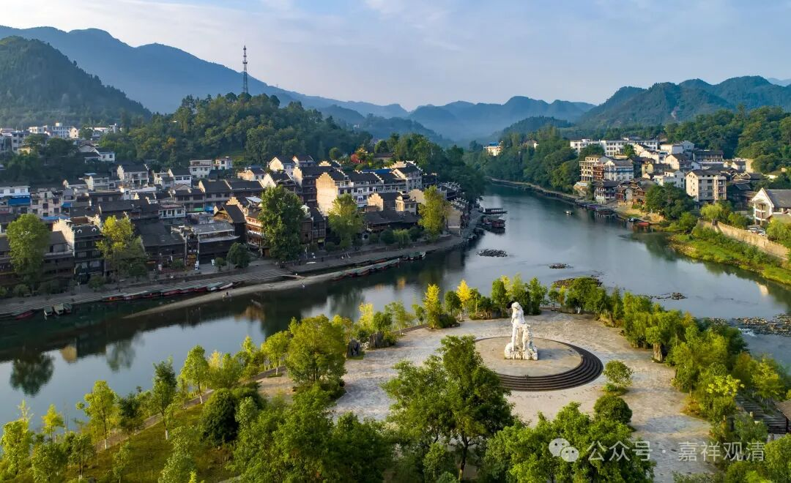

**《宗义略讲》005·041**

第七个：（经部师认为）心性不是“本来清净、客尘故染”的！这个都是针对大众部系统和分别说师系统的。

《成实论》在谈到自身和部派佛教的差异的时候，提到了十条，其中多分是反对有部而朋于大众部和分别说师系统的。但是关于“心性本净”与否的问题，狮子铠是和说一切有部站在一起而反对大众部、分别说师这两大系统的。

我们之前谈到了经部成实师的特殊宗义，那么，成实论师自己总结的核心宗义是十点——

《成实论》卷二：

** “问曰：汝经初言广习诸异论，欲论佛法义，何等是诸异论？**

** 答曰：于三藏中多诸异论，但人多喜起诤论者，所谓：**

** 1、二世（过去、未来）有、二世无；**

** 2、 一切有、一切无；**

** 3、 中阴有、中阴无；**

** 4、 四谛次第得、一时得；**

** 5、（预流、阿罗汉）有退、无退；**

** 6、使（随眠）与心相应、心不相应；**

** 7、 心性本净、性本不净；**

** 8、 已受报（过去已与果之）业或有、或无；**

** 9、佛在僧数、不在僧数；**

** 10 、有人（补特伽罗）、无人。”**

而成实论主在这十个他认为的核心宗义上的立场则是：

一、二世无──过去未来是非有的。

二、一切有与一切无，是方便说，第一义谛是非有非无的。

三、没有中阴。

四、一时见谛（顿见）。

五、阿罗汉不退。

六、不同意“心性本净，客尘故不净”。

七、使（随眠）与心相应。

八、过去是无。

九、佛不在僧中。

十、无我。

而大众部等认为”心性本净、客尘所染“，《异部宗轮论》说：

** “大众部、一说部、说出世部、鸡胤部本宗同义者、……心性本净，客随烦恼之所杂染，说为不净。”**

同样的，南传上座部系统也认为“心性本净”，南传上座部一向被认为是分别说师系统的。

许“心性本净”的主要是因为明确有阿含经文的支持……

