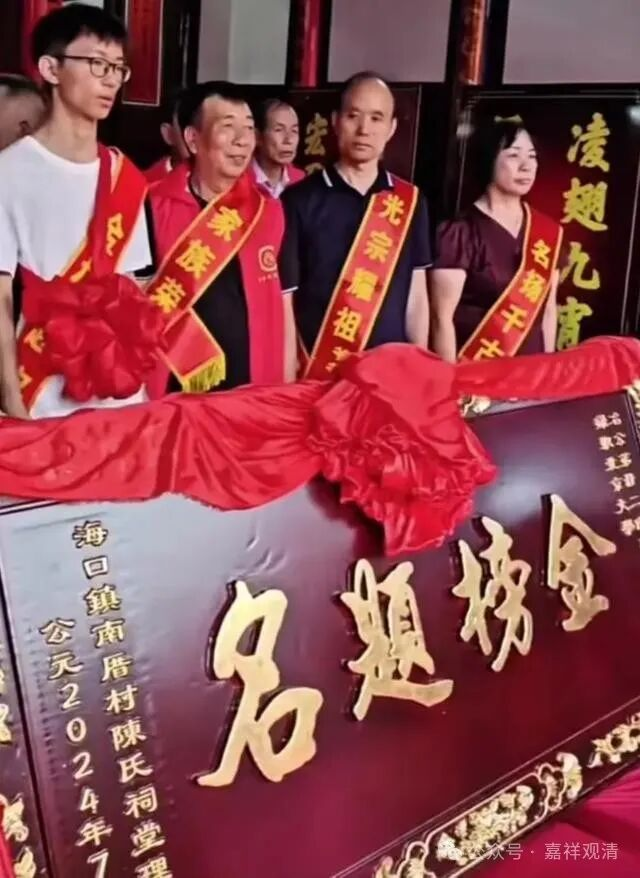
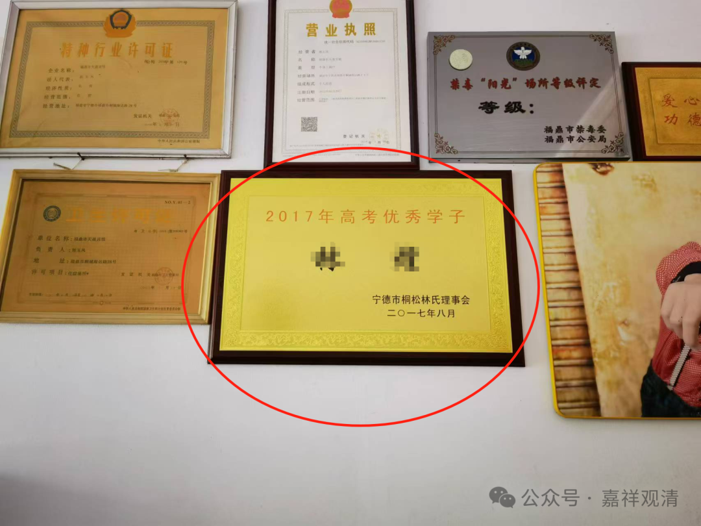

木生明天要回村帮忙办酒席，明天工地上有个工人也请假“吃酒”，我问了一下，是村里娃考上景德镇陶瓷大学了，要办酒。

我说你们“随礼多少”？就说“给个红包呗”。

我说，“福建有个考生今年考上北大，村里宗亲会凑起来一共给了500万！……”

他们说，我们乡里军民水库下面的那个村子，去年有个应届毕业生考上北大的，但这里给不了那么多。

前两天我在福鼎的时候，客栈墙上挂了个牌牌——

我问老板娘：“林氏宗亲会奖励了多少？”“五万……”

我又拿北大的那个说话，“今年福建有一个考上北大的宗亲会亲戚们一共奖励了五百万……”老板娘忙笑着说“那我们没那么多，一般的本科。”

（说起来，福建地区这些宗亲会的力量真的强大！）

上个月去湖南湘西科考，在某苗族古堡寨穿行的时候，看到一张公告牌（找了一下，发现没有拍照片存下来），上面意思是“不许随便摆酒席”。

我问龙老师原因，说是当地人就喜欢办酒，为了办酒巧立名目，买个车甚至母猪下个崽都办个酒收红包，巨量的“人情债”让有些人不堪重负……所以政府就出台了这个政策，制止盲目跟风……

