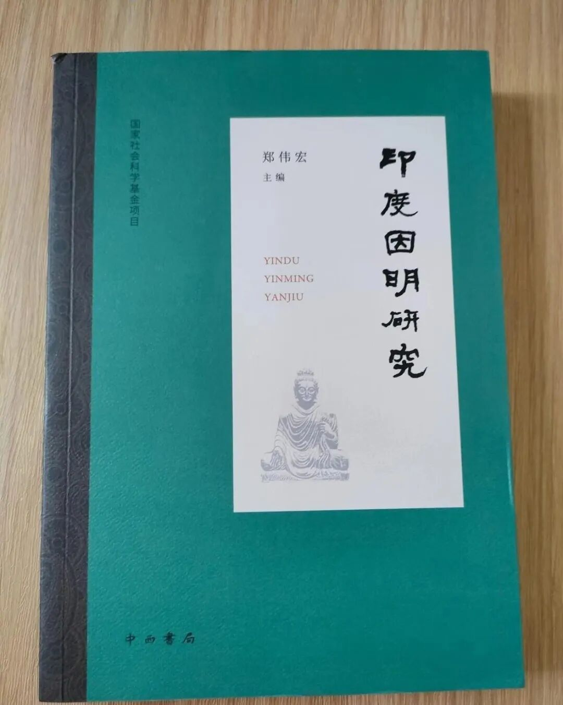

**谁是“阿毗达磨的反抗者”？**

我一向主张，认真准备学佛教的人，应该必须要学阿毗达磨，简单来说，就是要成建制地学习佛教的一些基础概念——五蕴、十二处、十八界、四谛、十二缘起……不学这些佛教的基础概念而学“佛”——大哥，你是想创教吗？！

长期以来，汉传佛教内部基本是不学阿毗达磨的，民国初年唯识复兴以来，在唯识圈（俱舍圈副之）是恢复研学阿毗达磨的，王恩洋先生的《杂集论疏》、韩清净的《<瑜伽师地论>科句·披寻记》可以算是其中的代表，但是，在唯识圈外，轻视阿毗达磨的现象并无丝毫变化。

世间学者我们自不必谈，有些不学阿毗达磨的、自诩的“中观师”人，由于缺乏基础，也是“开口便乱道”地“反对学习阿毗达磨”，甚至把“阿毗达磨”等同于有部哲学，这又完全可以说是佛教史的盲人。

今天看郑伟宏老师的《印度因明研究》，看到里面引用了一段南传上座部对“阿毗达磨反抗者”的批评，可以拿来警醒某些人——

** “对阿毗达磨反抗者，即予胜者（佛）之轮所害、反抗一切知智（佛陀的智慧）；使世尊的无所畏智转动;欺骗欲听的会众（四众）；绑锁圣道的障碍；可被视为破坏十八件事；应该举罪羯磨、苦切羯磨。因此件故，该（把他）赶走，得说：你是残食者过生活！”**

这是说：号召“不学阿毗达磨”的人（阿毗达磨的反抗者）是佛门里的罪人！哈哈，调子定得很高啊。

可以理解，而且，我们的意思很明确地就是：

任何内道宗派的佛教实践者不应该拒绝阿毗达磨、轻视阿毗达磨！

我经常和弟子说：“你可以不学中观、不学唯识，但必须要学阿毗达磨！”

