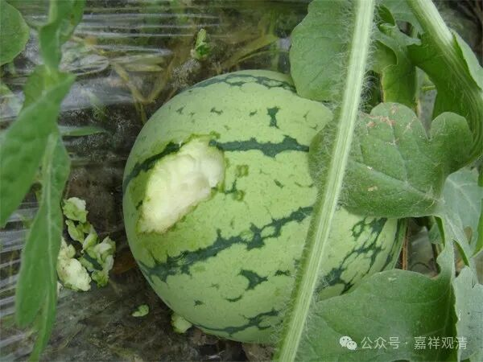
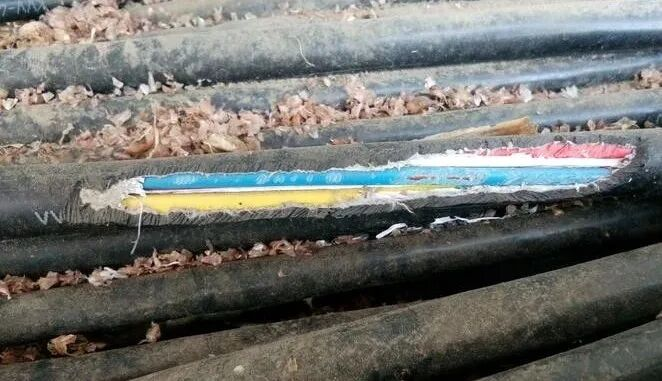

**鼠患！**

这两天天热……中午吃饭时忽然想起来——今年我们种过西瓜！去年我们就种过西瓜，吃得还挺爽的。

我问木生：“今年我们种的西瓜呢？”

木生还没回答，老胡和龙肃就抢着说了：“都被老鼠啃完了！”

原来今年老鼠把西瓜苗、玉米苗都啃了，今年地里的出产大减。

前天去综合楼巡视，冷水又没有了，检查下来应该是冷水泵不工作了，估计是线路问题。今天一大早沿路排查，原来是水泵的电线被老鼠咬坏了三处！三处！！！综合楼也出现大量老鼠活动的痕迹！这是逼我养猫啊！

电工小俞（就是早上一起排查电线的）说，今年整个乡里面庄稼都欠收，鼠患是一个重要的原因——今年不知道是因为什么情况，老鼠特别多，地里的东西被糟蹋得特别多，农作物都长不起来……

我们庙里的地也是这样，原先吃不完的南瓜，今年都看不到完整的……居士送上来一只猫，又被“乔丹”（土狗）差点咬死正在疗伤……现在就让它出战的话，估计死的是哪个还真不好说。

不过两只狗倒是也拿耗子——这对我们来说倒真不是“多管闲事”。（以前的小黑也拿耗子。）

山里面的寺院，鼠患一直是个问题。这刚好了几年，又卷土重来了！

