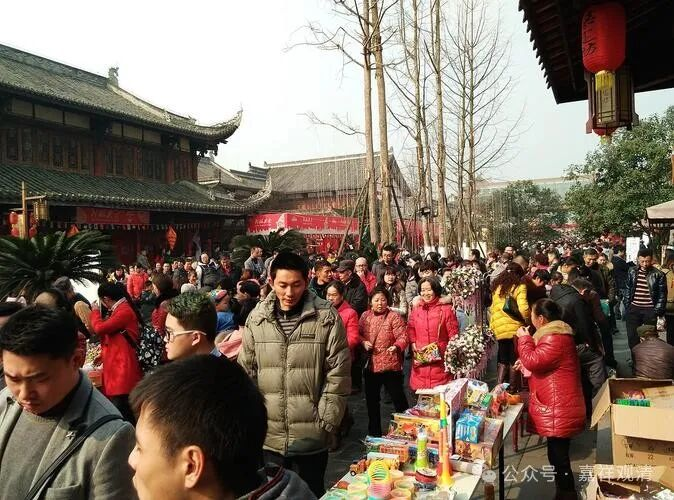
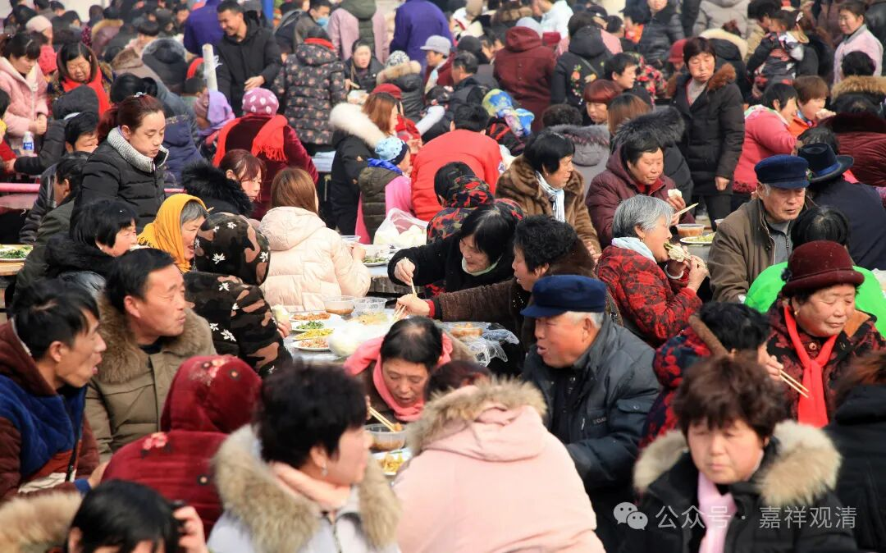

**准备开山会**

今天去村里，安排过两天的“开山会”。

去福建走了一圈，发现我们的“开山会”和他们那边法会开席也差不多，都是拜佛+流水席，和中原、北方的“山会”“庙会”还是不同。

我这几年都在考虑要不要往庙会的形式发展，搞点油炸土豆、银耳汤、煎素肠、冰激凌、冰冻果汁、油炸素排、素丸子汤、豆腐脑（甜&咸）、油炸桧、薏米粥、煮玉米……套圈……卖人参……卖袜子……，哈哈，搞点大家喜闻乐见的，单纯吃个饭也太无聊了。

这几年“开山会”来的人就是越来越少，当然也有其他的客观原因——附近的几个无证的小庙（没有出家人）也有样学样地、“不讲武德”地，都在同一天蹭流量搞“开山会”，于是人群被分流了，我又不好意思对小庙下狠手……

开山会人数不好控制，买菜、做菜也是麻烦事，但我表态：总不能让人来了又上不了桌子、吃不到饭，所以哪怕可能会有点浪费，那也得认，多做一点肯定没错。

不过今年山上、山下地里都出不了啥菜（被老鼠霍霍了，去年冬瓜、南瓜、都吃不完），居士们都没菜带上来，只能明后天去镇上买……而市场的菜价也都涨了

