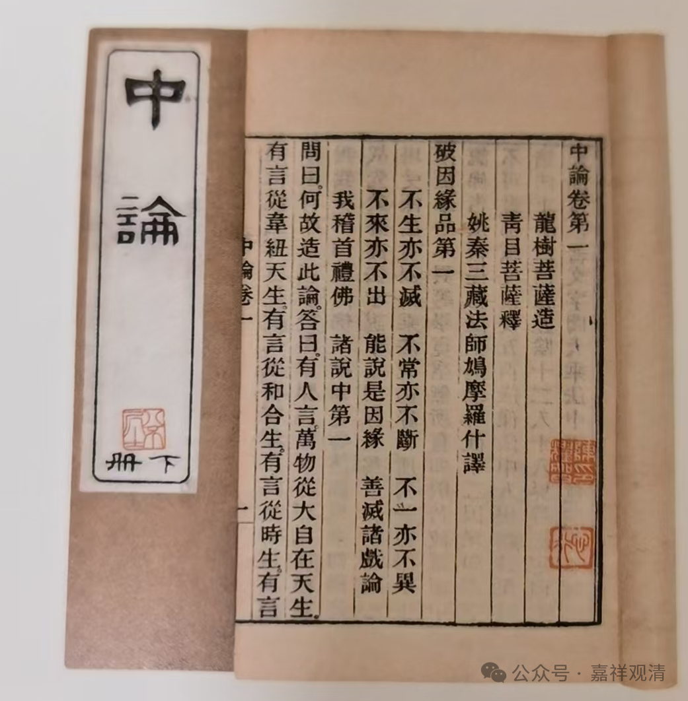
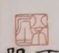
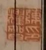
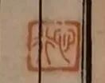

**“八不居士”陈耀智**

这是拍卖场上出现过的一部《中论》上下册，即鸠摩罗什法师翻译的《中论·青目释》，六卷。

可以看到三枚印章，封签上的是“八不居士”，第一页上盖的是“陈耀智印”、“心行”，其中，“八不居士”和“心行”都是朱文印。

八不居士

陈耀智，1885～1955，清末民国年间名人，曾入保定军官学校，后入新军，参加武昌起义，后参加北伐，任旅长。反蒋失败后退出军界，入庐山，开始研究佛学。

陈耀智印

这两册《中论·青目释》应即其藏本。

《中论》开篇归敬颂就是：

“不生亦不灭，不常亦不断，不一亦不异，不来亦不出。

能说是因缘，善灭诸戏论，我稽首礼佛，诸说中第一”

开篇就是不生、不灭、不常、不断、不一、不异、不来、不出——“八不”，所以汉传佛教一提到《中论》就说“八不”。

封签上的“八不居士”很可能就是陈耀智的“自号”了。“心行”，则可能指向佛教的道理需要在心上、从心出发去实践，或者亦为老先生的自号（？）。

心行

清末民国时期，军界很多人学佛，著名的有汤芗铭（陆军中将）、朱庆澜（陆军上将）、陈铭枢（陆军上将），还有陆军一级上将唐生智。陈耀智曾入唐生智军中，参与反蒋，其失败后研学佛典或与唐生智有关（？）。

老先生最后是自尽过世的……

        修改于