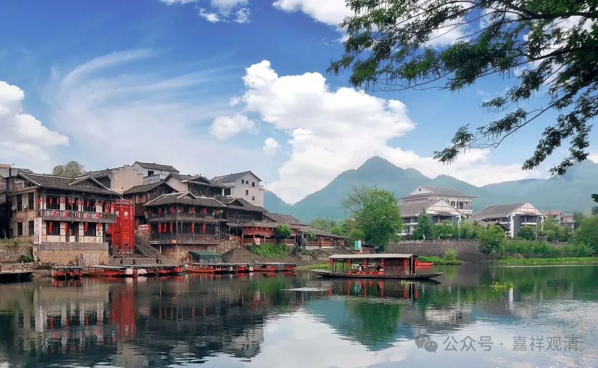

**《宗义略讲》005·047**

第十个：“无我”。

总体上说有两个，一个是人无我，一个是法无我，这在《成实论》里是都承认的。所以站在汉地保存的文献立场来看，“法无我”并不是大小乘宗义的分水岭。

此外可能还要再讲一个问题，关于“大天五事”。

那么早期的部派的差别呢，我们讲最早的上座部和大众部的分别是在石窟内结集和石窟外结集……第二次部派的重要分化跟一件事情有关，也是佛教史上比较重要的事情，就是“大天五事”。

（有一种说法是）说大众部就出现了一个人物，叫大天，大天他提出五件事情，上座部不接受，不同意，然后这两个就主要分成后来的上座部，大众部（其实这个说法时间线不对，大众部和上座部的分化之初并不是因为“大天五事”，“大天五事”是第二或者第三次部派大分化的重要标志性事件）。说大众部是承认大天五事的，

“大天五事”是：“1、余所诱；2、无知；3、犹豫；4、他令入；5、道因声故起，是名真佛教。”

上座部系统，包括有部《发智论》、南传《论事》等都对此五做了很离谱的解释，并倾向于说大天是一个破戒和尚。大众部系统则是支持的。

就现存的大乘记载来看，真谛三藏的意思是，上座部的解释基本上可以算是泼脏水，此五事实际是部派佛教里的部分学者提出的佛和罗汉差别的总结，而大天本人是一位高僧。基大师也认同这一说法，

比如说“无知”，这个后来的佛教里面基本上都已经接受了，就是说阿罗汉有“无知”，但这个“无知”是“不染污无知”或者叫“非染污无知”，就是不直接跟断烦恼有关的有些问题，罗汉也有不知道的，比如说孔雀的羽毛是怎么做的啊等等，阿罗汉不需要知道这么多，他也不觉得自己需要学这么多。这个其实连有部后来都接受了。

“犹豫”也是一样，罗汉可能对某些事情有疑，在某些不了解的事情上，可以有疑的，比如说在具体的因果事情上，具体的什么因，什么果，比如说成立戒律，比若说刚才讲的，我这个戒律到底有没有啊，阿罗汉不是要去问问弥勒佛嘛，这种事情阿罗汉还是会有疑问的，不是对这些事情都知道的，所以他会有这些犹豫方面的东西——这是这里“犹豫”的意思。

“他令入”，就是证果的这件事情，有些人未必自己知道，要别人来告知他，比如佛陀不是给人授记了嘛，你看舍利弗证果了，目犍连证果了，你看还需要佛陀给这两个人授记，给点出来，所以说证果与否，有些还是需要别人来点破的，比如说舍利弗、目犍连也是这样的，很多人都可以是这样的，包括你有没有成功，也需要一个长老来印证，所以说需要“他令入”。……不是有个说法，叫“如人饮水，冷暖自知”的吗？大众部或者大天认为不见得，有些还是需要大师来肯定一下。

“他令入”还有一种解释，就是即使如声闻里最利根的舍利弗、目犍连，也还是需要马胜比丘的启蒙才能入佛教、最终证道。

……

