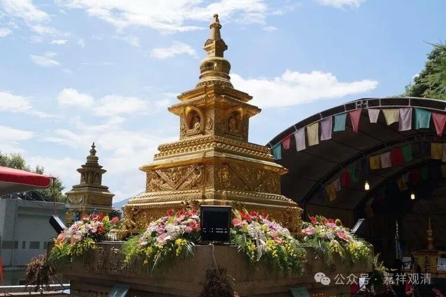
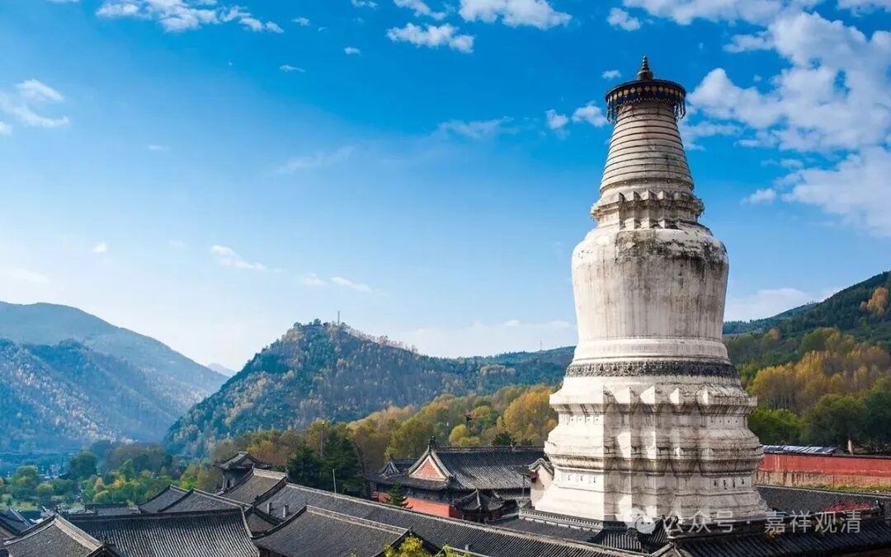

**明天开山会，还要吊装石塔**

明天开山会，今天要安排人手，念经、巡视殿堂、做饭端菜、维持停车秩序……忽然下午接到一个电话，明天来安装石塔！

明天？！

这个石雕厂的服务是真的拉垮，我们都吐槽好几回了。前几天我跟他们说八月初一（9月3日）准备安排吊装，厂家说正在其他地方出差……后面又催了一回，生硬地说“等消息”……今天等到“消息”，却是提前半天给我来个“我晚上到！”

我说：“明天我有庙会活动啊。”

对方说：“很快的，两个小时就搞完了！”

我说：“啊？我这里有十三个塔啊！两个小时可以安装完毕？”

对方说：“哦？！我以为一个……”

这……这厂家这两个人的行事方式……我觉得能挣到钱也真是本事！

不过回头想想，“开山会”的时候吊装石塔，也是个“节目”，可以让大家参与感更强一点，“开山会”多个内容，也更热闹一点……就一起办了吧。

下午一通忙活，把装藏的东西都整理出来——佛像、佛塔、经书，连大藏经的缩微胶卷都有……还要找吊车、挖机。吊车明天早上七点到，挖机还没联系好……

我们聊～～千万年后的外星人如果找到这些缩微胶卷，他们知道怎么打开、怎么解读吗？

厂家又来语音，说明天早上八点到……随便吧……

