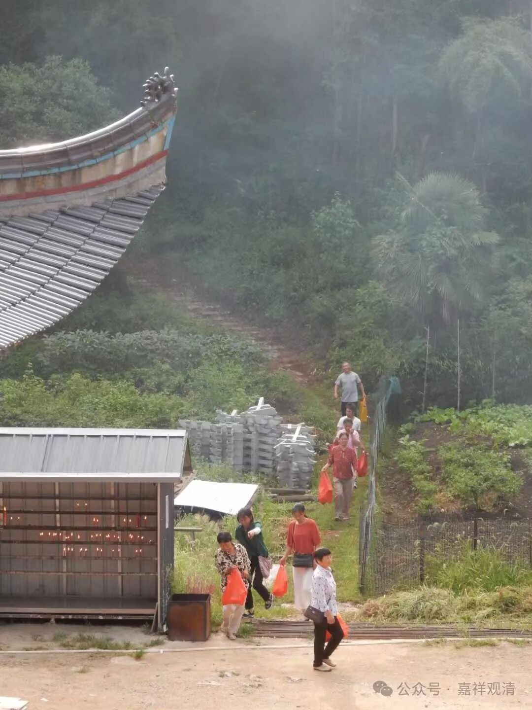
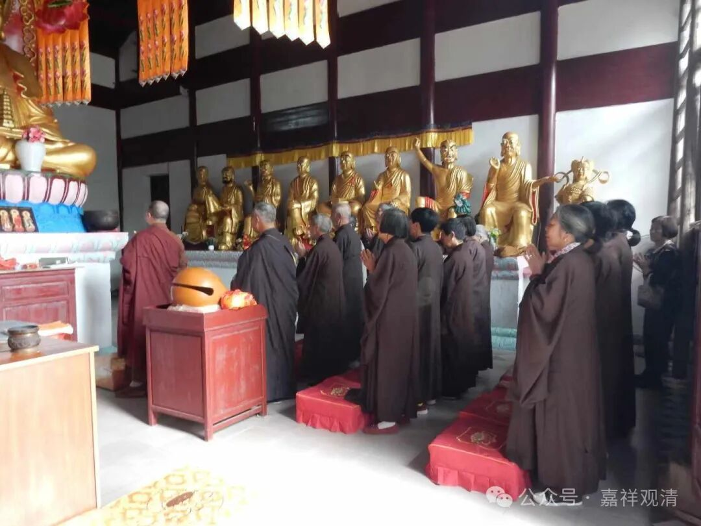
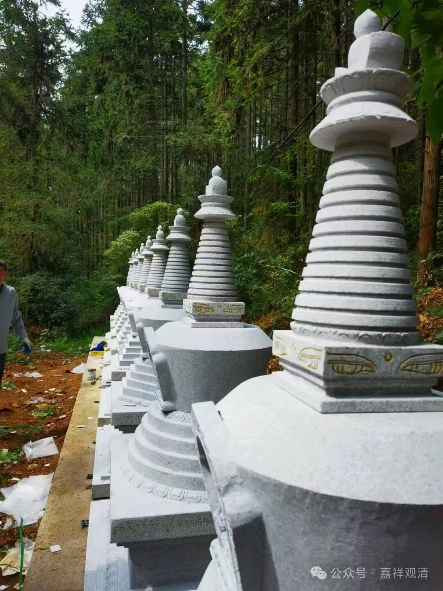
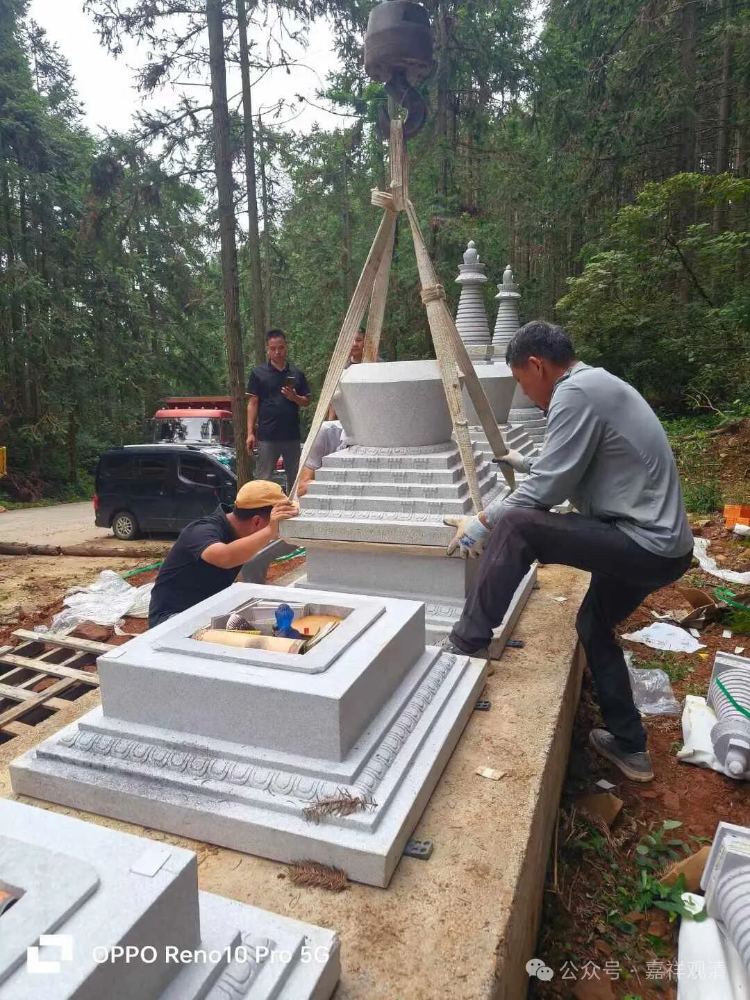
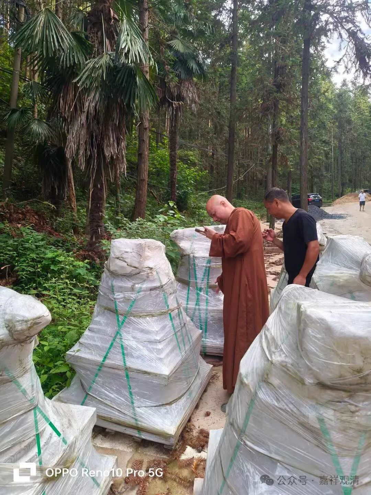
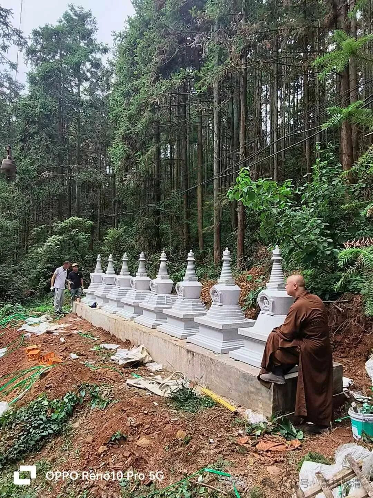
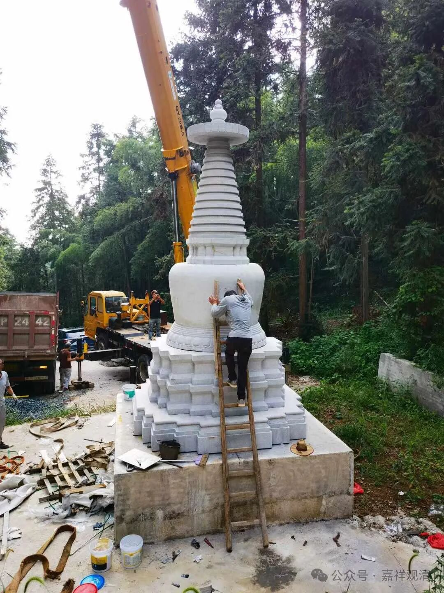

**修建佛塔（一）印度如来八塔**

今天庙里在做“开山会”，我基本没怎么跟进，直接去工地了——安装佛塔。

定了一批石雕佛塔，四五月份就送到山上了，但那时候连续下大雨，无法安装……前一段时间又太热，这次赶上开山会，正好。本来今天天气预报说是要下雨，结果之下了一小会儿很小的毛毛雨——那啥，真给面子！谢了！

上午先安装“如来八塔”。

“如来八塔”是印度佛教为了纪念释迦牟尼佛的一生（的主要事业）而整合出来的一个概念，宋施护翻译过一本《佛说八大灵塔名号经》，根据相应记载，这八大灵塔分别对应一个佛教圣地：

1、莲聚塔，释迦太子出生，迦毗罗卫国；

2、菩提塔，佛成道处，摩揭陀国；

3、吉祥门塔，最初讲经处，波罗奈城鹿野苑；

4、神变塔，现大神变，舍卫国祇园精舍；

5、天降塔，从天而降，回归僧团，曲女城；佛如涅槃

6、息诤塔，僧团和合，王舍城；

7、殊胜塔，受记寿量，广严城；

8、涅槃塔，释迦佛入涅槃，拘尸那城双树间。

后来为了纪念佛陀，有时会把这八个塔建在一起……

核对如来八塔次序

我们这如来八塔里面，装了整套大藏经的缩微胶卷、琉璃佛像、小塔、其余七宝、经书……

这是在对平拉直线

老居士们很兴奋：我们莲花山庙里又添新东西咯！

上午装完“如来八塔”，又吊装了五米高仿五台山的大白塔

这里面我们装了整套《乾隆大藏经》，等……原先预计两个小时吊装完毕，我们前后搞了大概有六个小时。

还有3个塔，明天继续……说不定还得两天才能完工。我们准备八月初一开光！

