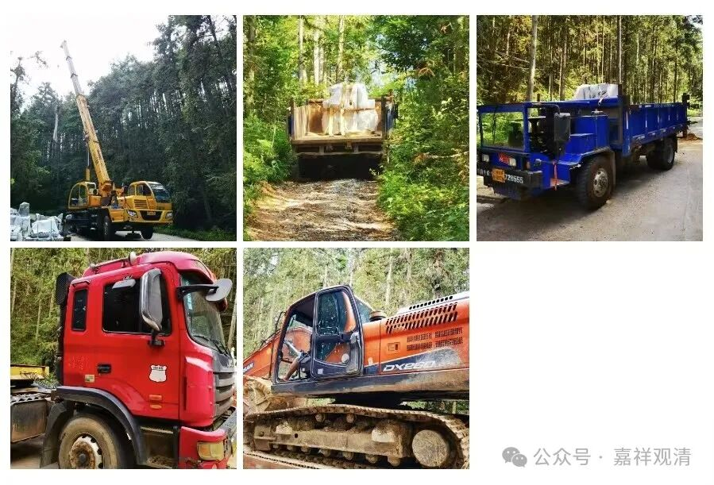
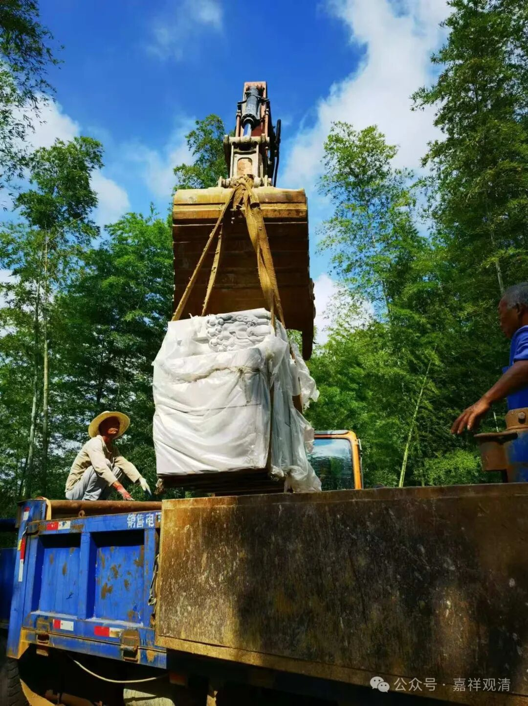
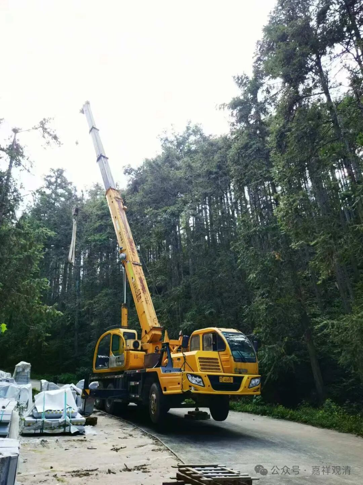
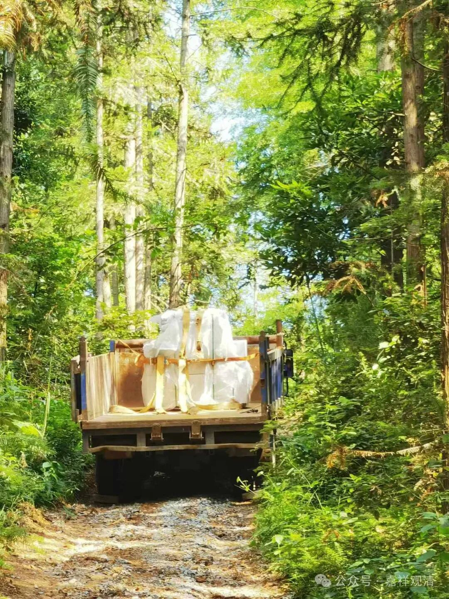
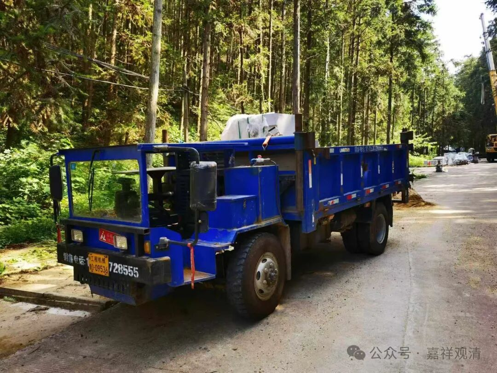
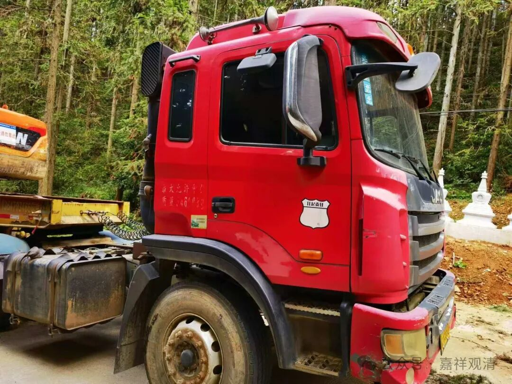
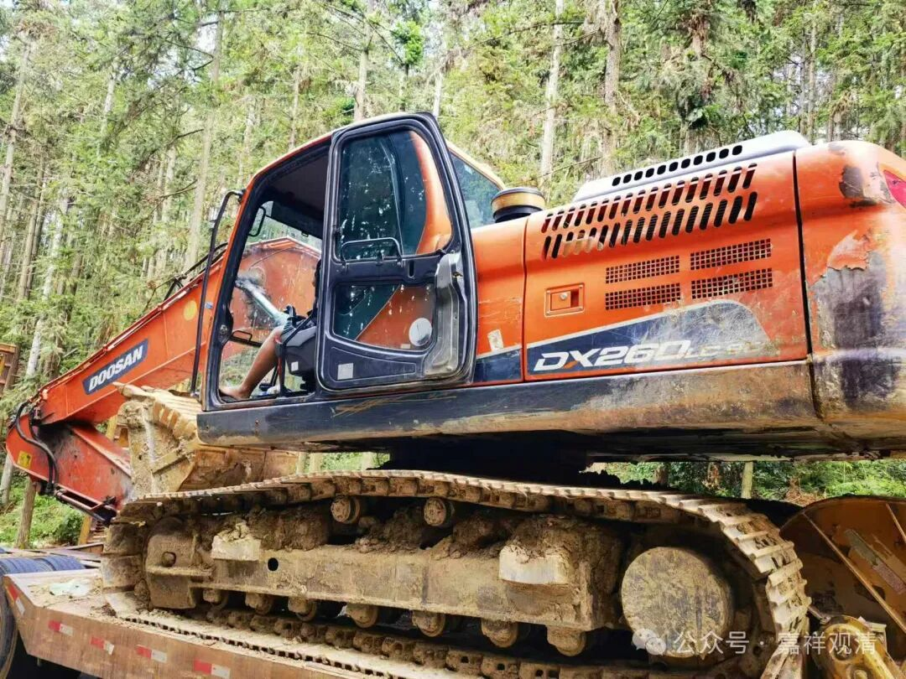
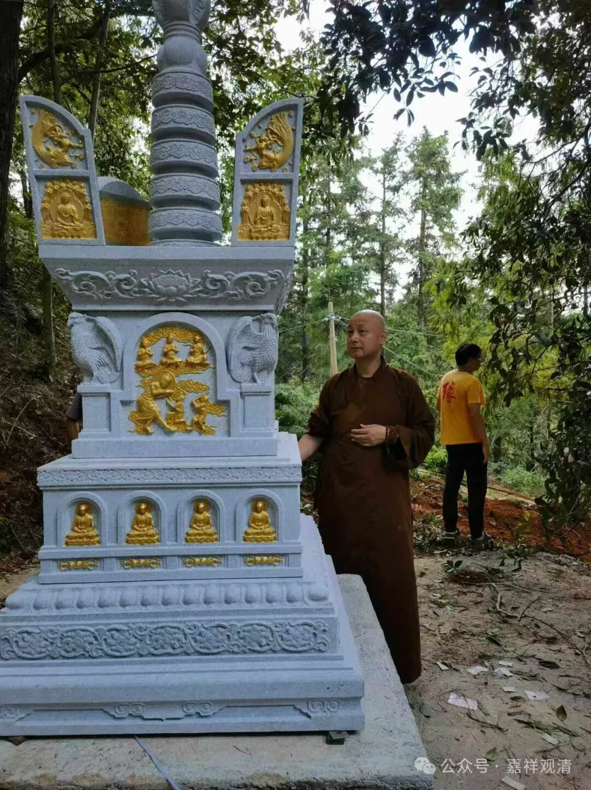
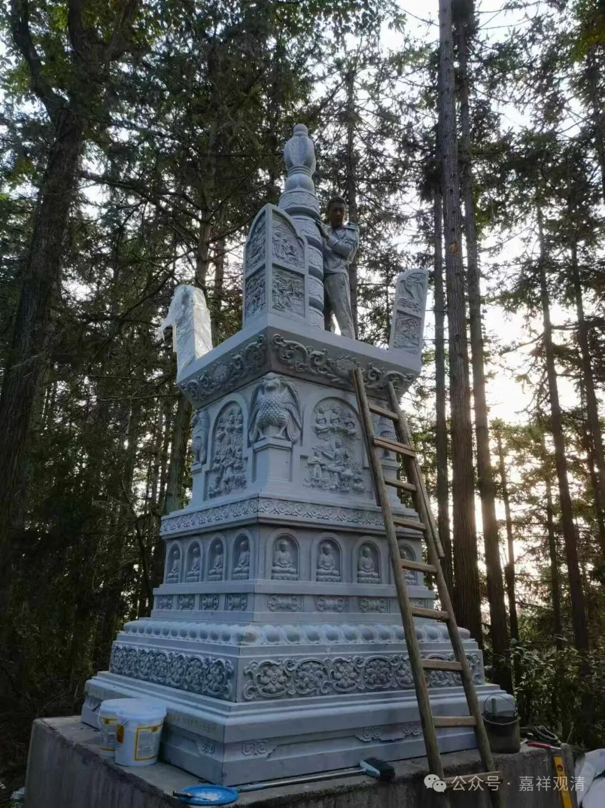

**石塔安装第二天：“阿育王塔”**

今明天安装石塔的模式和昨天不同——今天不是一个塔一个塔地吊装，而是先把所有的石料“元件”先运到各个塔基附近，然后再按次序吊装。其实主要是为了省钱……考虑到一天装不完，先把吊车、拖车的活儿都干完让他们回去，只留一台大的挖机安排吊装。这不就是省了三辆车一天的工钱了吗。

拖车先装了两吨的货上山，结果开到半道上不去、下不来……这时候需要外力，而挖机还没到！打电话催，说还没准备来！晕死！逼着他赶紧从四十公里外开过来！（其实他要是早上七点按时到的话，我们今天是可以完成全部吊装的。但是他的迟到，让他多挣了一天的钱——这就是来自底层的狡猾……）

……挖机一上山，还没靠上拖车发力，那辆推车居然颤颤巍巍自己动起来开上山了……我正纳闷，包工头告诉我：这是后面有了靠山胆子大了，就发动起来了，后面要是没这个挖机他心里没谱，害怕。嗯，有道理！

今天我们庙里是“工业大摸底”，为了建塔，来了五个变形金刚transformers：

吊车

拖车

“丑八怪”，又叫“四不像”。我问工人，他们给我的名字。我不知道学名该叫啥。

拖车：把挖机装来的。

挖机，又叫钩机。这是个大号的。有了它，可以不用吊车了——吊车需要场地开阔，这个挖机能适应复杂环境。

今天完成的两个，小号、大号的“钱王塔”，又叫“阿育王塔”。

