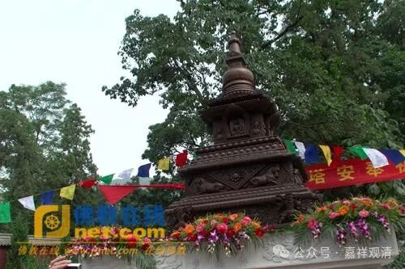
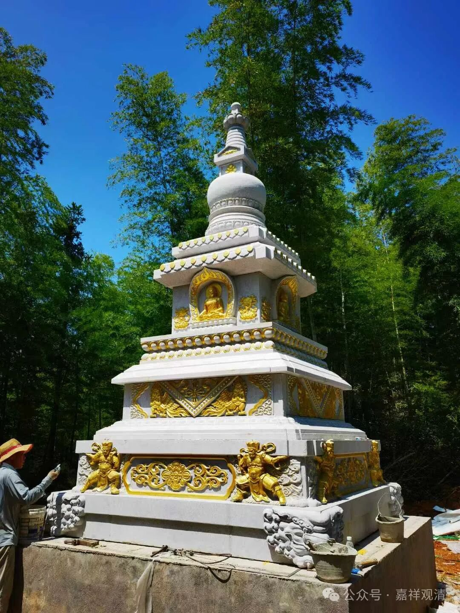
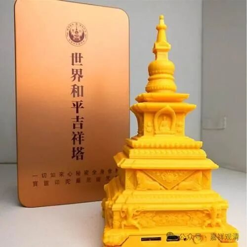
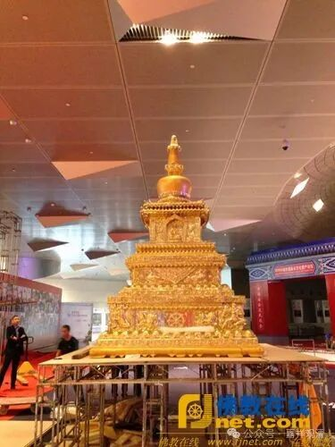
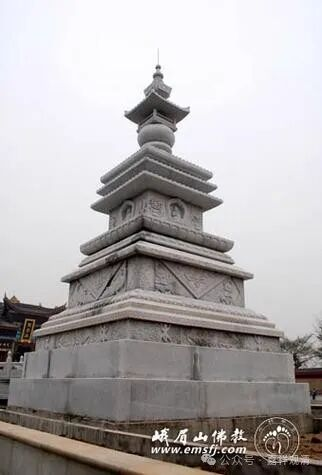

**世界和平吉祥塔**

今天，完成了这次最后一座“世界和平吉祥塔”的安装。

世界和平吉祥塔，又叫“宝箧印根本大塔”，是我一直很喜欢的新式样，这次终于在寺院安奉完成了！

刚吊装完成

世界和平吉祥塔，是佛教在线的安虎生先生主持创制的，后来发心要在全世界建此塔108座。

我忘了是什么机缘，曾经在北京和安先生专门聊过建塔的事，后来有一段时间经常请了小塔送给师父们。

此后也有见过安先生几面，算不上熟络，但有所了解。网上介绍他的文字很多，我就不再多说了。安先生今年过世，佛教圈也持续了不小的热度。

当时有准备在我们寺院安奉一座“世界和平吉祥塔”（作为江西的代表），后来忘了是什么原因没有继续下去。一度邀请我去少林问禅当评委，也是也正好有事错过了……

今天回想起来，可能是我刻意低调的原因——江西大寺院不少，我们小小白云寺名不见经传，作为江西的代表（来安奉这108座塔之一）底气实在不足，我也不太想出这个风头……但是我一直想建一个这样的塔，自费+不挂名就好，后来看到有石质的世界和平吉祥塔，就一直很留意，厦门佛展会上也曾问价过N次……

这次终于如愿！

煽情的话不多说了，唯愿世界和平，施主吉祥！

        修改于