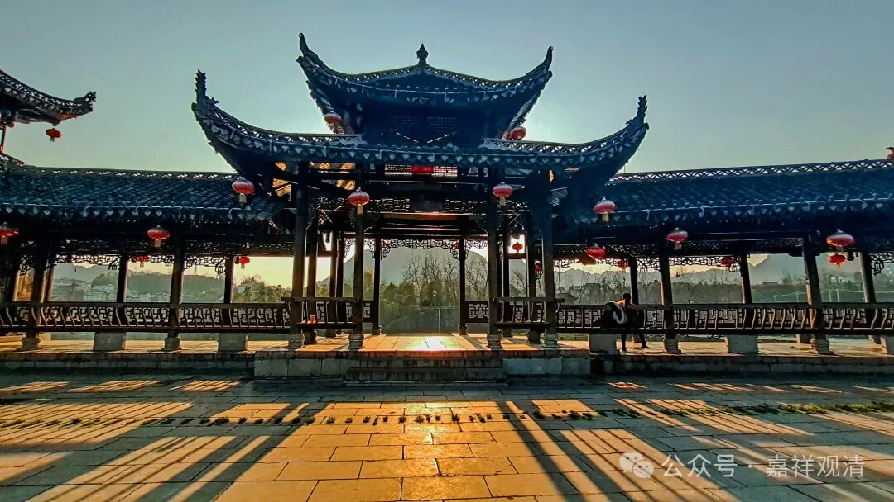

**《宗义略讲》005·052**

前面我一直提到中观的阿毗达磨不发达，或者说没有固定的、纯粹的属于中观的阿毗达磨……现在（南北朝的中国）突然有了一个跟空有关的阿毗达磨，用起来也很好用，没有什么障碍，可以用它来解释大乘经，所以这些用《成实论》来解释大乘的就成为“《成论》大乘”……从这个角度来讲“成论大乘”也可以讲。

当然《成》论本身不是大乘，从他的传统来说，他是经部的系统……反正综合起来看（主流的观点）还是把它（《成实论》）放在小乘当中、放在经部的系统当中。

汉地的习惯说法是这样的，小乘和大乘各有“空、有”二宗：经部、有部、中观、唯识，这个和臧地、印度的说法暗暗合拍了。

保存在汉地的经部典籍是承认法无我的，还要来个两重二谛，甚至隐藏三重二谛，他的第二重、第三重二谛直接往“一切法空”上靠，甚至直接往“空空”（空亦复空）靠，所以汉地认为《成实论》，或者说经部，是小乘里面的空宗。而说一切有部是小乘里面的有宗，有部说三世实有嘛。

那么大乘的唯识就被称为大乘的“有宗”，大乘的中观就被称为大乘的空宗。

那么，空有之外，汉地的佛教对这些怎么归类呢？三论和唯识以外其他的中国大乘宗派，他们不认为自己是空宗、有宗的，认为自己是“性宗”的，因为中国人还有自己的想法——空有是两个极端！而且在空有的背后，首先是存在……所以他们自称“性宗”（实际是对中观、唯识都没搞明白以后的自创）。

要知道中国人的想法是带着中国人自己的观念的，一方面他的思辨不像印度那么缜密，另一方面，中国人有自己的特殊思维，他们会说，“你们说空、说有，当年实际不是要先有个存在（性）才行吗？”那按照中国的思维，“两仪的起源一定是太极，是有、是空量就是两面、两仪嘛，而两仪之前的太极，就是首先要存在，才能谈有和空啊……”。

所以更重要的是存在、是本质“性”嘛！所以自称是性宗，“先要存在，我们先要是太极，然后才能有两仪，你们就是一个讲有，一个讲空，我就是比你们高，我要统一你们，在你们‘之先’，所以我是性宗，你们是空宗、是相宗……”。

这就是中国人的思路，所以天台啊，贤首啊，禅宗啊，其实他们都自称为“性宗”，有说三论宗也是性宗，其实真正的中观派不能叫“性宗”，应该叫“空宗”，唯识派应该称为“有宗”。

“性宗”是什么呢？

太虚法师对大乘佛教判摄为三：法性空慧宗、法相唯识宗、法界圆觉宗；

印顺法师也判大乘为三系：性空唯名、虚妄唯识、真常唯心。

太虚大师的分类、印顺法师的分类和中国传统的分类是一样的，他们说的“法界圆觉宗”“真常唯心系”就是中国传统中说的“性宗”——此三者同出而异名……

        修改于