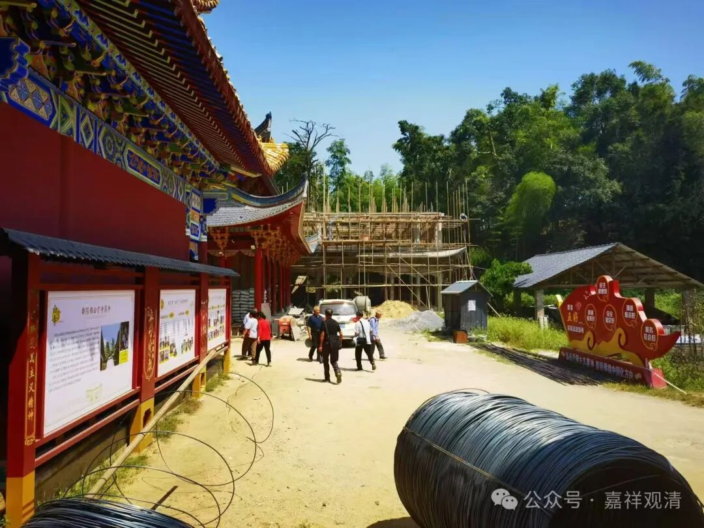
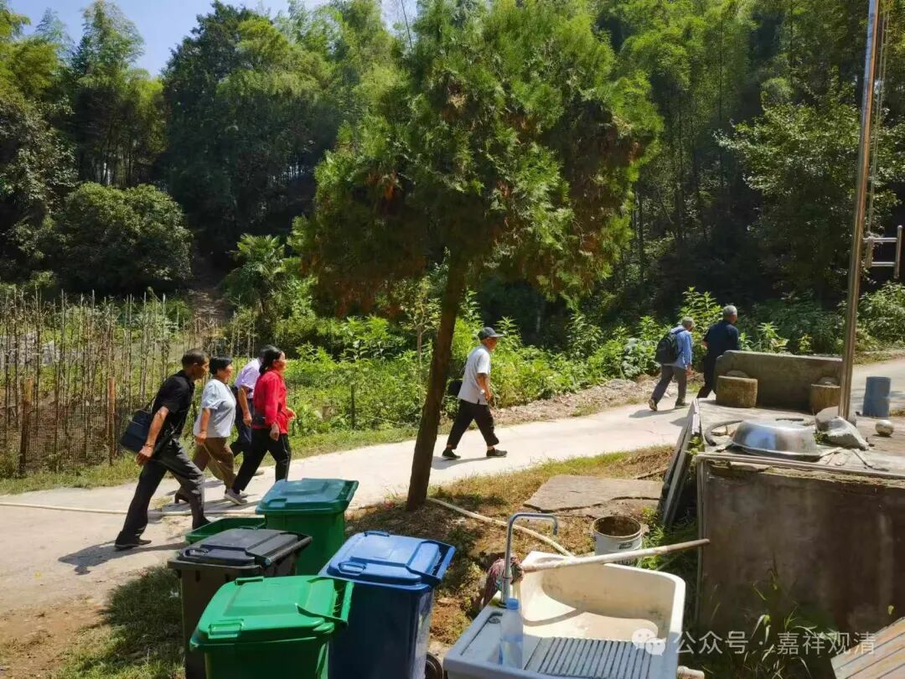
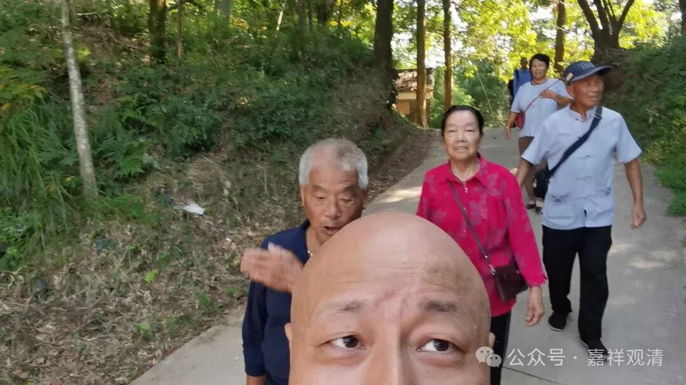
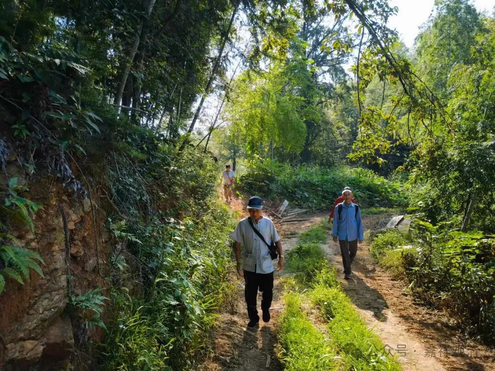

**贵溪进香团来了**

** ——“传统”还能持续多久**

贵溪进香团又来了。

今年的贵溪进香团来晚了。

每年开山会结束以后，一般第二天贵溪进香团就会到寺院近年来电话说，晚两天到，人数不多，当天来回……

我说的“贵溪进香团”是历史延续很久的（至少也是清末、民国至今）每年固定日子来白云寺进香的鹰潭贵溪的居士团，以前人数比较多，多的时候有三、五十个，在观音殿、地藏殿打地铺，上山的时候还扯上红旗，甚至还带着胡琴、铙钵，晚上唱戏给菩萨听……其实他们不怎么分得清菩萨和神仙，观音菩萨，他们是叫观音娘娘的（福建有些地方管观音菩萨叫“大奶奶”的）。

有一年他们来的人很多，在观音殿打地铺，晚上我就在观音殿给他们讲了五戒和成佛之道，第二天给他们做了皈依。

今天他们包了两辆车出发，上午八点半到的寺院。可能是天热+人老的缘故，只来了七个人。我带着他们走了一圈，看看我们新建的石塔。民间嘛，能建庙就是“好师父”，所以我也成了他们口里的“好师父”。

疫情期间，我们约定就不用来朝拜了，疫情以后这就续上了，不过人数明显少了，也偷懒直接包车过来了……以前他们是一路走过来的。

午饭后告别，相约“明年见”！

按现在这种缩水的速度，“贵溪进香团”不知道还能延续多久……

