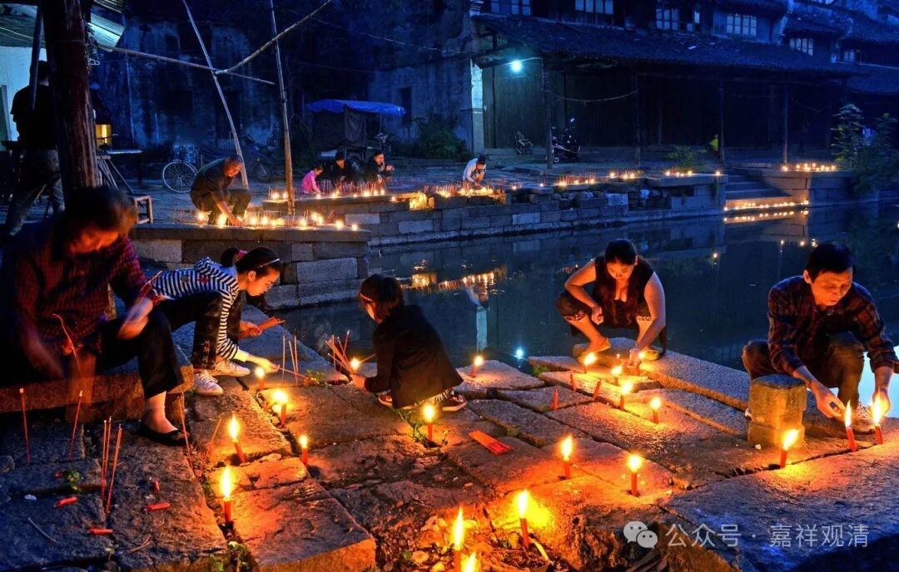
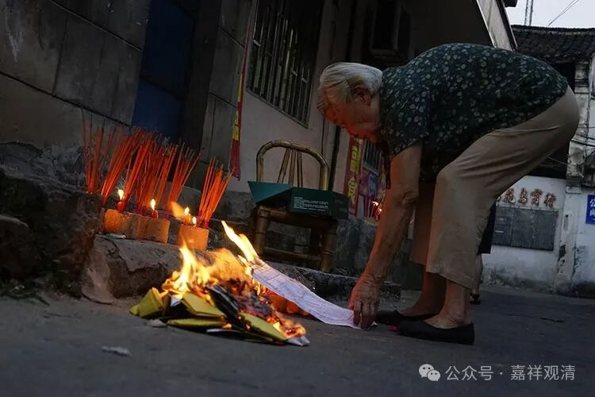
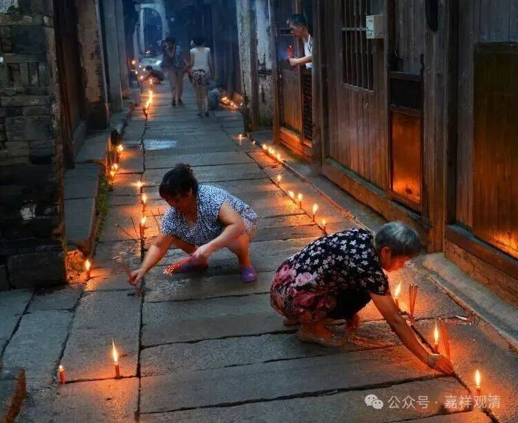
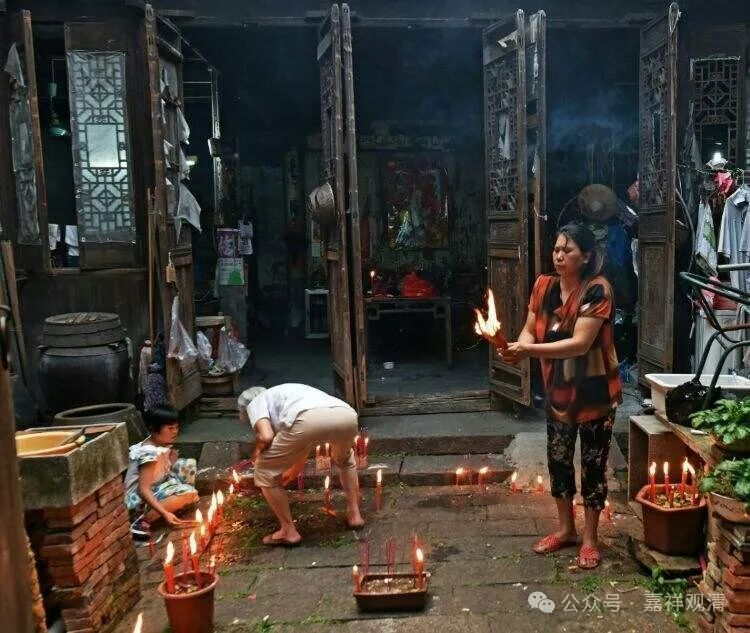

**“地藏香”，地方风俗的外溢**

今天是七月三十，民间说是“地藏菩萨生日”。

这一天，吴越地区有烧“地藏香”的风俗。大家烧香，就插在地上、砖缝里、桥上、路边、田头……地藏、地狱、鬼节、度亡，这些符号在中国民间是相关联的，而炎热夏季后的“一阴初生”又是中国“大易”之学的标准语境。

这一天在地上插香，很明显是吴越地区的背景，吴语方言中，“地藏”和“地上”是完全相同的发音——由“地藏香”而讹化、演变为“地上香”，在吴地的俗文化里是“应有之义”。

区域文化，是可以借商人、僧人、官员的流动而“外溢”的。我问过我们庙里的居士，她们说，以前这里有个年轻的出家人住持白云寺的时候，他在“地藏菩萨圣诞”这天会召集居士们来庙里守夜、带着居士们和孩子们到处找砖缝里插香……要过了晚上十二点才让大家回去睡觉。这其实就是僧人在打破地域限制传播“民俗”，也是一种意义上的“移风易俗”（无而令有）。

有弟子在朋友圈给我留言，说“潮汕地区路过插香叫大房池施孤，意思是古代纪念保家卫国的战死沙场的圣人和士兵，现在是纪念战死沙场的世界和平英雄烈士。”这也是外溢的“地藏香”，进而被正面地“移风易俗”了（已有令变）……

“地藏香”的事儿前两年我已经介绍过了，今天我就不再多说了，大家可以自行检索……

别忘了，还有时间的可以去插几支“地藏香”缅怀先烈、祈祷和平！

        修改于