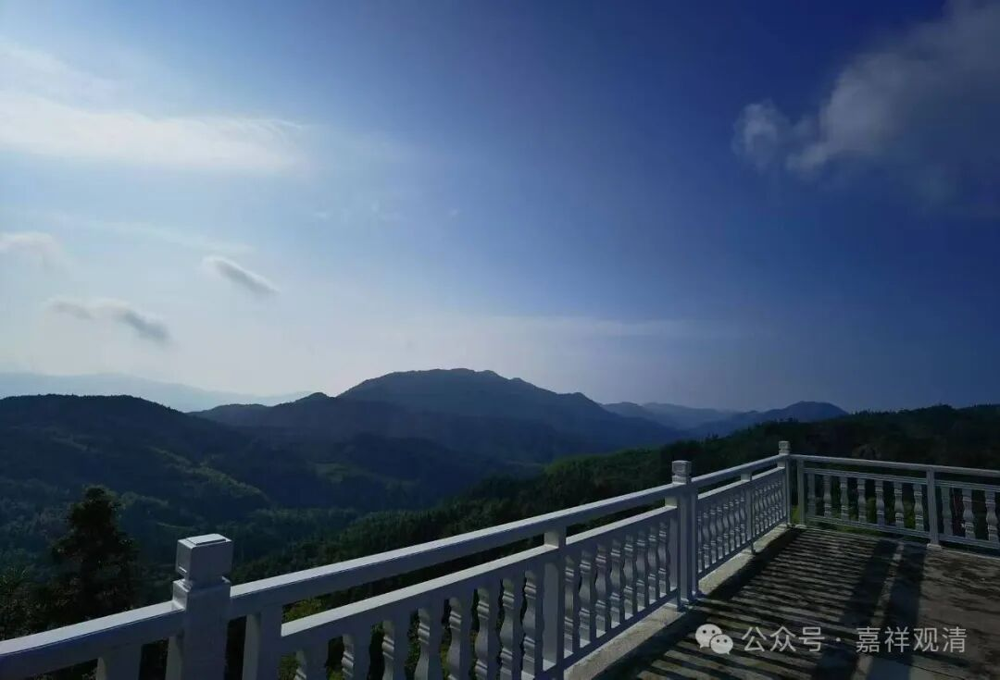
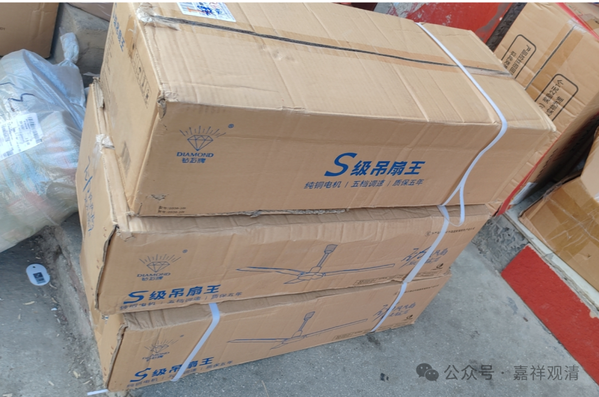
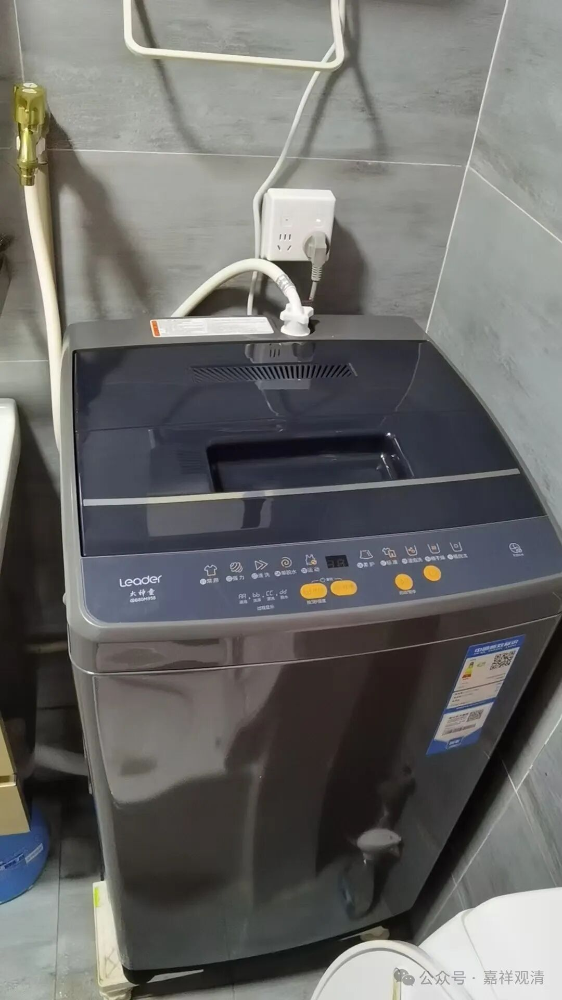

**山里的一次性电器，们**

庙里化缘了一堆电器——三个洗衣机，一个空调，九台吊扇……除了空调，今天都到了，明天装吊扇（今年太热了，往年根本都不考虑吊扇）。

住在山里和城里不一样，有些生活成本要比城里高，城里坏了个灯泡可以找物业帮你换，洗衣机坏了可以找品牌维修部，山里就麻烦得多——一个乡只有两个电工，你“求救”的机会，有限。（当然山里的房子没那么贵。）

从镇上开车上山要一百多块，假如我们三四百块钱的洗衣机主板坏了，你去镇上找人来修，那来回车钱加上维修费用还得超过这台洗衣机的费用……所以，小电器坏了就换吧——看起来已经养成了老外的“奢侈风”了，其实也是不得已啊。

或者，空调坏了，咱等……等到凑足三台以上的空调坏了，那就可以找人来修了，哈哈！最近就坏了一个空调，咱等……然后昨天发现综合楼一共坏了仨空调，那心情甚至是“高兴的”——嗯，过两天可以找人一起修了！

山上的电器还怕打雷，一场雷雨可以打坏好几个路由器，所以预报有雷雨的话，我们有时候会自己先切断电源，保电器。以前在黄山翠微寺也是，一年要打坏好几台电话机、打印机，我的电脑也被“干”废了，半年的工作都被雷神收了去……我把硬盘拆下来去找人修复，兄弟回复说～～没救了～～

空调过两天再到，这个气温之下，至少还能用半个月——我看到此后第十五天的天气预报，最高温度还是有35度！

老桂昨天请假下山……原来天气太热，学校推迟开学，他得去乡里把孩子接回家……

