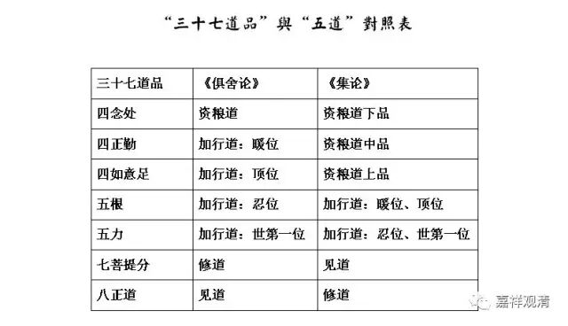

**《宗义略讲》005·056**

关于经部师所许的“道的所缘”～～“独立实有的我”经部是不承认的，连“独立实有的法”经部都是不认可的，他对“空”的理解明显比说一切有部要走的更远一点。

关于“染污无知”和“不染污无知”：他显然是承认有“不染污无知”（也可以叫“非染污无明”）的，也接受这个思想。受到大众部的影响，“所知障”这个名字，也没有，但是他有“法我”、“法执”的概念，那么在唯识和中观自续派当中，都会认为“法我执”和“所知障”是直接相关的，所以不妨推理一下，经部师是不妨碍建立“所知障”这个意思的，尽管他还没有明确出现这个词，没关系，那他们“法我执”是承认的嘛。

关于“道的体性”，五道：资粮道、加行道、见道、修道、无学道；这个“五道”的说法在后期的部派里普遍认可，但是加行道当中不一定立四个，有些经部师加行道当中只立三个的。

还有一个是和有部是不一样的，“世第一法”。我们还记得吧，唯识和有部在三十七道品当中，是四念处、四正勤、四如意足、五根、五力、七觉支、八正道来对应五道（四道）的；这个唯识是四念处、四正勤、四如意足，这三个分别对应的是资粮道的下品，中品和上品，然后五根、五力分别对应加行道的四个——暖位、顶位是对应五根，忍位、世第一位是对应五力——这个是唯识的对应。

《俱舍》的对应，四念处是对应资粮道，四正勤、四如意足分别对应暖位、顶位，忍位、世第一位则分别对应五根，五力。

见上表。

经部怎么讲？经部认为世第一法是五根，信、精进、念、定、慧根，这个是和有部不一样的。但是他的意思不是前面讲的对应、不对应（你看经部是不太机械的），它这个在“世第一位”说是“五根”的意思就是，一般在世第一法当中说是智慧，他觉得是第一位不仅仅是智慧，是“信、精进、念、定、慧”都有，世第一法中如果要修行，要具备的东西，他要具备什么呢？他要具备“信、精进、念、定、慧”，它在世第一法中都要具备，而不是仅仅具备一个慧。就一般的说法来说，世第一位的时候是在无间地以智慧在“正”断烦恼，而经部说此时“信、精进、念、定、慧”都有，所以世第一法是五根——这个说法也和说一切有部是不一样的。

