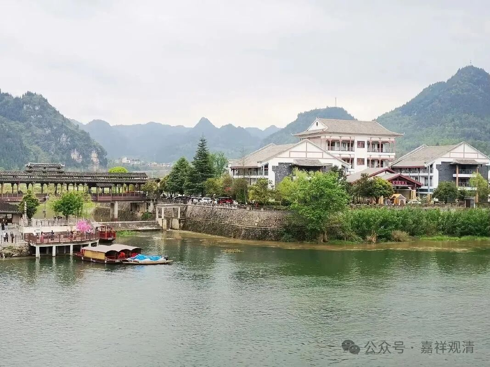

**《宗义略讲》005·057**

成实说见道不是见的四谛（按宗义书则认为自续一下都许可小乘见道是见四谛，但《成实论》不是这个说法），说见道见的是灭谛。见道见的是灭心，或者说是要灭掉那个灭心，灭掉那个第二重二谛的胜义谛。

经部认为佛的身体是有漏的还是无漏的，需要再查一下……

有部认为成佛是菩萨在最后一生“一座成佛”（从凡夫直至佛果）的，大众部不说“一座成佛”，大众部说菩萨到第二大阿僧祇劫已经是圣者了，这个和大乘的通说是一致的。但是经部没看到他有这方面的说法，或者我再去看一下，经部是不是许可“一坐成佛”，但我们手上这本宗义书说经部许菩萨最后生“一坐成佛”。

关于果的建立。

果的建立，前面讲过这个问题，经部应该认为从初果到四果都是不退的，这个四果，认为应该不退的，经部是比较强调慧的，应该认为不退的。这个也可以有机会深入研究看看。

那他的这个果位是不退的，阿罗汉的果位是不退为其他声闻的，佛的这些事业，需要再查一下，在大众部的话，佛的这些入胎、出家等事业的时候都已经是是圣者了，如在经部来说，让它成立“圣者菩萨”这个概念，这种可能性也不大，所以在这方面他可能和有部比较接近一点。

麟喻独觉这些，（相对来说）这个果的建立肯定和有部不一样了（和宗义书上说的经部也不一样），因为经部认为有二无我：人无我、法无我。《宗义书》说麟喻独觉也是证得补特伽罗独立实有我空，但至少《成实论》要明确说要证“法无我”，那即使是声闻，就也要法无我，独觉也是要证法无我的——这个观点几乎比中观自续还要厉害，因为中观自续说在声闻都是不证法无我的，成实则都还认为声闻要证法无我的，这样，成实论主在这个果的建立上甚至比唯识和中观自续在这个方面要进了一步……

鸠摩罗什大师说成实是有部和中观之间的阶梯，现在看来，他的有些观点甚至比大乘的某些部派的观点还要更先进，实际上可能是因为它绑到了一个大佬——龙树和提婆。

今天先到这里，汉地的经部，成实宗的部分观点给大家补充了，这是大家以前没提到的经部，但这个是至少“活”过的经部。（第五讲完）

