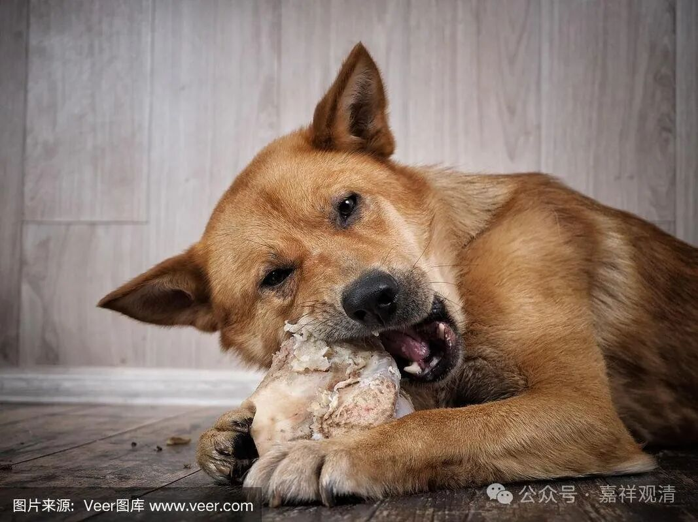

**俩狗进化了！开始挑食了！！**

《掌中解脱》说，我们对于所修之法不能不加观察抉择！我们对买菜都要挑挑拣拣，怎么对实现我们解脱目标——所修之法——却不加观察呢？

《掌中解脱》引萨班之文，说：

“虽有赖正法，妙劣不观察，

遇法即信受，如狗食不可。”

告诫我们说：不能“像狗吃东西一样，随便遇到什么吃什么就觉得满足了。这实在是个可怕的错误，绝对不可！因为法若有误，势必会导致今后诸生的长远目标也发生差错。”

呃，我觉得有点冤枉狗子了。

（怎么大德们都喜欢用狗来做比喻，讨论个佛性吧，也拿狗子来说话——“狗子佛性有无？！”……狗子表示：我好忙！）

以我们庙里的俩狗子来说吧，

哎……

最近已经不吃我们庙里给准备的饭了～～

小周的工程队单独开饭，每天有肉……庙里俩狗子（小黑、乔丹）每天围着他们的桌子转，因为有肉！有骨头！！！现在狗窝门口的饭盆，它们碰都不碰啦！！！

最近我觉得它们冲我摇尾巴开始越来越敷衍了，却很认真地在帮着工程队守着黄沙、石子！！！

《掌中解脱》都已经管不了它们啦！！！

