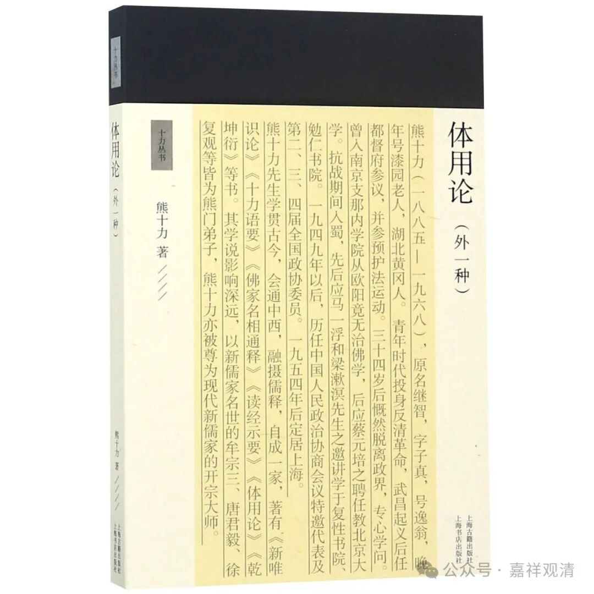
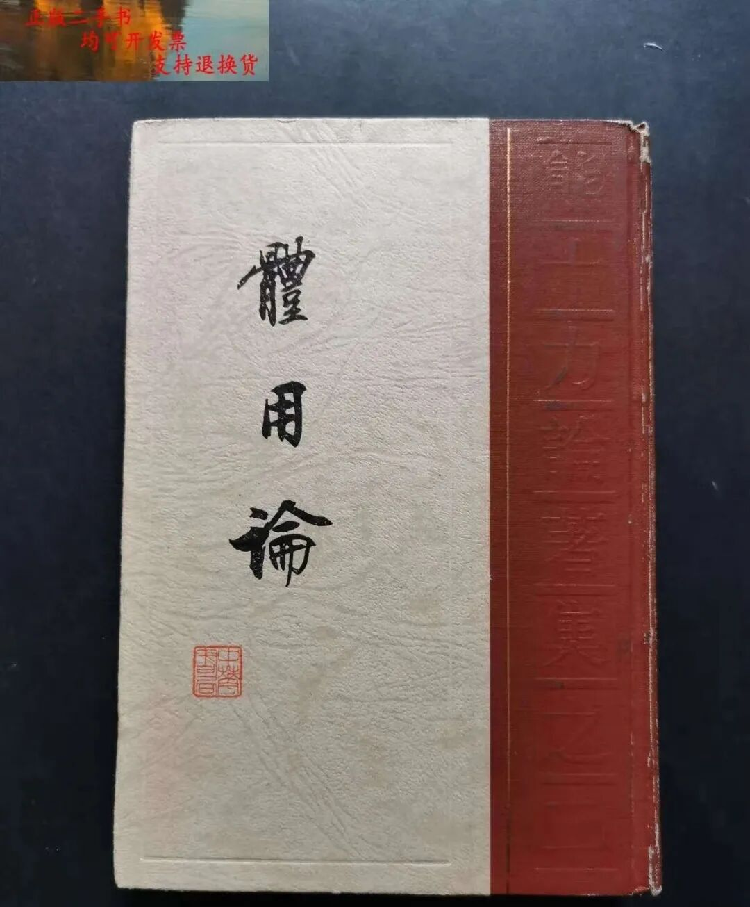

**《宗义略讲》006·003**

汉地的大师们每每在解释这个“性相”的时候，都带入自己发挥的一部分，都在谈“体、相、用”，实际的发挥很接近印度胜论派的“实、德、业”，但这个发挥的一部分呢，纯是属于中国思想、哲学，是中国思想史里所固有的，并不直接来源于印度哲学。

体用问题，有内学院背景的熊十力也在谈这个问题，他有一部《体用论》。

中国思想史上的这个“性相”“体相”，不是这里所谈的“性相”，这里的“性相”简单来讲就是定义，但是定义又不是特别确切，但是大概能够让大家理解，绝大部分情况下，“定义”这个说法已经够用了。一定要说“性相”呢，也是传统当中一个说法——符合这个表述的，具备这几个特征的……但真的辩论起来是，“特征”这个词是不能说的，因为“特征”就是“实德业”的“德”、“体相用”的“相”了——正在谈事物本身“实、体”，怎么可以说“实、体”就是特征呢？……不多展开了，这里的“性相”、“……之相”、“……之性”，大家就简单理解为“定义”就好。

** “经部与譬喻师同义。”**

“经部”与“譬喻师”到底同义不同义（是不是指向同一类人群）呢？其实很难讲的。按历史来说，不仅有“经部譬喻师”，其实还有说一切有部的“譬喻师”，比如说法救，法救应该算是经部的先驱譬喻师，但是他还没有放弃“三世实有”的这个主张，所以他还是宗根本说一切有部，是有部师；同时此时经部尚未出现在历史舞台，所以法救还不能算“符合定义的”经部师，只能算“经部先驱”或者“（说一切有部的）譬喻师”

譬喻师跟经部师有关，这一点是可以确定的，而后期的“譬喻师”主要指的经部师，早期呢，“持经的譬喻师”属于说一切有部内部的“异师”……所以“经部师”和“譬喻师”到底能不能划等号，其实还真不见得百分百地说“能”。当然我们可以理解，前面说了，因为在“佛教史”这门课上的缺陷，因为他们的知识范围有限，因为他们缺少早期佛教部派的文献……

为什么称“譬喻师”呢？有几个原因，一方面是经量部不太接受有部以论为量的背景所以自称经量部，也称说经部，以经为量，说一切有部称他们为“说经部”，“说经部”里面的“经”指的是什么？上次也讲了，一部分经里面自己也有论议的，论议经，经文自带解释的，因为解释的比较清楚，所以以此作为他们“了义经”的内容；另外呢就是譬喻经、因缘经，故事方面、因缘方面比较多的，譬喻也有这个意。还有一种，据宗义书的解释系统，把这个“譬喻”看作是“宗因喻”的“喻”，说他们比较强调因明，所以叫“譬喻师”（但实际看来，这种说法未见得是历史的事实）。

