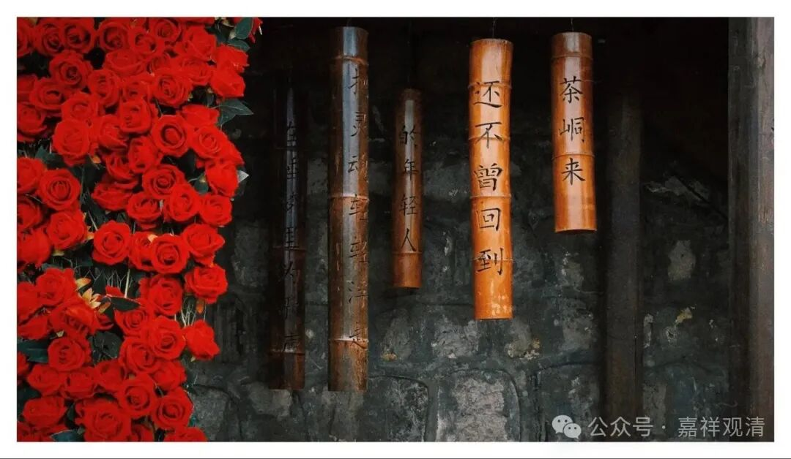

**故事里的事，说“是”就是“不是”也“是”……**

今天继续讲《掌中解脱》。

佛教书里面经常会有一些传记故事，假如我们要求严格一点的话，其实我们可以注意一下这里面的“故事成分”……有的故事非常精彩、故事性很强，很有感染力，但是实际这些未必是史实……

我讲课的时候说：这类似于普通中国人的“三国知识”——普通中国人的三国知识是由《三国演义》而非由《后汉书》《三国志》构建的，通过《三国演义》，我们被输入了“义气”、“智谋”、“忠君”这些概念，甚至有的人（后金将领）还通过它学会了打仗……这也就够了！甚至《三国志》《后汉书》也未必能有如此的教育作用（可以说就是没有）。

我们用考证的方法来看，有些佛教故事是各种嫁接、串联的产物，更类似于说书、评话，比如益西沃没有去过拉达克、也没有被捕（被捕囚禁并出逃的是他的一个儿子、绛曲沃的叔叔），他在阿里出家并在阿里圆寂；金洲法称是中观师而非唯识师……这些史实我们知道那更好，不知道呢，也不影响一般人学习——故事也可以有实际的教育价值，是吧！

就随便聊几句……

