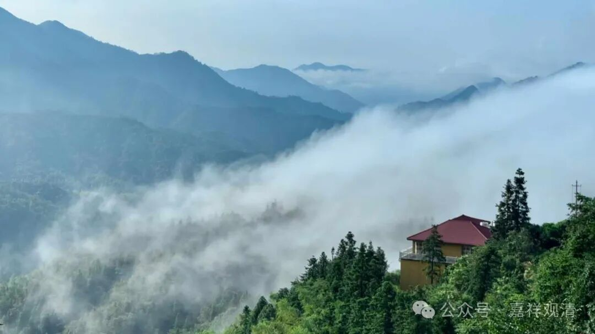
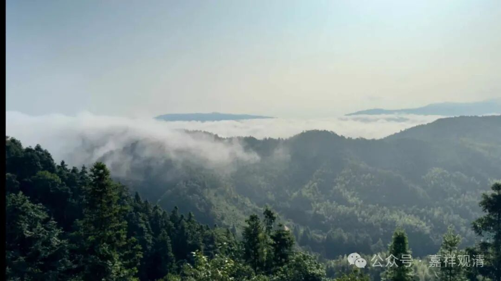
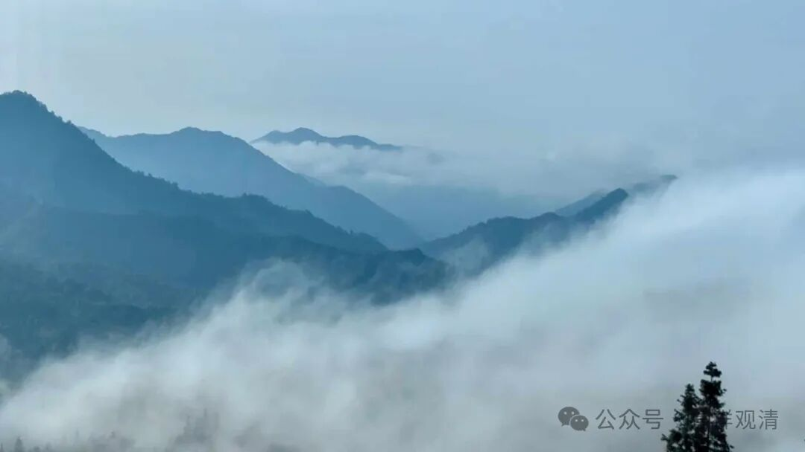
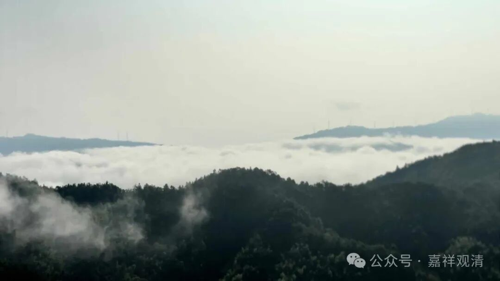
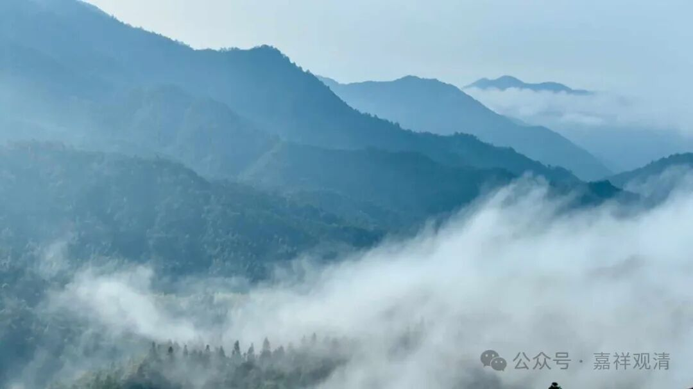
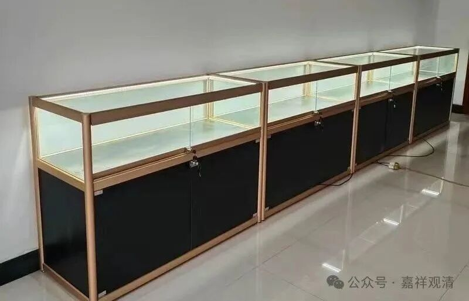

**云海·观景台·化石展**

昨天晚上下雨，今天一早，太阳出来了，还雾蒙蒙的……老胡说要给工人们拍照，因为有太阳、有雾会拍得很好看……去大雄宝殿边上往水库方向看过去，果然是厚厚的云上浮着几个山头……

那综合楼方向一定更漂亮了，云海那是必须的了……

果然——

山上就是这样，下完雨的第二天如果是大晴天，那基本肯定可以看到云海，如果带点风的话，云海会更漂亮。

山上观景有两个方向，一个向正东、往景德镇方向，这个方向，我们的综合楼可以覆盖到；一个是往莲花山乡、水库方向，要到庙后面鸡冠石方向可以看到——接下去准备往鸡冠石修一条步道，山顶上搞一个观景台，那样以后大家就可以看到另一个方向的美景了。到时候在那里放一个钟，这要是敲起来，乡里面都可以听得到……

买了20个展柜，这两天都在安装，已经装了一半了。

咱庙里准备做一个小小的古生物化石展，哈哈，咱誓把跨界进行到底！我们现在有几种三叶虫、狼鳍鱼、三尾拟浮游、叶之介、海百合、珊瑚石、江汉鱼……的化石了，再加上圈内大佬们的支援马上就到，等展板都到位了，我就要做“馆长”了！

“副馆长”位置还空着，兄弟们，你们的名片上缺头衔吗？

