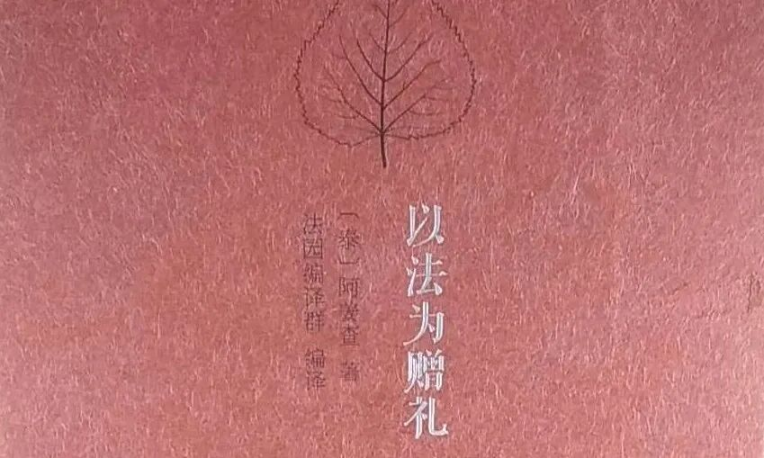

**以法为赠礼**

今天讲课，讲到“多闻”是我们的财富。七圣财（信、戒、惭、愧、闻、舍、慧）就包括“多闻”。佛教说，世间的财富是五家共（王、贼、水、火、不肖子孙）的，但“多闻”是盗贼等无法盗走的。

大三的时候暑假在南京实习，在淮海路的金陵刻经处买了一副赵朴老题字的复制品——“多闻多思”

但实际生活中大家并不真的认同“七圣财”要超越世间的财富，比如，比起听法，徒弟们一定认为师父发个大红包才更令人兴奋……

我有个小师弟，他很认真地对我说：“我第一喜欢干活，第二喜欢学习！……”

“哈哈哈哈……”我笑着拍他的脑袋：“你实际的意思是：你宁愿干活也不肯学习！”

我的一个师父说过他的故事——他学了二十多年回家，妈妈有点抱怨地问：“（跟你一起出去学佛的，）人家学了四年就回来，学会了念经挣钱……你怎么学了二十多年才回来？！（你真够笨的怎么要学这么久？）你挣的钱呢？”

哈哈哈哈，师父大笑不止……（我觉得他的笑，很复杂……）

我想，那时候他大概很想说——

“我以法为赠礼！”

但怕被打

