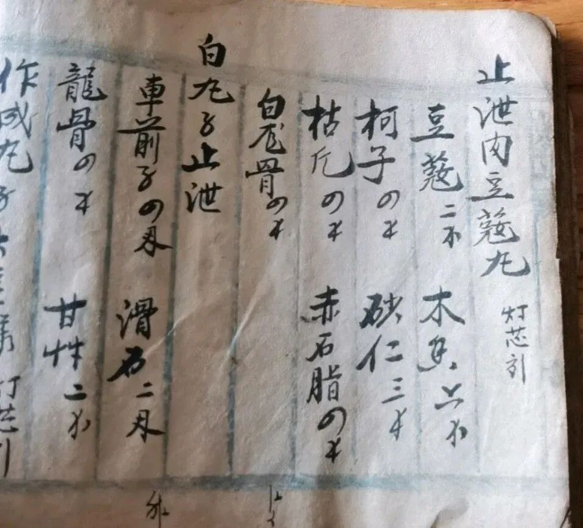

**法是无上药，我是重病人**

“道前基础”里有说，于自己做病人想，修法做服药想……

首先知道我有病，然后才能去看病；找好医生开了药，应当按时服药。同样的，知道我有烦恼，要听善知识的正法开示然后去用于实修……

但是，很拧巴的，有些人真的学法不修，就像有些人真的看了病却不吃药……世间上的人真的啥都有。

文革的时候唐老在乡里行医谋生……八、九十年代唐老出来讲课以后，有些信众知道他做过中医，就找他开方看病。我去那里的时候，也看到有信众找唐老开方……（还排队……）

诡异的是，他们找唐老开完方却不去照方抓药，而是把方子折叠两下揣上衣兜里，说这样跟吃了药一样，随身带着就好！——他们是把药方当护身符用啊！这还不是一个人是这样，几乎全都是这么“玩”的！

我看不懂，但我大受震撼！

以后我一直拿这个说话——开了方子不吃药，没有比这个更蠢的人了！但是听起来这么荒谬的事情，却是非常常见地发生在我们的周围！

然后，我们把这种“习惯”带到了我们治烦恼病的现场……

